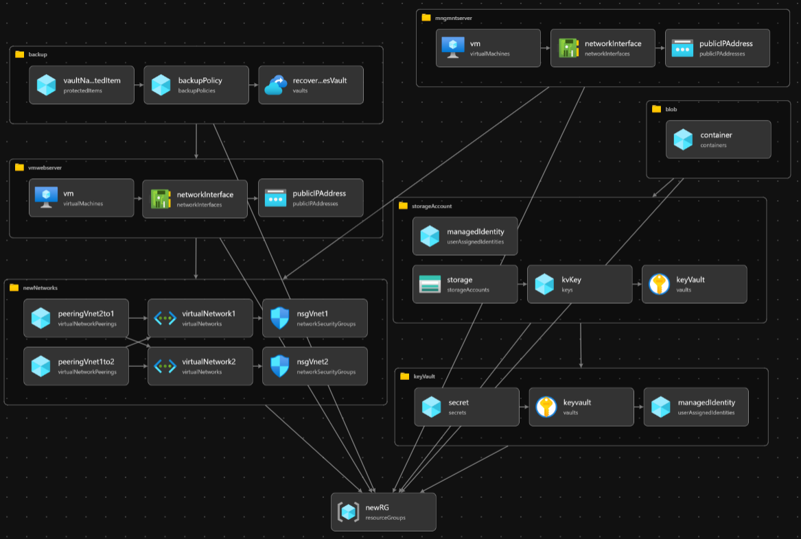
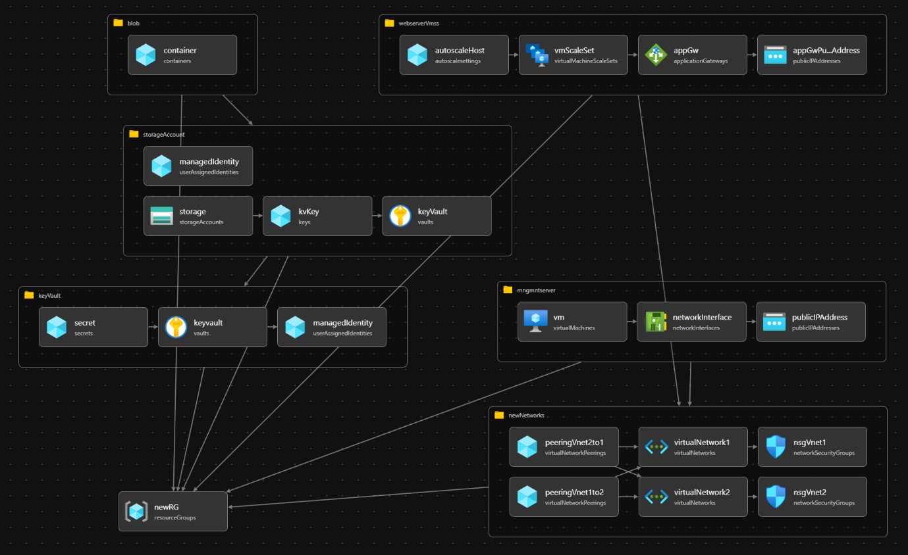

## Design Documentation

### Version 1.0

The architecture for version 1.0 is set up as follows:

- Two **Virtual Networks**.
- Both containing one **Subnet** each.
- Two **Network Security Groups** each linked to one Subnet.
- Connected via **Virtual Network Peering**.
- Network 1 contains the *webserver* **Virtual Machine** (Linux).
- **Custom Data** fed into the *webserver* to automatically install and launch apache.
- Network 2 contains the *management server* **Virtual Machine** (Windows Server).
- NSGs containing **Security Rules** that only allow **SSH** and **RDP** from trusted locations.
- **Storage Account** containing a **Blob Container** for scripts.
- Storage account encrypted with a user managed key stored in the **Key Vault**
- **Storage OS Disk**, **NIC** and **Public IP** for each Virtual Machine.
- **Azure Recovery Service Vault** for backups of the webserver.
- A new **Backup Policy** to handle daily backups that are kept for 7 days.
- **Azure Disk Storage Server-Side Encryption** and **Encryption at host** enabled for data at rest as well as temp disks, caches and Data flows encrypted between Compute and Storage encryption.

### Architecture Diagram

### Version 1.1

The architecture for version 1.1 is set up as follows:

- Two **Virtual Networks**.
- Both containing one **Subnet** each.
- Two **Network Security Groups** each linked to one Subnet.
- Connected via **Virtual Network Peering**.
- Network 1 contains the *webserver* **Virtual Machine** (Linux).
- **Custom Data** fed into the *webserver* to automatically install and launch apache.
- Network 2 contains the *management server* **Virtual Machine** (Windows Server).
- NSGs containing **Security Rules** that only allow **SSH** and **RDP** from trusted locations.
- **Storage Account** containing a **Blob Container** for scripts.
- Storage account encrypted with a user managed key stored in the **Key Vault**
- **Storage OS Disk**, **NIC** and **Public IP** for the management server.
- **Azure Disk Storage Server-Side Encryption** and **Encryption at host** enabled for data at rest as well as temp disks, caches and Data flows encrypted between Compute and Storage encryption.
- **Virtual Machine Scale Set** for the webserver.
- **Health Extension** to periodically check the servers health and a 30 minute **automatic repair policy** to put the server back up if it fails.
- An **Application gateway** to handle load balancing and http to https redirection.
- An **Autoscale Settings** resource to handle increasing the number of virtual machines if cpu load goes beyond a certain treshold.

### Architecture Diagram

