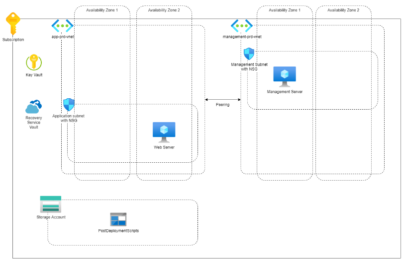

## Project Requirements

#### Epic: exploration

Deliver a point by point description of the product requirements.

### Deliverable: 

##### Upfront Requirements

1. All VM disks must be encrypted.
2. The webserver requires daily backups. These backups must be kept for at 7 days.
3. The webserver must be installed in an automated way.
4. The admin/management server must be reachable via a public IP address.
5. The admin/management server should only be reachable via trusted locations (office/admin's house)
6. The following IP ranges should be used:
    - 10.10.10.0/24
    - 10.20.20.0/24
7. All subnets must be protected via a firewall at the subnet level.
8. SSH or RDP connections to the webserver should only be allowed via the admin/management server.

Diagram:

##### Additional requirements after product owner meeting

1. One region.
2. Basic/cheapest storage for postscript storage.
3. NSG sufficient for firewall.
4. Azure managed keys for disk encryption.