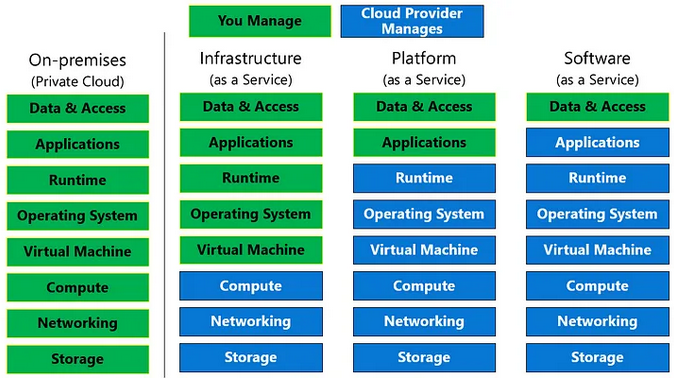
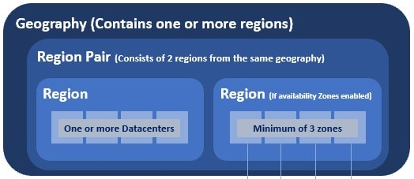

# AZ-900 Exam Cheat Sheet

This cheat sheet is based on the [Full Exam Guide July 31, 2023](https://learn.microsoft.com/en-us/certifications/resources/study-guides/az-900)

Azure training courses: https://learn.microsoft.com/en-gb/training/courses/az-900t00

Practice Assessment for Exam AZ-900 Microsoft Azure Fundamentals: https://learn.microsoft.com/en-us/certifications/exams/az-900/practice/assessment?assessment-type=practice&assessmentId=23

# Cloud concepts
## Cloud computing

### Define **cloud computing**

Cloud computing is the delivery of computing services—including servers, storage, databases, networking, software, analytics, and intelligence—over the internet (“the cloud”) to offer faster innovation, flexible resources, and economies of scale.
> https://azure.microsoft.com/en-us/resources/cloud-computing-dictionary/what-is-cloud-computing

### Describe **the shared responsibility model**
Which security tasks are handled by the cloud provider and which tasks are handled by you.

Workload responsibilities vary depending on whether the workload is hosted on Software as a Service (SaaS), Platform as a Service (PaaS), Infrastructure as a Service (IaaS), or in an on-premises datacenter.

Responsibilities you always retain:
- Data
- Endpoints
- Account
- Access management

*On-premises vs cloud:*

In the cloud-enabled approach, you are able to shift day to day security responsibilities to your cloud provider and reallocate your resources.

> https://learn.microsoft.com/en-us/azure/security/fundamentals/shared-responsibility

### Define cloud models, including public, private, and hybrid

**Public cloud:** all hardware, software, and other supporting infrastructure are owned and managed by the cloud provider. Microsoft Azure is an example of a public cloud. Benefits: *Lowers costs, no maintenance, near-unlimited scalability, high reliability.* 

**Private cloud:** cloud computing resources used exclusively by one business or organization. Services and infrastructure are always maintained on a private network and the hardware and software are dedicated solely to your organization. It may be hosted on-premises or in a colocation data center. Benefits: *More flexibility, more control, more scalability.*

**Hybrid cloud:** a type of cloud computing that combines on-premises infrastructure—or a private cloud—with a public cloud. Allows data/app movement between environments. Benefits: *Control, Flexibility, Cost-effectiveness, Ease*.

*A multi-cloud is a combination of public and private clouds.*

> https://azure.microsoft.com/en-us/resources/cloud-computing-dictionary/what-are-private-public-hybrid-clouds/

### Identify appropriate use cases for each cloud model

Public Cloud:
- Web Applications
- Software as a Service (SaaS)
- Development and Testing
- Big Data Analytics
- Content Delivery

Private Cloud:
- Data Security and Compliance
- Legacy Applications
- High-Performance Computing
- Governance or Regulatory Requirements

Hybrid Cloud:
- Cloudbursting (workloads are “spilled over” to a different cloud environment to meet capacity demands)
- High Availability and Disaster Recovery
- Regulatory Requirements

> https://www.flexera.com/blog/cloud/private-and-hybrid-clouds-9-use-cases-and-implementation-advice/

> https://cloudian.com/guides/hybrid-it/what-is-hybrid-cloud-examples-use-cases-and-challenges/

### Describe the consumption-based model

You're charged for only what you use. This model is also known as the pay-as-you-go rate.

> https://learn.microsoft.com/en-us/azure/well-architected/cost/design-price

### Compare cloud pricing models

- *Pay-as-you-go:* consumption-based.
- *Reserved Instances:* virtual machines that are pre-purchased for one or three years in a specific region.
- *Hybrid Benefit:* for organizations that own Microsoft licenses in their on-premise data centers. This is known as bring your own license (BYOL).
- *Spot Instances:* buy unused computing power at a discount of up to 90% compared to pay as you go prices.
- *Azure Dev/Test:* if you use Azure service for development and testing, you are eligible to substantial discounts.

> https://azure.microsoft.com/en-us/pricing/

> https://spot.io/resources/azure-pricing/the-complete-guide/

> https://www.c-sharpcorner.com/article/azure-pricing-models-understanding-the-different-pricing-options/

### Describe serverless

A cloud computing model offered by Azure that allows developers to build and run applications without managing or provisioning the underlying infrastructure. *Serverless Containerized Microservices, Serverless Kubernetes, Serverless Functions, Azure SQL Database serverless*

> https://azure.microsoft.com/en-us/solutions/serverless

## The benefits of using cloud services

### Describe the benefits of high availability and scalability in the cloud
**High Availability**: it’s important the resources are available when needed. High availability focuses on ensuring maximum availability, regardless of disruptions or events that may occur.

**Scalability**: the ability to adjust resources to meet demand.
- Combats peak traffic/overwhelmed systems.
- No overpaying for services. 

*Vertical Scaling*: more processing power, CPU, RAM etc. (scaling up)

*Horizontal Scaling*: deploying more resources, VMs, containers. (scaling out)

### Describe the benefits of reliability and predictability in the cloud
**Reliability**: the ability of a system to recover from failures and continue to function.

**Predictability**: *Performance predictability* focuses on predicting the resources needed to deliver a positive experience for your customers (Autoscaling, load balancing, and high availability). *Cost predictability* is focused on predicting or forecasting the cost of the cloud spend (predict future costs and adjust your resources as needed).

### Describe the benefits of security and governance in the cloud
**Governance:**
- Set templates help ensure that all your deployed resources meet corporate standards and government regulatory requirements.
- Update all your deployed resources to new standards as standards change.
- Cloud-based auditing helps flag any resource that’s out of compliance with your corporate standards and provides mitigation strategies.
- Software patches and updates may also automatically be applied, which helps with both governance and security.

**Security**:
- Patches and maintenance taken care of automatically
- Cloud providers are typically well suited to handle things like distributed denial of service (DDoS) attacks

### Describe the benefits of manageability in the cloud
**Management of the cloud**: managing your cloud resources.

- Automatically scale resource deployment based on need.
- Deploy resources based on a preconfigured template, removing the need for manual configuration.
- Monitor the health of resources and automatically replace failing resources.
- Receive automatic alerts based on configured metrics, so you’re aware of performance in real time.

**Management in the cloud**: how you’re able to manage your cloud environment and resources.

- Through a web portal.
- Using a command line interface.
- Using APIs.
- Using PowerShell.

## Cloud service types

> https://medium.com/chenjd-xyz/azure-fundamental-iaas-paas-saas-973e0c406de7

### Describe infrastructure as a service (IaaS)
Rent and manage virtual machines, storage, and networking resources, allowing them to have more control over their infrastructure without the need to invest in physical hardware.

### Describe platform as a service (PaaS)
A platform for developers to build, deploy, and manage applications over the internet.

### Describe software as a service (SaaS)
A platform that allows users to connect to and use cloud-based apps over the Internet. Common examples are email, calendaring, and office tools (such as Microsoft Office 365).

### Identify appropriate use cases for each cloud service (IaaS, PaaS, and SaaS)

**IaaS**
- Development and testing environments
- Scalable web hosting
- Data backup and recovery
- High-performance computing

**PaaS**
- Application development
- Mobile application backend
- Continuous integration and deployment

**SaaS**
- Email and collaboration
- CRM
- Project management 

> https://www.eginnovations.com/blog/saas-vs-paas-vs-iaas-examples-differences-how-to-choose/
# Azure architecture and services

## The core architectural components of Azure

### Describe Azure regions, region pairs, and sovereign regions

**Azure region**: a set of data centers deployed within a latency-defined perimeter and connected through a dedicated regional low-latency network.

**Region pair**: two Azure regions that are located in close proximity to each other, typically within the same geography or continent, but physically separated to minimize the impact of natural disasters or other localized incidents.  Azure services and resources deployed in the primary region are automatically replicated to the secondary region, creating a failover or disaster recovery capability. *Replication*

**Geography**: area of the world that contains one or more Azure Regions.

> https://learn.microsoft.com/en-us/azure/reliability/availability-zones-overview

### Describe availability zones
a physically separate data center within an Azure region, with its own power, cooling, and networking infrastructure. The purpose of Availability Zones is to protect applications and data from failures or disruptions within a single data center. *Replication*

### Describe Azure datacenters
unique physical buildings—located all over the globe—that house a group of networked computer servers.

### Describe Azure resources and resource groups

**Resources**: in Azure, a resource is an entity managed by Azure. Virtual machines, virtual networks, and storage accounts are all examples of Azure resources. *Azure Resource Manager* is the deployment and management service for Azure.

**Resource groups**: a container that holds related resources for an Azure solution. Stores metadata about the resources.

> https://learn.microsoft.com/en-us/azure/azure-resource-manager/management/manage-resource-groups-portal

### Describe subscriptions
A logical container used to provision resources in Azure. Subscription is at the level at which the customer is billed based on usage. It also provides a logical segmentation for simplifying administration.

### Describe management groups
Management groups provide a governance scope above subscriptions. You organize subscriptions into management groups. For example, you can apply policies to a management group that limits the regions available for virtual machine (VM) creation. This policy would be applied to all nested management groups, subscriptions, and resources.

### Describe the hierarchy of resource groups, subscriptions, and management groups
he highest level of these Azure architectural components is the *Management Group*. Management Groups contain one or more *subscriptions*. Inside of Subscriptions are *Resource Groups*. Resource Groups belong to exactly one Subscription. A Subscription can have many resource groups, but a resource group may belong to only one subscription. The *Resources* themselves (the Azure cloud services) can be grouped together in Resource Groups. 

> https://vegibit.com/azure-management-groups-vs-resource-groups/

## Azure compute and networking services

### Compare compute types, including containers, virtual machines, and functions
Azure compute is an on-demand computing service for running cloud-based applications

**Containers**: a virtualization environment for running applications. Doesn't include OS.
**Virtual Machines**: software emulations of physical computers. Includes OS.
**Functions**: event-driven, serverless compute platform that helps you develop more efficiently using the programming language of your choice.

> https://www.testpreptraining.com/tutorial/microsoft-azure-fundamentals-az-900/azure-compute-options/

### Describe virtual machine options, including Azure virtual machines, Azure Virtual Machine Scale Sets, availability sets, and Azure Virtual Desktop

**Azure virtual machines**:  on-demand virtualized computing resources that can be used to run various operating systems and applications (VM).

**Azure Virtual Machine Scale Sets**: create and manage a group of identical virtual machines.

**Availability sets**: group VMs together and distribute them across different fault domains and update domains within a single Azure region.

**Azure Virtual Desktop**: cloud-based virtual desktop infrastructure (VDI) service; virtualized desktops and applications that can be accessed remotely from various devices

### Describe the resources required for virtual machines
- Resource Group
- Virtual Network
- Storage Account
- Image/OS

### Describe application hosting options, including web apps, containers, and virtual machines

**Web apps**: Azure Static Web Apps is a service that automatically builds and deploys full stack web apps to Azure from a code repository. GitHub or Azure DevOps integration.

**containers**: Azure Container Instances (ACI) is a managed service that allows you to run containers directly on Azure, without having to manage any virtual machines and without having to adopt a higher-level service.

**Virtual machines**: Azure Virtual Machines provide an Infrastructure as a Service (IaaS) solution for hosting your applications on either Windows or Linux VMs in the cloud.

> https://learn.microsoft.com/en-us/azure/developer/intro/hosting-apps-on-azure

### Describe virtual networking, including the purpose of Azure virtual networks, Azure virtual subnets, peering, Azure DNS, Azure VPN Gateway, and ExpressRoute

A virtual network is similar to a traditional network that you'd operate in your own data center. An Azure Virtual Network brings with it extra benefits of Azure's infrastructure such as scale, availability, and isolation.

**Azure virtual networks**: enables many types of Azure resources, such as Azure Virtual Machines (VM), to securely communicate with each other, the internet, and on-premises networks.

**Azure virtual subnets**: enable you to segment the virtual network into one or more subnetworks and allocate a portion of the virtual network's address space to each subnet.

**Peering**: enables you to seamlessly connect two or more Virtual Networks in Azure.

- Virtual network peering: Connecting virtual networks within the same Azure region.
- Global virtual network peering: Connecting virtual networks across Azure regions.

> https://learn.microsoft.com/en-us/azure/virtual-network/virtual-network-peering-overview

**Azure DNS**: a hosting service for DNS domains that provides name resolution by using Microsoft Azure infrastructure.

**Azure VPN Gateway**: a service that uses a specific type of virtual network gateway to send encrypted traffic between an Azure virtual network and on-premises locations over the public Internet.

**ExpressRoute**: extend your on-premises networks into the Microsoft cloud over a private connection with the help of a connectivity provider.

> https://learn.microsoft.com/en-us/azure/virtual-network/virtual-networks-overview

### Define public and private endpoints

**Private Endpoint**: A private endpoint is a network interface that uses a private IP address from your virtual network. This network interface connects you privately and securely to a service that's powered by *Azure Private Link*. By enabling a private endpoint, you're bringing the service into your virtual network. E.g.: Azure Storage, Azure Cosmos DB etc.

**Public Endpoint**: enable data access to your managed instance from outside the virtual network.

## Azure storage services

### Compare Azure Storage services

**Azure Blobs**: A massively scalable object store for text and binary data. Also includes support for big data analytics through Data Lake Storage Gen2.

**Azure Files**: Managed file shares for cloud or on-premises deployments.

**Azure Elastic SAN (preview)**: A fully integrated solution that simplifies deploying, scaling, managing, and configuring a SAN in Azure.

**Azure Queues**: A messaging store for reliable messaging between application components.

**Azure Tables**: A NoSQL store for schemaless storage of structured data.

**Azure managed Disks**: Block-level storage volumes for Azure VMs.

### Describe storage tiers

**Hot Access tier**: should be used for the data frequently accessed by applications, and that is read or written very often.

**Cool Access tier**: suitable for data that is not accessed frequently by applications and is expected to be stored for a minimum of 30 days;

**Archive tier**: used to store rarely accessed or archival data. Its storage rate is the cheapest on Azure, but the data retrieval charges are the highest.

> https://www.whizlabs.com/labs/understanding-azure-blob-storage-tiers

### Describe redundancy options

Data in an Azure Storage account is always replicated three times in the primary region. Azure Storage offers two options for how your data is replicated in the primary region:

- **Locally redundant storage (LRS)**: copies your data synchronously three times within a single physical location in the primary region. LRS is the least expensive replication option, but isn't recommended for applications requiring high availability or durability.

- **Zone-redundant storage (ZRS)**: copies your data synchronously across three Azure availability zones in the primary region. For applications requiring high availability, Microsoft recommends using ZRS in the primary region, and also replicating to a secondary region.

> https://learn.microsoft.com/en-us/azure/storage/common/storage-redundancy

### Describe storage account options and storage types

**Storage account name**: 3-24 chars, numbers and lowercase letters only. Unique within Azure.

**Storage account endpoints**: every object that you store in Azure Storage has a URL address that includes your unique account name.

- Standard endpoints (recommended). By default, you can create up to 250 storage accounts per region with standard endpoints in a given subscription. With a quota increase, you can create up to 500 storage accounts with standard endpoints per region. For more information, see Increase Azure Storage account quotas.
- Azure DNS zone endpoints (preview). You can create up to 5000 storage accounts per region with Azure DNS zone endpoints in a given subscription.

**Storage account encryption**: all data in your storage account is automatically encrypted on the service side. 

**Storage account billing**: Azure Storage bills based on your storage account usage. All objects in a storage account are billed together as a group.

| Type of storage account | Supported storage services | Redundancy options | Usage |
| ----------- | ----------- | ----------- | ----------- |
| Standard general-purpose v2 | Blob Storage (including Data Lake Storage1), Queue Storage, Table Storage, and Azure Files | Locally redundant storage (LRS) / geo-redundant storage (GRS) / read-access geo-redundant storage (RA-GRS) / Zone-redundant storage (ZRS) / geo-zone-redundant storage (GZRS) / read-access geo-zone-redundant storage (RA-GZRS)2 | Standard storage account type for blobs, file shares, queues, and tables. Recommended for most scenarios using Azure Storage. If you want support for network file system (NFS) in Azure Files, use the premium file shares account type. |
| Premium block blobs | Blob Storage (including Data Lake Storage1) | LRS, ZRS | Premium storage account type for block blobs and append blobs. Recommended for scenarios with high transaction rates or that use smaller objects or require consistently low storage latency. |
| Premium file shares | Azure Files | LRS, ZRS | Premium storage account type for file shares only. Recommended for enterprise or high-performance scale applications. Use this account type if you want a storage account that supports both Server Message Block (SMB) and NFS file shares. |
| Premium page blobs | Page blobs only | LRS | Premium storage account type for page blobs only. |

> https://learn.microsoft.com/en-us/azure/storage/common/storage-account-overview

### Identify options for moving files, including AzCopy, Azure Storage Explorer, and Azure File Sync

**AzCopy**: a command-line tool that moves data into and out of Azure Storage

**Azure Storage Explorer**: GUI app; Upload, download, and manage Azure Storage blobs, files, queues, and tables, as well as Azure Data Lake Storage entities and Azure managed disks.

**Azure File Sync**: transforms Windows Server into a quick cache of your Azure file share.

### Describe migration options, including Azure Migrate and Azure Data Box

**Azure Migrate**: migration of physical and full virtual machines together with the underlying block-based devices. Includes discovering and assessing on-premises resources tools.

**Azure Data Box**: a family of physical data transfer devices offered by Microsoft Azure. It is designed to help organizations securely transfer large amounts of data to and from Azure, particularly in scenarios where transferring data over the network is impractical or time-consuming.

> https://learn.microsoft.com/en-us/azure/storage/common/storage-migration-overview

## Azure identity, access, and security

### Describe directory services in Azure, including Azure Active Directory (Azure AD), part of Microsoft Entra and Azure Active Directory Domain Services (Azure AD DS)

**Azure Active Directory (Azure AD)**: an enterprise identity service that provides single sign-on, multifactor authentication, and conditional access to guard against 99.9 percent of cybersecurity attacks.

**Azure Active Directory Domain Services (Azure AD DS)**: a fully managed cloud-based service provided by Microsoft Azure that offers traditional on-premises Active Directory (AD) capabilities. Azure AD DS allows you to seamlessly extend your on-premises Active Directory environment to the Azure cloud. 

### Describe authentication methods in Azure, including single sign-on (SSO), multi-factor authentication (MFA), and passwordless

**sign-on (SSO)**: access multiple applications and services with a single set of credentials.

**multi-factor authentication (MFA)**: requiring users to provide additional verification beyond their username and password, such as phone calls, text messages, mobile apps, and hardware tokens.

**Passwordless**: eliminates the need for passwords altogether and replaces them with alternative authentication methods.

### Describe external identities in Azure, including business-to-business (B2B) and business-to-customer (B2C)

Azure AD External Identities refers to all the ways you can securely interact with users outside of your organization. With External Identities, external users can "bring their own identities." Whether they have a corporate or government-issued digital identity, or an unmanaged social identity like Google or Facebook, they can use their own credentials to sign in.

**business-to-business (B2B)**: allows organizations to securely collaborate with external users, such as partners, vendors, or customers. It enables organizations to grant access to their resources and applications to users from other organizations without requiring them to create separate user accounts. 

**and business-to-customer (B2C)**: a cloud-based customer identity and access management solution that focuses on providing authentication and authorization services for customer-facing applications. It is designed for business-to-consumer scenarios and supports large-scale identity management for millions of users.

> https://learn.microsoft.com/en-us/azure/active-directory/external-identities/external-identities-overview

### Describe Conditional Access in Azure AD

Conditional Access policies at their simplest are if-then statements, if a user wants to access a resource, then they must complete an action. Example: A payroll manager wants to access the payroll application and is required to do multifactor authentication to access it. Use Conditional Access policies to apply the right access controls when needed to keep your organization secure.

Signals include: User or group membership, Device, IP Location information, Application, Real-time and calculated risk detection, Microsoft Defender for Cloud Apps.

> https://learn.microsoft.com/en-us/azure/active-directory/conditional-access/overview

### Describe Azure role-based access control (RBAC)

RBAC helps you manage who has access to Azure resources, what they can do with those resources, and what areas they have access to. Azure RBAC is an authorization system built on Azure Resource Manager that provides fine-grained access management to Azure resources. Examples:

- Allow one user to manage virtual machines in a subscription and another user to manage virtual networks
- Allow a DBA group to manage SQL databases in a subscription
- Allow a user to manage all resources in a resource group, such as virtual machines, websites, and subnets
- Allow an application to access all resources in a resource group

The way you control access to resources using Azure RBAC is to assign Azure roles using three elements:

- *Security principal:* an object that represents a user, group, service principal, or managed identity that is requesting access to Azure resources.
- *Role definition:* a collection of permissions; write, delete etc.
- *Scope*: the set of resources that the access applies to.

> https://learn.microsoft.com/en-us/azure/role-based-access-control/overview

### Describe the concept of Zero Trust

A new security model that assumes breach and verifies each request as though it originated from an uncontrolled network. It is an approach to cybersecurity that emphasizes the need to verify and validate every access request and not automatically trust any user or device within a network, regardless of their location or origin.

> https://learn.microsoft.com/en-us/azure/security/fundamentals/zero-trust

### Describe the purpose of the defense-in-depth model
An information security strategy that employs multiple layers of security controls to protect systems and data. Examples of security layers:

- Perimitor Security (firewalls, intrusion detection systems)
- Identity and Access Management (IAM)
- Network Segmentation
- Data Encryption
- User Education and Awareness

### Describe the purpose of Microsoft Defender for Cloud

A cloud-native application protection platform (CNAPP) with a set of security measures and practices designed to protect cloud-based applications from various cyber threats and vulnerabilities. It is a combination of:

- A development security operations (DevSecOps) solution that unifies security management at the code level across multicloud and multiple-pipeline environments
- A cloud security posture management (CSPM) solution that surfaces actions that you can take to prevent breaches
-  A cloud workload protection platform (CWPP) with specific protections for servers, containers, storage, databases, and other workloads

> https://learn.microsoft.com/en-us/azure/defender-for-cloud/defender-for-cloud-introduction

# Azure management and governance
## Describe cost management in Azure

Monitor, allocate, and optimize cloud costs with transparency, accuracy, and efficiency.

### Describe factors that can affect costs in Azure

- Pricing Models
- Resource Type
- Services
- Location
- Azure Billing Zones
    - Zone 1	USA, Canada, Europe, UK
    - DE Zone 1	Germany
    - Zone 2	Japan,  Korea, Australia, India
    - Zone 3	Brazil

> https://granulate.io/blog/understanding-azure-costs-reduce/

### Compare the pricing calculator and the Total Cost of Ownership (TCO) Calculator

**Azure Pricing Calculator**: helps users estimate the costs associated with specific Azure services and configurations.

**Azure Total Cost of Ownership (TCO) Calculator**: helps organizations evaluate the cost savings and benefits of migrating their on-premises infrastructure to Azure.

Pricing calculator: https://azure.microsoft.com/en-us/pricing/calculator/
Total Cost of Ownership: https://azure.microsoft.com/en-us/pricing/tco/calculator/

### Describe cost management capabilities in Azure

Microsoft Cost Management is a suite of tools that help organizations monitor, allocate, and optimize the cost of their Microsoft Cloud workloads. 

Examples:

- eport on and analyze costs in the Azure portal, Microsoft 365 admin center, or externally by exporting data.
- Monitor costs proactively with budget, anomaly, and scheduled alerts.
- Split shared costs with cost allocation rules.
- Create and organize subscriptions to customize invoices.
- Configure payment options and pay invoices.
- Manage your billing information, such as legal entity, tax information, and agreements.

> https://learn.microsoft.com/en-us/azure/cost-management-billing/cost-management-billing-overview

### Describe the purpose of tags

Azure tags are widely used to group costs to align with different business units, engineering environments, and cost departments. Tags provide the visibility needed for businesses to manage and allocate costs across the different groups.

> https://learn.microsoft.com/en-us/azure/cost-management-billing/costs/enable-tag-inheritance

## Features and tools in Azure for governance and compliance

As you establish corporate policy and plan your governance strategies, you have options. You can use tools and services like Azure Policy, Azure Blueprints, and Microsoft Defender for Cloud. These tools enforce and automate your organization's governance decisions.

**Azure Blueprints**: enables cloud architects and central information technology groups to define a repeatable set of Azure resources.

**Azure Policy**: helps you create, assign, and manage policies. These policies enforce rules on your resources so those resources stay compliant with your corporate standards and service-level agreements. Azure Policy scans your resources to identify resources that aren't compliant with corporate policies.

**Microsoft Defender for Cloud**: provides a unified view of security across your workloads;  collects, searches, and analyzes security data from various sources, which includes firewalls and other partner solutions; provides actionable security recommendations to fix issues before they can be exploited; applies security policies across your hybrid cloud workloads to ensure compliance with security standards

> https://learn.microsoft.com/en-us/azure/cloud-adoption-framework/ready/azure-setup-guide/govern-org-compliance?tabs=AzureBlueprints

### Describe the purpose of Microsoft Purview in Azure

Microsoft Purview's solutions in the governance portal provide a unified data governance service that helps you manage your on-premises, multicloud, and software-as-a-service (SaaS) data. The Microsoft Purview governance portal allows you to:

- Create a holistic, up-to-date map of your data landscape with automated data discovery, sensitive data classification, and end-to-end data lineage.
- Enable data curators and security administrators to manage and keep your data estate secure.
- Empower data consumers to find valuable, trustworthy data.

> https://learn.microsoft.com/en-us/azure/purview/

### Describe the purpose of Azure Policy

Azure Policy helps you create, assign, and manage policies. These policies enforce rules on your resources so those resources stay compliant with your corporate standards and service-level agreements. Azure Policy scans your resources to identify resources that aren't compliant with corporate policies.

> https://learn.microsoft.com/en-us/azure/cloud-adoption-framework/ready/azure-setup-guide/govern-org-compliance?tabs=AzurePolicy

### Describe the purpose of resource locks

As an administrator, you can lock an Azure subscription, resource group, or resource to protect them from accidental user deletions and modifications. The lock overrides any user permissions.

> https://learn.microsoft.com/en-us/azure/azure-resource-manager/management/lock-resources?tabs=json

## Features and tools for managing and deploying Azure resources

### Describe the Azure portal

The Azure portal is a web-based, unified console that provides an alternative to command-line tools. With the Azure portal, you can manage your Azure subscription using a graphical user interface. You can build, manage, and monitor everything from simple web apps to complex cloud deployments in the portal.

> https://learn.microsoft.com/en-us/azure/azure-portal/

### Describe Azure Cloud Shell, including Azure Command-Line Interface (CLI) and Azure PowerShell

**Azure Cloud Shell**: Azure Cloud Shell is an interactive, authenticated, browser-accessible terminal for managing Azure resources. It provides the flexibility of choosing the shell experience that best suits the way you work, either Bash or PowerShell.

> https://learn.microsoft.com/en-us/azure/cloud-shell/overview

**Azure CLI**: the Azure Command-Line Interface (CLI) is a cross-platform command-line tool to connect to Azure and execute administrative commands on Azure resources. It allows the execution of commands through a terminal using interactive command-line prompts or a script.

> https://learn.microsoft.com/en-us/cli/azure/what-is-azure-cli

**Azure PowerShell**: Azure PowerShell is a set of cmdlets for managing Azure resources directly from PowerShell. Azure PowerShell is designed to make it easy to learn and get started with, but provides powerful features for automation.

> https://learn.microsoft.com/en-us/powershell/azure/what-is-azure-powershell?view=azps-10.1.0

### Describe the purpose of Azure Arc

Azure Arc simplifies governance and management by delivering a consistent multicloud and on-premises management platform.

Azure Arc provides a centralized, unified way to:

- Manage your entire environment together by projecting your existing non-Azure and/or on-premises resources into Azure Resource Manager.
- Manage virtual machines, Kubernetes clusters, and databases as if they are running in Azure.
- Use familiar Azure services and management capabilities, regardless of where your resources live.
- Continue using traditional ITOps while introducing DevOps practices to support new cloud native patterns in your environment.
- Configure custom locations as an abstraction layer on top of Azure Arc-enabled Kubernetes clusters and cluster extensions.

Some of the key scenarios that Azure Arc supports are:

- Implement consistent inventory, management, governance, and security for servers across your environment.
- Configure Azure VM extensions to use Azure management services to monitor, secure, and update your servers.
- Manage and govern Kubernetes clusters at scale.
- Use GitOps to deploy configurations across one or more clusters from Git repositories.
- Zero-touch compliance and configuration for Kubernetes clusters using Azure Policy.

> https://learn.microsoft.com/en-us/azure/azure-arc/overview

### Describe infrastructure as code (IaC)

Infrastructure as Code (IaC) is an approach to managing and provisioning infrastructure resources using machine-readable configuration files or scripts. It involves defining and deploying infrastructure components, such as virtual machines, networks, storage, and other resources, using code instead of manual processes.

> https://learn.microsoft.com/en-us/devops/deliver/what-is-infrastructure-as-code

### Describe Azure Resource Manager (ARM) and ARM templates

**Azure Resource Manager**: is the deployment and management service for Azure. It provides a management layer that enables you to create, update, and delete resources in your Azure account. You use management features, like access control, locks, and tags, to secure and organize your resources after deployment. When you send a request through any of the Azure APIs, tools, or SDKs, Resource Manager receives the request.

> https://learn.microsoft.com/en-us/azure/azure-resource-manager/management/overview

**ARM Templates**: To implement infrastructure as code for your Azure solutions, use Azure Resource Manager templates (ARM templates). The template is a JavaScript Object Notation (JSON) file that defines the infrastructure and configuration for your project. 

> https://learn.microsoft.com/en-us/azure/azure-resource-manager/templates/overview

## Monitoring tools in Azure

### Describe the purpose of Azure Advisor

Advisor is a personalized cloud consultant that helps you follow best practices to optimize your Azure deployments. It analyzes your resource configuration and usage telemetry and then recommends solutions that can help you improve the cost effectiveness, performance, Reliability (formerly called High availability), and security of your Azure resources.

> https://learn.microsoft.com/en-us/azure/advisor/

### Describe Azure Service Health

Azure Service Health is a combination of three separate smaller services:

*Azure status:* informs you of service outages in Azure on the Azure Status page. The page is a global view of the health of all Azure services across all Azure regions.

*Service health:* provides a personalized view of the health of the Azure services and regions you're using. This is the best place to look for service impacting communications about outages, planned maintenance activities, and other health advisories

*Resource health:* provides information about the health of your individual cloud resources such as a specific virtual machine instance. Using Azure Monitor, you can also configure alerts to notify you of availability changes to your cloud resources.

> https://learn.microsoft.com/en-us/azure/service-health/overview

### Describe Azure Monitor, including Log Analytics, Azure Monitor alerts, and Application Insights

**Azure Monitor**: a comprehensive monitoring solution for collecting, analyzing, and responding to monitoring data from your cloud and on-premises environments. You can use Azure Monitor to maximize the availability and performance of your applications and services.

> https://learn.microsoft.com/en-us/azure/azure-monitor/overview

**Log Analytics**: a tool in the Azure portal to edit and run log queries from data collected by Azure Monitor logs and interactively analyze their results. You can use Log Analytics queries to retrieve records that match particular criteria, identify trends, analyze patterns, and provide various insights into your data.

> https://learn.microsoft.com/en-us/azure/azure-monitor/logs/log-analytics-tutorial

**Azure Monitor alerts**: alerts help you detect and address issues before users notice them by proactively notifying you when Azure Monitor data indicates there might be a problem with your infrastructure or application.

> https://learn.microsoft.com/en-us/azure/azure-monitor/alerts/alerts-overview

**Application Insights**: Application Insights is an extension of Azure Monitor and provides application performance monitoring (APM) features. APM tools are useful to monitor applications from development, through test, and into production in the following ways:

- Proactively understand how an application is performing.
- Reactively review application execution data to determine the cause of an incident.

> https://learn.microsoft.com/en-us/azure/azure-monitor/app/app-insights-overview?tabs=net