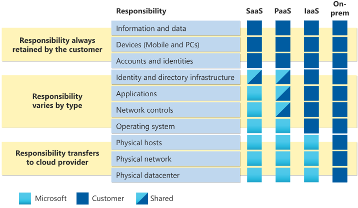

# AZ-900 Exam Cheat Sheet

This cheat sheet is based on the [Full Exam Guide July 31, 2023](https://learn.microsoft.com/en-us/certifications/resources/study-guides/az-900)

Azure training courses: https://learn.microsoft.com/en-gb/training/courses/az-900t00

Practice Assessment for Exam AZ-900 Microsoft Azure Fundamentals: https://learn.microsoft.com/en-us/certifications/exams/az-900/practice/assessment?assessment-type=practice&assessmentId=23

# Cloud concepts
## Cloud computing

### Define **cloud computing**

Cloud computing is the delivery of computing services—including servers, storage, databases, networking, software, analytics, and intelligence—over the internet (“the cloud”) to offer faster innovation, flexible resources, and economies of scale.
> https://azure.microsoft.com/en-us/resources/cloud-computing-dictionary/what-is-cloud-computing

### Describe **the shared responsibility model**
Which security tasks are handled by the cloud provider and which tasks are handled by you.

Workload responsibilities vary depending on whether the workload is hosted on Software as a Service (SaaS), Platform as a Service (PaaS), Infrastructure as a Service (IaaS), or in an on-premises datacenter.

Responsibilities you always retain:
- Data
- Endpoints
- Account
- Access management

*On-premises vs cloud:*

In the cloud-enabled approach, you are able to shift day to day security responsibilities to your cloud provider and reallocate your resources.

> https://learn.microsoft.com/en-us/azure/security/fundamentals/shared-responsibility

### Define cloud models, including public, private, and hybrid

**Public cloud:** all hardware, software, and other supporting infrastructure are owned and managed by the cloud provider. Microsoft Azure is an example of a public cloud. Benefits: *Lowers costs, no maintenance, near-unlimited scalability, high reliability.* 

**Private cloud:** cloud computing resources used exclusively by one business or organization. Services and infrastructure are always maintained on a private network and the hardware and software are dedicated solely to your organization. It may be hosted on-premises or in a colocation data center. Benefits: *More flexibility, more control, more scalability.*

**Hybrid cloud:** a type of cloud computing that combines on-premises infrastructure—or a private cloud—with a public cloud. Allows data/app movement between environments. Benefits: *Control, Flexibility, Cost-effectiveness, Ease*.

*A multi-cloud is a combination of public and private clouds.*

> https://azure.microsoft.com/en-us/resources/cloud-computing-dictionary/what-are-private-public-hybrid-clouds/

### Identify appropriate use cases for each cloud model

Public Cloud:
- Web Applications
- Software as a Service (SaaS)
- Development and Testing
- Big Data Analytics
- Content Delivery

Private Cloud:
- Data Security and Compliance
- Legacy Applications
- High-Performance Computing
- Governance or Regulatory Requirements

Hybrid Cloud:
- Cloudbursting (workloads are “spilled over” to a different cloud environment to meet capacity demands)
- High Availability and Disaster Recovery
- Regulatory Requirements

> https://www.flexera.com/blog/cloud/private-and-hybrid-clouds-9-use-cases-and-implementation-advice/
> https://cloudian.com/guides/hybrid-it/what-is-hybrid-cloud-examples-use-cases-and-challenges/

### Describe the consumption-based model

You're charged for only what you use. This model is also known as the pay-as-you-go rate.

> https://learn.microsoft.com/en-us/azure/well-architected/cost/design-price

### Compare cloud pricing models

- *Pay-as-you-go:* consumption-based.
- *Reserved Instances:* virtual machines that are pre-purchased for one or three years in a specific region.
- *Hybrid Benefit:* for organizations that own Microsoft licenses in their on-premise data centers. This is known as bring your own license (BYOL).
- *Spot Instances:* buy unused computing power at a discount of up to 90% compared to pay as you go prices.
- *Azure Dev/Test:* if you use Azure service for development and testing, you are eligible to substantial discounts.

> https://azure.microsoft.com/en-us/pricing/
> https://spot.io/resources/azure-pricing/the-complete-guide/
> https://www.c-sharpcorner.com/article/azure-pricing-models-understanding-the-different-pricing-options/

### Describe serverless

A cloud computing model offered by Azure that allows developers to build and run applications without managing or provisioning the underlying infrastructure. *Serverless Containerized Microservices, Serverless Kubernetes, Serverless Functions, Azure SQL Database serverless*

> https://azure.microsoft.com/en-us/solutions/serverless

## The benefits of using cloud services

### Describe the benefits of high availability and scalability in the cloud
**High Availability**: it’s important the resources are available when needed. High availability focuses on ensuring maximum availability, regardless of disruptions or events that may occur.

**Scalability**: the ability to adjust resources to meet demand.
- Combats peak traffic/overwhelmed systems.
- No overpaying for services. 

*Vertical Scaling*: more processing power, CPU, RAM etc. (scaling up)
*Horizontal Scaling*: deploying more resources, VMs, containers. (scaling out)

### Describe the benefits of reliability and predictability in the cloud
**Reliability**: the ability of a system to recover from failures and continue to function.

**Predictability**: *Performance predictability* focuses on predicting the resources needed to deliver a positive experience for your customers (Autoscaling, load balancing, and high availability). *Cost predictability* is focused on predicting or forecasting the cost of the cloud spend (predict future costs and adjust your resources as needed).

### Describe the benefits of security and governance in the cloud
**Governance:**
- Set templates help ensure that all your deployed resources meet corporate standards and government regulatory requirements.
- Update all your deployed resources to new standards as standards change.
- Cloud-based auditing helps flag any resource that’s out of compliance with your corporate standards and provides mitigation strategies.
- Software patches and updates may also automatically be applied, which helps with both governance and security.

**Security**:
- Patches and maintenance taken care of automatically
- Cloud providers are typically well suited to handle things like distributed denial of service (DDoS) attacks

### Describe the benefits of manageability in the cloud
**Management of the cloud**: managing your cloud resources.

- Automatically scale resource deployment based on need.
- Deploy resources based on a preconfigured template, removing the need for manual configuration.
- Monitor the health of resources and automatically replace failing resources.
- Receive automatic alerts based on configured metrics, so you’re aware of performance in real time.

**Management in the cloud**: how you’re able to manage your cloud environment and resources.

- Through a web portal.
- Using a command line interface.
- Using APIs.
- Using PowerShell.

## Cloud service types

> https://medium.com/chenjd-xyz/azure-fundamental-iaas-paas-saas-973e0c406de7

### Describe infrastructure as a service (IaaS)
Rent and manage virtual machines, storage, and networking resources, allowing them to have more control over their infrastructure without the need to invest in physical hardware.

### Describe platform as a service (PaaS)
A platform for developers to build, deploy, and manage applications over the internet.

### Describe software as a service (SaaS)
A platform that allows users to connect to and use cloud-based apps over the Internet. Common examples are email, calendaring, and office tools (such as Microsoft Office 365).

### Identify appropriate use cases for each cloud service (IaaS, PaaS, and SaaS)

**IaaS**
- Development and testing environments
- Scalable web hosting
- Data backup and recovery
- High-performance computing

**PaaS**
- Application development
- Mobile application backend
- Continuous integration and deployment

**SaaS**
- Email and collaboration
- CRM
- Project management 

> https://www.eginnovations.com/blog/saas-vs-paas-vs-iaas-examples-differences-how-to-choose/
# Azure architecture and services

## The core architectural components of Azure

### Describe Azure regions, region pairs, and sovereign regions

**Azure region**: a set of data centers deployed within a latency-defined perimeter and connected through a dedicated regional low-latency network.

**Region pair**: two Azure regions that are located in close proximity to each other, typically within the same geography or continent, but physically separated to minimize the impact of natural disasters or other localized incidents.  Azure services and resources deployed in the primary region are automatically replicated to the secondary region, creating a failover or disaster recovery capability. *Replication*

**Geography**: area of the world that contains one or more Azure Regions.

> https://learn.microsoft.com/en-us/azure/reliability/availability-zones-overview

### Describe availability zones
a physically separate data center within an Azure region, with its own power, cooling, and networking infrastructure. The purpose of Availability Zones is to protect applications and data from failures or disruptions within a single data center. *Replication*

### Describe Azure datacenters
unique physical buildings—located all over the globe—that house a group of networked computer servers.

### Describe Azure resources and resource groups

**Resources**: in Azure, a resource is an entity managed by Azure. Virtual machines, virtual networks, and storage accounts are all examples of Azure resources. *Azure Resource Manager* is the deployment and management service for Azure.

**Resource groups**: a container that holds related resources for an Azure solution. Stores metadata about the resources.

> https://learn.microsoft.com/en-us/azure/azure-resource-manager/management/manage-resource-groups-portal

### Describe subscriptions
A logical container used to provision resources in Azure. Subscription is at the level at which the customer is billed based on usage. It also provides a logical segmentation for simplifying administration.

### Describe management groups
Management groups provide a governance scope above subscriptions. You organize subscriptions into management groups. For example, you can apply policies to a management group that limits the regions available for virtual machine (VM) creation. This policy would be applied to all nested management groups, subscriptions, and resources.

### Describe the hierarchy of resource groups, subscriptions, and management groups
he highest level of these Azure architectural components is the *Management Group*. Management Groups contain one or more *subscriptions*. Inside of Subscriptions are *Resource Groups*. Resource Groups belong to exactly one Subscription. A Subscription can have many resource groups, but a resource group may belong to only one subscription. The *Resources* themselves (the Azure cloud services) can be grouped together in Resource Groups. 

> https://vegibit.com/azure-management-groups-vs-resource-groups/

## Azure compute and networking services

### Compare compute types, including containers, virtual machines, and functions
Azure compute is an on-demand computing service for running cloud-based applications

**Containers**: a virtualization environment for running applications. Doesn't include OS.
**Virtual Machines**: software emulations of physical computers. Includes OS.
**Functions**: event-driven, serverless compute platform that helps you develop more efficiently using the programming language of your choice.

> https://www.testpreptraining.com/tutorial/microsoft-azure-fundamentals-az-900/azure-compute-options/

### Describe virtual machine options, including Azure virtual machines, Azure Virtual Machine Scale Sets, availability sets, and Azure Virtual Desktop

**Azure virtual machines**:  on-demand virtualized computing resources that can be used to run various operating systems and applications (VM).
**Azure Virtual Machine Scale Sets**: create and manage a group of identical virtual machines.
**Availability sets**: group VMs together and distribute them across different fault domains and update domains within a single Azure region.
**Azure Virtual Desktop**: cloud-based virtual desktop infrastructure (VDI) service; virtualized desktops and applications that can be accessed remotely from various devices

### Describe the resources required for virtual machines
- Resource Group
- Virtual Network
- Storage Account
- Image/OS

### Describe application hosting options, including web apps, containers, and virtual machines
**Web apps**: Azure Static Web Apps is a service that automatically builds and deploys full stack web apps to Azure from a code repository. GitHub or Azure DevOps integration.
**containers**: Azure Container Instances (ACI) is a managed service that allows you to run containers directly on Azure, without having to manage any virtual machines and without having to adopt a higher-level service.
**Virtual machines**: Azure Virtual Machines provide an Infrastructure as a Service (IaaS) solution for hosting your applications on either Windows or Linux VMs in the cloud.

> https://learn.microsoft.com/en-us/azure/developer/intro/hosting-apps-on-azure

### Describe virtual networking, including the purpose of Azure virtual networks, Azure virtual subnets, peering, Azure DNS, Azure VPN Gateway, and ExpressRoute

A virtual network is similar to a traditional network that you'd operate in your own data center. An Azure Virtual Network brings with it extra benefits of Azure's infrastructure such as scale, availability, and isolation.

**Azure virtual networks**: enables many types of Azure resources, such as Azure Virtual Machines (VM), to securely communicate with each other, the internet, and on-premises networks.
**Azure virtual subnets**: enable you to segment the virtual network into one or more subnetworks and allocate a portion of the virtual network's address space to each subnet.
**Peering**: enables you to seamlessly connect two or more Virtual Networks in Azure.

- Virtual network peering: Connecting virtual networks within the same Azure region.
- Global virtual network peering: Connecting virtual networks across Azure regions.

> https://learn.microsoft.com/en-us/azure/virtual-network/virtual-network-peering-overview

**Azure DNS**: a hosting service for DNS domains that provides name resolution by using Microsoft Azure infrastructure.
**Azure VPN Gateway**: a service that uses a specific type of virtual network gateway to send encrypted traffic between an Azure virtual network and on-premises locations over the public Internet.
**ExpressRoute**: extend your on-premises networks into the Microsoft cloud over a private connection with the help of a connectivity provider.

> https://learn.microsoft.com/en-us/azure/virtual-network/virtual-networks-overview

### Define public and private endpoints
**Private Endpoint**: A private endpoint is a network interface that uses a private IP address from your virtual network. This network interface connects you privately and securely to a service that's powered by *Azure Private Link*. By enabling a private endpoint, you're bringing the service into your virtual network. E.g.: Azure Storage, Azure Cosmos DB etc.
**Public Endpoint**: enable data access to your managed instance from outside the virtual network.

## Azure storage services

### Compare Azure Storage services

**Azure Blobs**: A massively scalable object store for text and binary data. Also includes support for big data analytics through Data Lake Storage Gen2.
**Azure Files**: Managed file shares for cloud or on-premises deployments.
**Azure Elastic SAN (preview)**: A fully integrated solution that simplifies deploying, scaling, managing, and configuring a SAN in Azure.
**Azure Queues**: A messaging store for reliable messaging between application components.
**Azure Tables**: A NoSQL store for schemaless storage of structured data.
**Azure managed Disks**: Block-level storage volumes for Azure VMs.

### Describe storage tiers
**Hot Access tier**: should be used for the data frequently accessed by applications, and that is read or written very often.
**Cool Access tier**: suitable for data that is not accessed frequently by applications and is expected to be stored for a minimum of 30 days;
**Archive tier**: used to store rarely accessed or archival data. Its storage rate is the cheapest on Azure, but the data retrieval charges are the highest.

> https://www.whizlabs.com/labs/understanding-azure-blob-storage-tiers

### Describe redundancy options

Data in an Azure Storage account is always replicated three times in the primary region. Azure Storage offers two options for how your data is replicated in the primary region:

- **Locally redundant storage (LRS)**: copies your data synchronously three times within a single physical location in the primary region. LRS is the least expensive replication option, but isn't recommended for applications requiring high availability or durability.
- **Zone-redundant storage (ZRS)**: copies your data synchronously across three Azure availability zones in the primary region. For applications requiring high availability, Microsoft recommends using ZRS in the primary region, and also replicating to a secondary region.

> https://learn.microsoft.com/en-us/azure/storage/common/storage-redundancy

### Describe storage account options and storage types

| Type of storage account | Supported storage services | Redundancy options | Usage |
| ----------- | ----------- | ----------- | ----------- |
| Standard general-purpose v2 | Blob Storage (including Data Lake Storage1), Queue Storage, Table Storage, and Azure Files | Locally redundant storage (LRS) / geo-redundant storage (GRS) / read-access geo-redundant storage (RA-GRS) / Zone-redundant storage (ZRS) / geo-zone-redundant storage (GZRS) / read-access geo-zone-redundant storage (RA-GZRS)2 | Standard storage account type for blobs, file shares, queues, and tables. Recommended for most scenarios using Azure Storage. If you want support for network file system (NFS) in Azure Files, use the premium file shares account type. |
| Premium block blobs | Blob Storage (including Data Lake Storage1) | LRS, ZRS | Premium storage account type for block blobs and append blobs. Recommended for scenarios with high transaction rates or that use smaller objects or require consistently low storage latency. |
| Premium file shares | Azure Files | LRS, ZRS | Premium storage account type for file shares only. Recommended for enterprise or high-performance scale applications. Use this account type if you want a storage account that supports both Server Message Block (SMB) and NFS file shares. |
| Premium page blobs | Page blobs only | LRS | Premium storage account type for page blobs only. |

### Identify options for moving files, including AzCopy, Azure Storage Explorer, and Azure File Sync

### Describe migration options, including Azure Migrate and Azure Data Box

## Azure identity, access, and security

### Describe directory services in Azure, including Azure Active Directory (Azure AD), part of Microsoft Entra and Azure Active Directory Domain Services (Azure AD DS)

### Describe authentication methods in Azure, including single sign-on (SSO), multi-factor authentication (MFA), and passwordless

### Describe external identities in Azure, including business-to-business (B2B) and business-to-customer (B2C)

### Describe Conditional Access in Azure AD

### Describe Azure role-based access control (RBAC)

### Describe the concept of Zero Trust

### Describe the purpose of the defense-in-depth model

### Describe the purpose of Microsoft Defender for Cloud

# Azure management and governance
## Describe cost management in Azure

### Describe factors that can affect costs in Azure

### Compare the pricing calculator and the Total Cost of Ownership (TCO) Calculator

### Describe cost management capabilities in Azure

### Describe the purpose of tags

## Features and tools in Azure for governance and compliance

### Describe the purpose of Microsoft Purview in Azure

### Describe the purpose of Azure Policy

### Describe the purpose of resource locks

## Features and tools for managing and deploying Azure resources

### Describe the Azure portal

### Describe Azure Cloud Shell, including Azure Command-Line Interface (CLI) and Azure PowerShell

### Describe the purpose of Azure Arc

### Describe infrastructure as code (IaC)

### Describe Azure Resource Manager (ARM) and ARM templates

## Monitoring tools in Azure

### Describe the purpose of Azure Advisor

### Describe Azure Service Health

### Describe Azure Monitor, including Log Analytics, Azure Monitor alerts, and Application Insights
