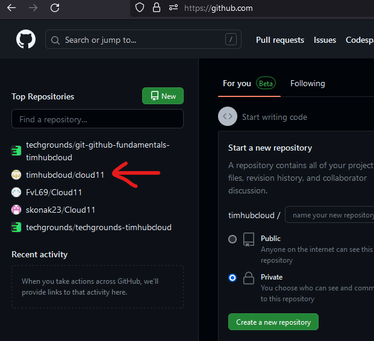
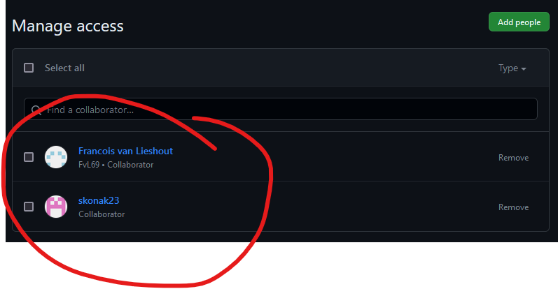
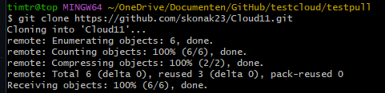
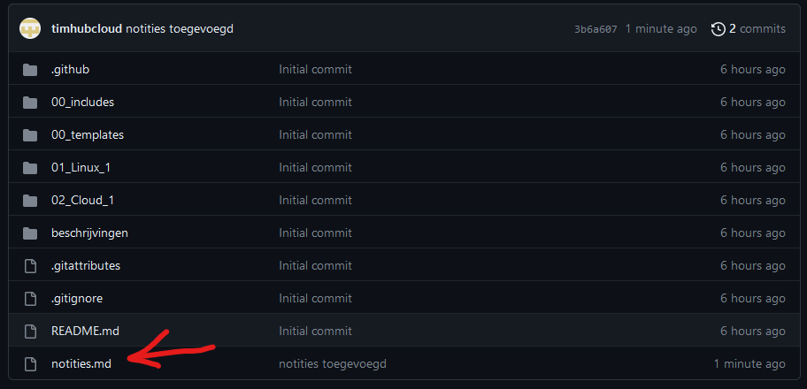

# Git en GitHub
Git is een version control system waarmee verschillende contributors paralel kunnen werken aan hetzelde project. Het systeem houdt wijzigingen van de bestanden bij waar ontwikkelaars mee werken en zorgt er zo voor dat geen conflicten ontstaan in de code.

Github is een platform voor ontwikkeleraars om samen te werken aan projecten via code repositories. Dit platform werkt met Git en is gratis maar heeft ook betaalde plannen.

## Key-terms
- **Repository**: hier vind je alle bestanden van het project en een geschiedenis van de wijzigingen.
- **Main / Master**: de main of master is de hoofdbranch waar alle veranderingen uiteindelijk in gemerged worden.
- **Branch**: een momentopname van een verzameling veranderingen.
- **Commit**: hiermee pas je alle veranderingen toe op een specifieke branch.
- **Push / Pull**: met push wordt een local repository geupload naar een remote repository. Pull doet hetzelfde maar dan in de omgekeerde richting: van remote naar local.
- **Merge**: meerdere branches kunnen hiermee worden samengevoegd in één branch.
- **Fork**: door een repository te forken maak je een nieuwe repository met dezelfde code, zonder dat dit invloed heeft op de orginele code.

## Opdrachten

### Opdracht 1
[x] Maak een GitHub account als je er nog geen hebt
[x] Maak een repository op je GitHub account voor je portfolio
[x] Geef permissies aan je teamgenoten om de repository te gebruiken
[x] Push je code naar je repository
[x] Pull / Clone een repository van je peer.

### Opdracht 2
[x] Maak een nieuwe repository aan voor je portfolio
[x] Push je notities naar de repository
[x] Deel deze repository met je Learning Coach

### Gebruikte bronnen
[An introduction to Git: what it is, and how to use it](https://www.freecodecamp.org/news/what-is-git-and-how-to-use-it-c341b049ae61/)
[GIT Push and Pull Tutorial](https://www.datacamp.com/tutorial/git-push-pull)
[Git Bash Commands](https://dev.classmethod.jp/articles/git-bash-commands/)

### Ervaren problemen
Korte tijd had een teamgenoot problemen met het gebruik van Git. Na samen troubleshooting te hebben gedaan is het hem zelf gelukt de problemen op te lossen door Git opnieuw te installeren.

### Resultaat
Account succesvol aangemaakt op Github en een repository opgezet via "Create a new repository":

Teamgenoten access gegeven via de collaborators tab:

Code gepushed naar mijn repository via Git Bash:

`$ git push -u origin main`

Vervolgens de repository van mijn teamgenoot gecloned:

Als laatste heb ik het portfolio repository opgezet in de techgrounds classroom en notities toegevoegd:

