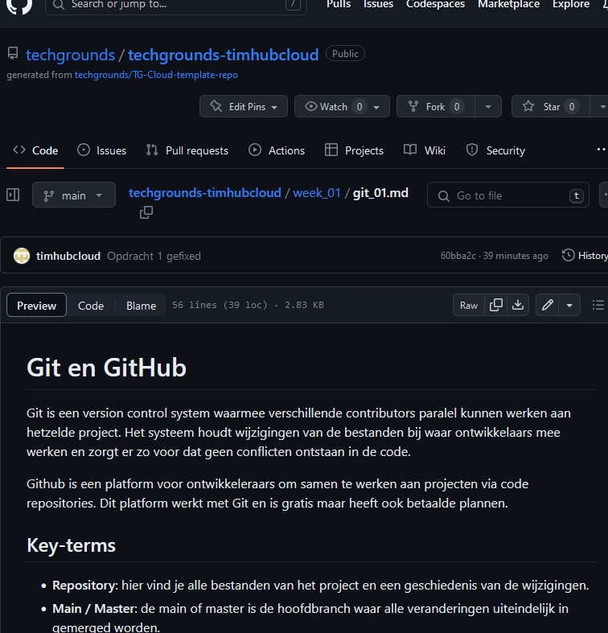

# Markdown
Markdown is een markup language die lichtgewicht en makkelijk te gebruiken is zonder een geavanceerde text editor. Door de gebruiksvriendelijke syntax is Markdown makkelijk te lezen in plaintext. Dit is bijvoorbeeld bij een markup language als HTML niet het geval.

Markdown is gebaseerd op het principe van WYSIWYM oftewel: What You See Is What You Mean. De structuur van het het document wordt hierin duidelijk aangegeven. Het is gerelateerd aan WYSIWYG oftewel: What You See Is What You Get. Hierbij zie je exact wat je te zien krijgt. Een voorbeeld hiervan is Microsoft Word.

## Key-terms
- **Markup Language**: een text-encoding system waarbij gebruikt wordt gemaakt van symbolen om de structuur van text op te zetten.
- **Headings**: syntax voor het maken van titles of section headings.
- **Code Blocks**: structuur voor het tonen van stukjes code in een gekleurde box.
- **WYSIWYG**: what you see is what you get.
- **WYSIWYM**: what you see is what you mean.

## Opdrachten

### Opdracht 1
- [x] Maak een Markdown-document met je gekozen editor. Je document moet de volgende elementen bevatten:
	- Een level 1 header
	- Een level 2 header
	- Een codeblok
	- Een bold tekst
	- Een link naar een website

### Gebruikte bronnen
- [Basic writing and formatting syntax](https://docs.github.com/en/get-started/writing-on-github/getting-started-with-writing-and-formatting-on-github/basic-writing-and-formatting-syntax)
- [Markdown Guide - Basic Syntax](https://www.markdownguide.org/basic-syntax/)
- [HTML File Paths](https://www.w3schools.com/html/html_filepaths.asp)

### Ervaren problemen
Er ontstonden problemen met afbeeldingen die niet wilden laden in de .md file omdat die zich in een folder bevonden die één level hoger zat. Ik heb mij vervolgens verder verdiept in het gebruik van relative file paths van W3Schools. Daar heb ik de juist path constructie gevonden en nu werkt alles perfect.

### Resultaat

Voor efficiëntie heb ik de voor deze opdracht benodigde elementen meteen toegepast op de voorgaande opdracht. Deze heb ik geadd:

`$ git add week_01/git_01.md`

En gepushed naar mijn repository op de techgrounds classroom:

