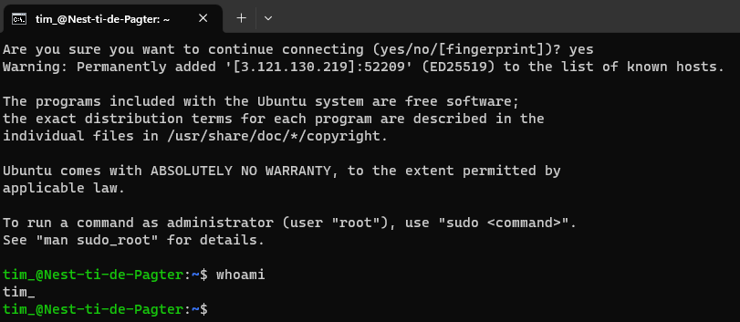

# Linux
Linux is een gratis open source operating system gebaseerd op Unix. Linux komt in meerdere varianten die distributies worden genoemd. In deze opdracht ga ik via SSH verbinding maken met een Ubuntu distributie van Linux. SSH staat voor Secure Shell en is een netwerk protocol waarmee een beveiligde verbinding kan worden opgezet met een remote system.

## Key-terms
- **SSH**: Secure Shell; zorgt voor een beveiligde verbinding met remote devices of servers.
- **CLI**: Command Line Interface; een text-based gebruikersinterface waarmee je commands geeft aan een computer.
- **GUI**: Graphical User Interface; een gebruikersinterface bestaande uit interactive visuele componenten.
- **VM**: een computer resource waar software in plaats van een fysieke computer wordt gebruikt.
- **Key File**: access credentials voor het SSH netwerk protocol.
- **whoami**: een Unix commando waarmee de username kan worden weergegeven.

## Opdrachten

### Opdracht 1
- [x] Make an SSH-connection to your virtual machine. SSH requires the key file to have specific permissions, so you might need to change those.
- [x] When the connection is successful, type whoami in the terminal. This command should show your username.

### Gebruikte bronnen
- [Get started with OpenSSH for Windows](https://learn.microsoft.com/en-us/windows-server/administration/openssh/openssh_install_firstuse?tabs=gui)
- [How to Connect to an EC2 Instance Using SSH](https://www.clickittech.com/aws/connect-ec2-instance-using-ssh/)
- [SSH](https://man.openbsd.org/ssh)

### Ervaren problemen
Tijdens het verbinden kreeg ik de volgende foutmelding:

`tim_@3.121.130.219: Permission denied (publickey).`

Na wat troubleshooting kwam ik erachter dat we allemaal een eigen SSH port hadden gekregen die ik niet had gebruikt in het SSH commando. Aangepast en de verbinding lukte zonder problemen.

### Resultaat

Inloggen was succesvol en vervolgens **whoami** ingevoerd:

