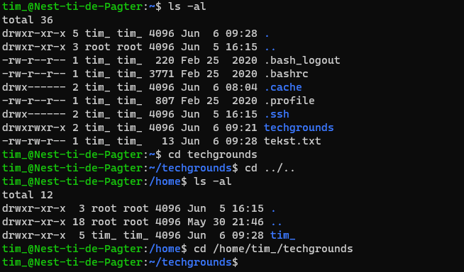

# Files and Directories
Bestanden worden in linux georganiseerd in een hierarchische structuur die we het filesystem noemen. Directories zijn de folders waar deze bestanden in worden geplaatst.

Om je te verplaatsen in dit filesystem kun je gebruik maken van relative en absolute paths. Een absolute path is het complete path vanaf de root directory. Een relative path is het path relatief gezien ten opzichte van he huidige directory.

## Key-terms
- **Filesystem**: hierarchische structuur van bestanden en folders in linux.
- **Directories**: folders voor bestanden.
- **Absolute path**: complete path vanaf de root directory.
- **Relative path**: path relatief gezien ten opzichte van het huidige directory.
- **Home directory (~)**: directory van de gebruiker en de plek waar je begint als je inlogd.
- **Hidden file (.)**: verborgen bestanden.

## Opdrachten

### Opdracht 1
- [x] Find out your current working directory.
- [x] Make a listing of all files and directories in your home directory.
- [x] Within your home directory, create a new directory named ‘techgrounds’.
- [x] Within the techgrounds directory, create a file containing some text.
- [x] Move around your directory tree using both absolute and relative paths.

### Gebruikte bronnen
- [Top 50+ Linux Commands You MUST Know](https://www.digitalocean.com/community/tutorials/linux-commands)
- [How to Quickly Create a Text File Using the Command Line in Linux](https://www.howtogeek.com/199687/how-to-quickly-create-a-text-file-using-the-command-line-in-linux/)

### Ervaren problemen
Geen problemen ervaren

### Resultaat
Working directory gevonden, bestanden en directories gelist (inclusief verborgen bestanden) en een nieuwe directory aangemaakt:

Bestand aangemaakt met **cat** en vervolgens bekeken:

Heen en weer gesprongen via zowel absolute als relative paths:

