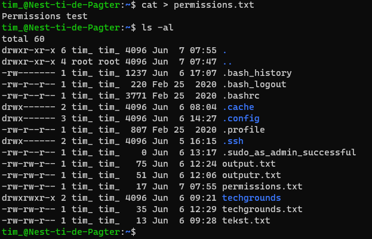
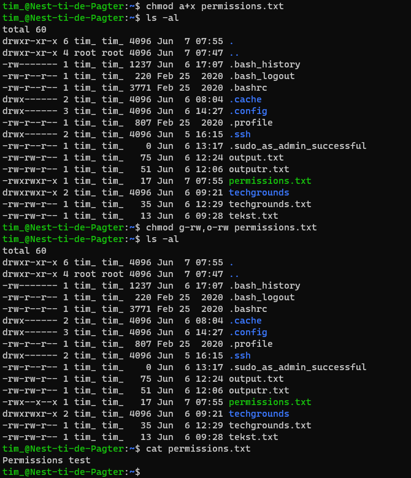
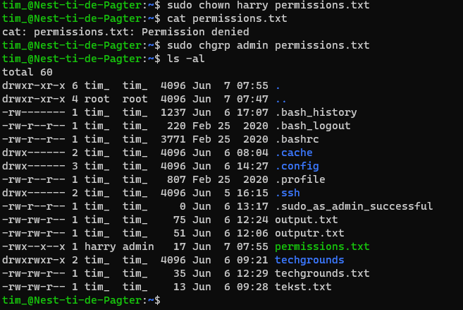

# File Permissions
Linux is een operating system die meerdere gebruikers toestaat. Het is voor de veiligheid daarom belangrijk dat deze gebruikers alleen toegang hebben tot de files en directories die ze daadwerkelijk nodig hebben.

Hiervoor heeft Linux het file permissions system dat bestaat uit permission groups en permission types die worden toegewezen aan elke file en directory. Er zijn drie permission groups: owner, group, all users. Iedere group heeft heeft vervolgens drie basic permission types: read, write, exectute. Daarnaast heeft elke file en directory een eigen owner en group.

## Key-terms
- **Read**: de gebruiker kan de files of directory bekijken.
- **Write**: de gebruiker kan files en de content van directories wijzigen en verwijderen.
- **Execute**: de gebruiker kan files uitvoeren en toegang krijgen tot directories.
- **Owner permissions**: de user account die eigenaar is van de file of directory.
- **Group permissions**: in groups kunnen gebruikers worden gezet die dezelfde rechten moeten hebben.
- **chmod**: command waarmee je de permissions van een file of directory aan kunt passen.
- **chown**: command waarmee je de eigenaar van een file of directory aan kunt passen.
- **chgrp**: command waarmee je de group van een file of directory aan kunt passen.

## Opdrachten

### Opdracht 1
- [x] Create a text file.
- [x] Make a long listing to view the file’s permissions. Who is the file’s owner and group? What kind of permissions does the file have?
- [x] Make the file executable by adding the execute permission (x).
- [x] Remove the read and write permissions (rw) from the file for the group and everyone else, but not for the owner. Can you still read it?
- [x] Change the owner of the file to a different user. If everything went well, you shouldn’t be able to read the file unless you assume root privileges with ‘sudo’.
- [x] Change the group ownership of the file to a different group.

### Gebruikte bronnen
- [Classic SysAdmin: Understanding Linux File Permissions](https://www.linuxfoundation.org/blog/blog/classic-sysadmin-understanding-linux-file-permissions)
- [An Introduction to Linux Permissions](https://www.digitalocean.com/community/tutorials/an-introduction-to-linux-permissions)
- [How to Use the chmod Command on Linux](https://www.howtogeek.com/437958/how-to-use-the-chmod-command-on-linux/)

### Ervaren problemen
Geen problemen ervaren.

### Resultaat

Permissions.txt aangemaakt met `cat` en vervolgens een lijst met permissions geprint via `ls -al`:

Permissions aangepast met `chmod`:

Owner en group van permissions.txt aangepast met `chown` en `chgrp`:

