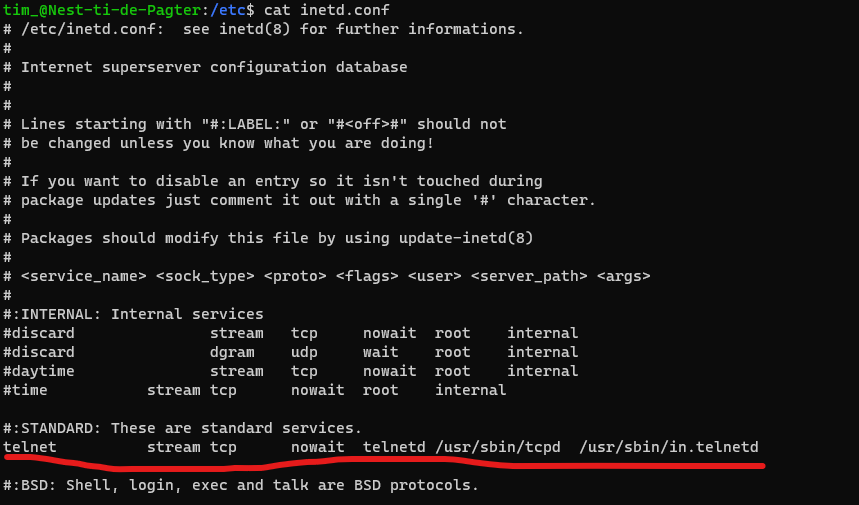
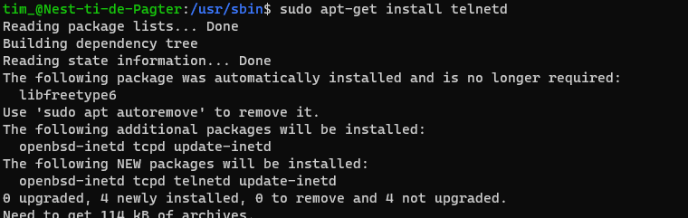
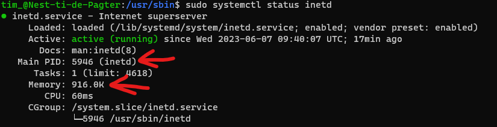
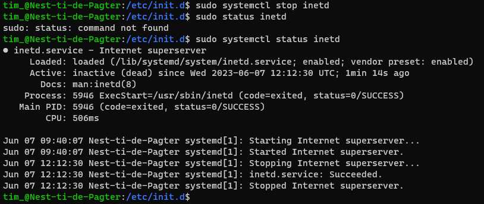

# Processen
In linux is een process een individueele instance van een programma dat op dat moment wordt uitgevoerd. Elk process krijgt van het operating system een unieke Process ID (PID) toegewezen. Via de CLI kun je in linux gemakkelijk deze processen beheren.

## Key-terms
- **Process**: een running command instance.
- **Process ID**: een unieke ID toegewezen aan een process.
- **Daemon**: een programma dat op de achtergrond wordt uitgevoerd.
- **Process States**: de status van een process. Dat kan zijn: running, sleeping, stopped of zombie.
- **ps aux**: command om alle lopende processen weer te geven.
- **kill**: command waarmee een process kan worden stop gezet.
- **inetd**: super-server daemon die o.a. telnetd serviced.

## Opdrachten

### Opdracht 1
- [x] Start the telnet daemon.
- [x] Find out the PID of the telnet daemon.
- [x] Find out how much memory telnetd is using.
- [x] Stop or kill the telnetd process.

### Gebruikte bronnen
- [Working with Processes and Services in Linux: A Beginner’s Guide](https://tecadmin.net/working-with-processes-and-services-in-linux-a-beginners-guide/)
- [https://www.makeuseof.com/linux-process-management/](https://www.makeuseof.com/linux-process-management/)
- [What is a daemon?](https://www.techtarget.com/whatis/definition/daemon)
- [telnetd Daemon](https://www.ibm.com/docs/en/aix/7.2?topic=t-telnetd-daemon)
- [inetd](https://en.wikipedia.org/wiki/Inetd)

### Ervaren problemen
Enige tijd moeten zoeken naar de locatie van de telnet daemon. Ik kwam er via documentatie achter dat het onderdeel is van **inetd**. Om dit te bevestigen `cat` uitgevoerd op inetd.conf:

### Resultaat

**telnetd** geinstalleerd:

Status van **inetd** opgehaald. Process ID was 5946 en memory 916.0K:

Process stopgezet en vervolgens de status gecontroleerd:

