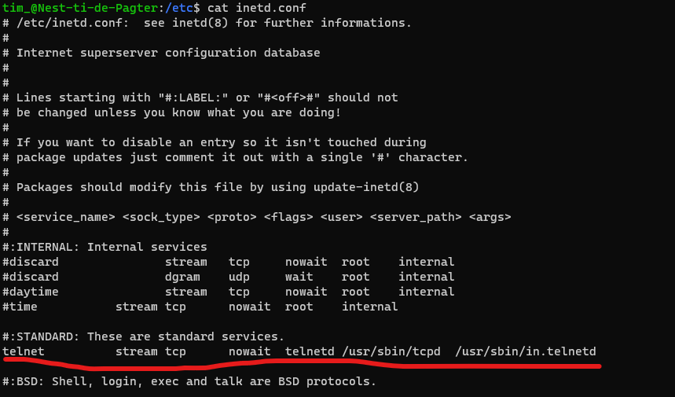
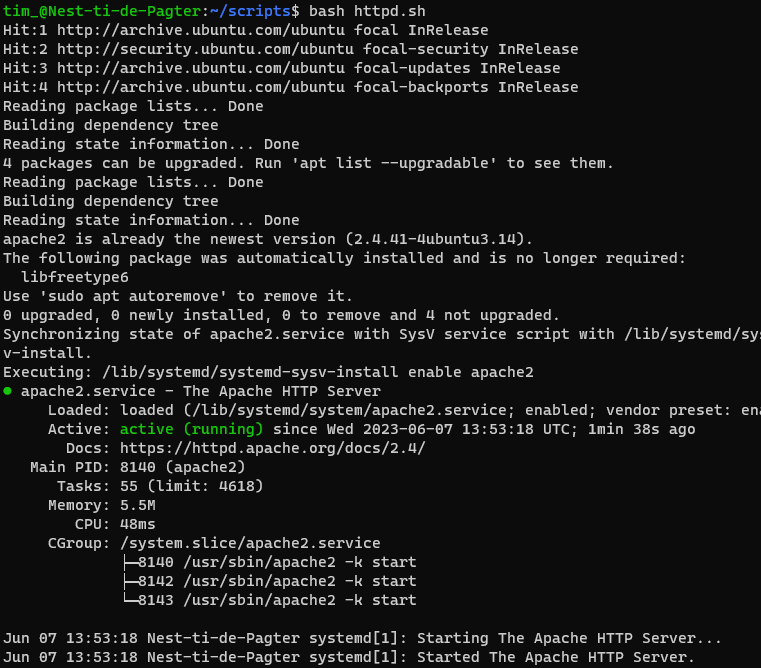
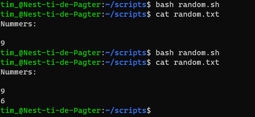

# Bash scripting
Shell scripting is een belangrijk onderdeel van process automatisering in Linux. Het is een krachtig gereedschap voor het automatiseren van o.a. herhaaldelijke taken. Bash (Bourne Again SHell) is the standaard shell van Linux.

## Key-terms
- **Shell**: een Command Line Interpreter waarmee commands kunnen worden uitgevoerd.
- **Bash**: de standaard shell van Linux
- **Variables**: via bash kun je hier data opslaan en opvragen.

## Opdrachten

### Opdracht 1
- [x] Create a directory called ‘scripts’. Place all the scripts you make in this directory.
- [x] Add the scripts directory to the PATH variable.
- [x] Create a script that appends a line of text to a text file whenever it is executed.
- [x] Create a script that installs the httpd package, activates httpd, and enables httpd. Finally, your script should print the status of httpd in the terminal.

### Opdracht 2
- [x] Create a script that generates a random number between 1 and 10, stores it in a variable, and then appends the number to a text file.

### Gebruikte bronnen
- [How to Add a Directory to PATH in Linux](https://linuxize.com/post/how-to-add-directory-to-path-in-linux/)
- [Bash Scripting Tutorial – Linux Shell Script and Command Line for Beginners](https://www.freecodecamp.org/news/bash-scripting-tutorial-linux-shell-script-and-command-line-for-beginners/#how-to-get-started-with-bash-scripting)
- [Package Management Essentials: apt, yum, dnf, pkg](https://www.digitalocean.com/community/tutorials/package-management-basics-apt-yum-dnf-pkg)
- [Generate Random Number in Bash](https://www.delftstack.com/howto/linux/random-number-generation-in-bash/)

### Ervaren problemen
Geen problemen ervaren.

### Resultaat

Scripts directory aangemaakt en toegevoegd aan de `$PATH` variable:



Eerste bash script geschreven en getest. Elke keer dat **append.sh** wordt uigevoerd komt er een regel bij in **append.txt**:

```
#!/usr/bin/bash
echo "Another line" >> append.txt
```


Bash script voor het installeren, enablen en starten van apache:

```
#!/usr/bin/bash
sudo apt update
sudo apt install apache2
sudo systemctl enable apache2
sudo systemctl start apache2
sudo systemctl status apache2
```

Screenshot hieronder laat de installatie niet zien, want die was al eerder gelukt:



Ten slotte een script die het `shuf` command gebruikt om een willekeurig getal te genereren en vervolgens toe te voegen aan random.txt:

```
#!/usr/bin/bash
random=$(shuf -i 2-9 -n1)
echo $random >> random.txt
```

