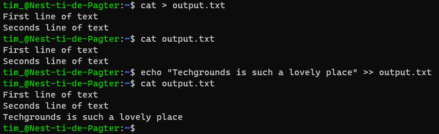
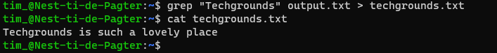

# Working with text (CLI)
Ieder Unix systeem heeft een standaard plek waar een output naar toe wordt gestuurd. We noemen dit **Standard output** of **stdout**. Ook is er **Standard Input** of **stdin**. Dit is de standaard plek waar commands luisteren voor informatie.

Via de Command Line Interface kunnen we deze standaard plekken wijzigen en bijvoorbeeld de output van een command redirecten naar een ander command of bestand. Dit noemen we redirecting input/output.

## Key-terms
- **Input/Output redirection**: het omleiden van de input/output van een command.
- **stdin**: Standard Input; de standaard plek voor input.
- **stdout**: Standard Output; de standaard plek voor output.
- **Cat**: concatenate command; combineert en schrijft bestanden.
- **Echo**: command dat een regel of string laat zien.
- **Grep**: command dat je een string laat zoeken in een bestand.

## Opdrachten

### Opdracht 1
- [x] Use the echo command and output redirection to write a new sentence into your text file using the command line. The new sentence should contain the word ‘techgrounds’.
- [x] Use a command to write the contents of your text file to the terminal. Make use of a command to filter the output so that only the sentence containing ‘techgrounds’ appears.
- [x] Read your text file with the command used in the second step, once again filtering for the word ‘techgrounds’. This time, redirect the output to a new file called ‘techgrounds.txt’.

### Gebruikte bronnen
- [Input Output Redirection in Linux/Unix Examples](https://www.guru99.com/linux-redirection.html)
- [Input/Output Redirection in the Shell](https://thoughtbot.com/blog/input-output-redirection-in-the-shell)
- [12 Useful Commands For Filtering Text for Effective File Operations in Linux](https://www.tecmint.com/linux-file-operations-commands/)

### Ervaren problemen
Klein probleem bij het gebruik van het grep command. De juiste zin verscheen niet in de terminal. Ik kwam er al snel achter dat de letters case-sensitive zijn. Probleem opgelost.

### Resultaat

Bestand **output.txt** aangemaakt met twee regels text er in. Vervolgens een mooie nieuwe regel toegevoegd met het woord "Techgrounds":

Het **grep** command gebruikt om de regel met "Techgrounds" te printen:

Idem dito maar dit keer de standerd output verwisseld naar techgrounds.txt:

