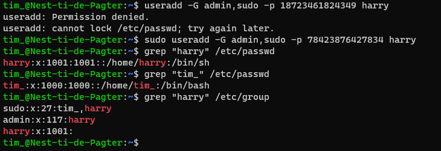
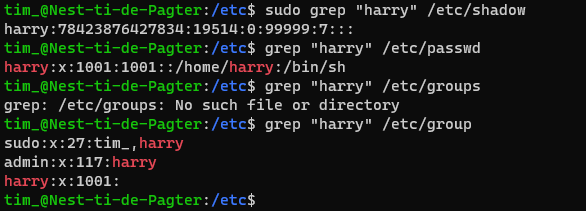

# Users and groups
User management in Linux gaat over het maken, wijzigen en beheren van user accounts en de toegang die deze accounts in het systeem hebben. De gebruikersnamen, groepen en wachtwoorden worden in Linux respectievelijk opgeslagen in /etc/passwd, /etc/group en /etc/shadow.

Voor het bekijken en wijzigen van user accounts is in sommige gevallen root access nodig. Het bestand waar wachtwoorden worden opgeslagen, /etc/shadow, is bijvoorbeeld alleen toegankelijk voor de root user, om te voorkomen dat alle gebruikers van het systeem deze wachtwoorden kunnen inzien.

## Key-terms
- **User accounts**: elke gebruiker van Linux heeft zijn eigen user account waar verschillende soorten informatie in is opgeslagen zoals settings, home directory etc.
- **User ID**: een unieke ID om een gebruiker te identificeren. Normale gebruikers krijgen IDs aangewezen vanaf 1000.
- **Username**: een naam om de gebruiker makkelijker te identificeren.
- **Superuser (sudo)**: de root user heeft speciale administratieve privileges en kan met het sudo command veranderingen aanbrengen door het hele systeem.
- **Groups**: in groups kunnen gebruikers worden gezet die dezelfde rechten moeten hebben.
- **Passwords**: gebruikers zijn met een wachtwoord beschermd voor authenticatie tijdens het inloggen.

## Opdrachten

### Opdracht 1
- [x] Create a new user in your VM. 
	- The new user should be part of an admin group.
	- The new user should have a password.
	- The new user should be able to use ‘sudo’
- [x] Locate the files that store users, passwords, and groups. See if you can find your newly created user’s data in there.

### Gebruikte bronnen
- [The Complete Guide to User Management in Linux](https://www.makeuseof.com/user-management-linux-guide/)

### Ervaren problemen
Geen problemen ervaren.

### Resultaat

Gebruiker "harry" toegevoegd, in de groepen admin en sudo geplaatst met een wachtwoord:

Grep gebruikt om "harry" vervolgens op te zoeken in /etc/passwd, /etc/group en /etc/shadow

