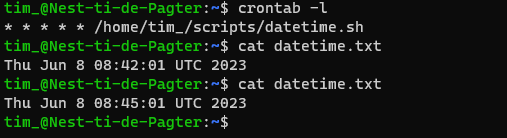
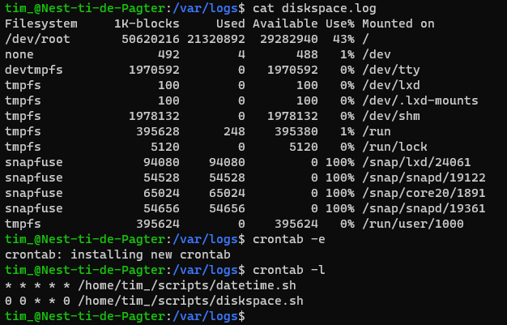

# Cron jobs
Crontab (afkorting van Cron Table) is een job scheduler in Unix die op basis van tijd commands en scripts uitvoert. Dit is handig voor het uitvoeren van o.a. repetitieve taken en periodiek onderhoud. Voorbeelden hiervan zijn: het maken van backups, software updates etc.

## Key-terms
- **Cron**: naam van het system in dat periodiek taken uitvoert.
- **Cron job**: een individueel command of script dat op een bepaalde tijd of interval wordt uitgevoerd.
- **Cron tab**: het bestand waarin de lijst met uit te voeren cron jobs staan.

## Opdrachten

### Opdracht 1
- [x] Create a Bash script that writes the current date and time to a file in your home directory.
- [x] Register the script in your crontab so that it runs every minute.
- [x] Create a script that writes available disk space to a log file in ‘/var/logs’. Use a cron job so that it runs weekly.

### Gebruikte bronnen
- [A Beginners Guide To Cron Jobs](https://ostechnix.com/a-beginners-guide-to-cron-jobs/)
- [Linux Crontab Reference Guide](https://linuxconfig.org/linux-crontab-reference-guide)
- [Check your disk space use with the Linux df command](https://www.redhat.com/sysadmin/linux-df-command)
- [Crontab Guru](https://crontab.guru)

### Ervaren problemen
Script geschreven voor het printen van tijd en datum naar datetime.txt en vervolgens toegevoegd aan crontab. De tijd werd in datetime.txt echter niet geüpdatet. Na wat troubleshouting erachter gekomen dat ik was vergeten execute permissions te geven aan het .sh bestand. Snel opgelost.

### Resultaat

Script voor het schrijven van de tijd naar datetime.txt:

```
#!/usr/bin/bash
echo $(date) > /home/tim_/datetime.txt
```

Vervolgens toegevoegd via `crontab -e`. Resultaat gecontroleerd via `cat datetime.txt`:



Script voor het schrijven van diskspace naar /var/logs/diskspace.log:

```
#!/usr/bin/bash
df > /var/logs/diskspace.log
```

En toegevoegd aan crontab; wordt elke sunday om 00:00 uitgevoerd:

