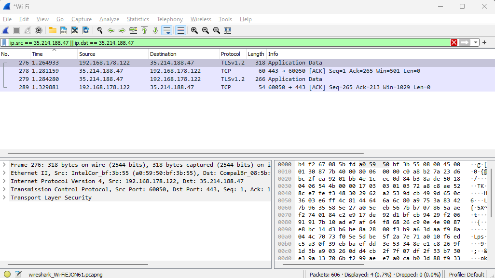

--------03---------

# Protocols
A network protocol governs the communication between network devices based on a set of rules. By having a standardized set of communication rules devices with different internal processes, structures and design are able to communicate with each other.

## Key-terms
- **Network**:  a collection of interconnected devices or nodes that communicate and share resources with each other.
- **HTTP**: Hypertext Transfer Protocol
- **SMTP**: Simple Mail Transfer Protocol
- **DHCP**: Dynamic Host Configuration Protocol
- **FTP**: File Transfer Protocol
- **Telnet**: Telecommunication Network
- **SNMP**: Simple Network Management Protocol
- **SMPP**: Short Message Peer-to-Peer Protocol
- **XDR**: External Data Representation
- **TLS**: Transport Layer Security
- **SSL**: Secure Sockets Layer
- **MIME**: Multipurpose Internet Mail Extensions
- **PPTP**: Point-to-Point Tunneling Protocol
- **SAP**: Service Advertising Protocol
- **L2TP**: Layer 2 Tunneling Protocol
- **NetBIOS**: Network Basic Input/Output System
- **TCP**: Transmission Control Protocol
- **UDP**: User Datagram Protocol
- **SPX**: Sequenced Packet Exchange
- **DCCP**: Datagram Congestion Control Protocol
- **SCTP**: Stream Control Transmission Protocol
- **IPX**: Internetwork Packet Exchange
- **AppleTalk**: AppleTalk Networking System
- **ICMP**: Internet Control Message Protocol
- **IPSec**: Internet Protocol Security
- **IGMP**: Internet Group Management Protocol
- **ARP**: Address Resolution Protocol
- **CSLIP**: Compressed Serial Line Internet Protocol
- **HDLC**: High-Level Data Link Control
- **IEEE 802.3**: Ethernet (IEEE Standard 802.3)
- **PPP**: Point-to-Point Protocol
- **X.25**: X.25 Packet Switched Network
- **SLIP**: Serial Line Internet Protocol
- **ATM**: Asynchronous Transfer Mode
- **SDLS**: Synchronous Data Link Control
- **PLIP**: Parallel Line Internet Protocol
- **PON**: Passive Optical Network
- **OTN**: Optical Transport Network
- **DSL**: Digital Subscriber Line
- **IEEE 802.11**: Wi-Fi (Wireless LAN, IEEE Standard 802.11)
- **L431**: TIA/EIA-431 (RS-449) Interface
- **TIA 449**: TIA/EIA-449 (RS-449) Interface

## Assignments

### Assignment 1
- [x] Identify several other protocols and their associated OSI layer. Name at least one for each layer.

### Assignment 2
- [x] Figure out who determines what protocols we use and what is needed to introduce your own protocol.

### Assignment 3
- [x] Look into wireshark and install this program. Try and capture a bit of your own network data. Search for a protocol you know and try to understand how it functions.

### Sources
- [List of network protocols (OSI model)](https://en.wikipedia.org/wiki/List_of_network_protocols_(OSI_model))
- [Design Your Own Protocol In Five Minutes](https://mayaposch.wordpress.com/2011/10/03/design-your-own-protocol-in-five-minutes/)
- [What Is a Network Protocol, and How Does It Work?](https://www.comptia.org/content/guides/what-is-a-network-protocol)
- [Network Protocol Design](https://www.cs.uaf.edu/courses/cs441/notes/protocols/)
- [OSI Protocols](https://www.techopedia.com/definition/24961/osi-protocols)
- [Internet Standard](https://en.wikipedia.org/wiki/Internet_Standard)
- [TLS](https://wiki.wireshark.org/TLS)


### Problems
No problems.

### Result

## Assignment 1

7. Application Layer: HTTP, SMTP, DHCP, FTP, Telnet, SNMP, SMPP
6. Presentation Layer: XDR, TLS, SSL, MIME
5. Session layer: PPTP, SAP, L2TP, NetBIOS
4. Transport Layer: Transmission Control Protocol (TCP), UDP, SPX, DCCP, SCTP
3. Network Layer: Internet Protocol (IPv4), Internet Protocol (IPv6), IPX, AppleTalk, ICMP, IPSec, IGMP
2. Data Link Layer: ARP, CSLIP, HDLC, IEEE.802.3, PPP, X-25, SLIP, ATM, SDLS, PLIP
1. Physical Layer: Bluetooth, PON, OTN, DSL, IEEE.802.11, IEEE.802.3, L431, TIA 449

## Assignment 2

The selection of which network protocols we use is a complex process shaped by many factors such as technical requirements, industry standards and the collaborative effort of various players in the networking community.

There are several organizations that try to standardize these protocols such as the Internet Engineering Task Force (IETF) and the International Organization for Standardization (ISO). Industry consortia are also very influential with regards to what protocols we use such as the Institute of Electrical and Electronics Engineers (IEEE) and the Internet Corporation for Assigned Names and Numbers (ICANN).

It is also possible to construct your own protocol. For example: to write a protocol on top of TCP only requires you to have the  ability to write your own specification that defines the data you send through the TCP socket. Anyone can write a new protocol but to get that new protocol accepted by one of the standardization organization is far more difficult.

The Internet Engineering Task Force (IETF) process to get your protocol standardized is called the Internet Standards Process and has two main steps:

1. Proposed Standard: this standard is defined as stable, has resolved known design choices, has received significant community review, and appears to enjoy enough community interest to be considered valuable.
2. Internet Standard: this standard is defined as having a high degree of technical maturity and by a generally held belief that the specified protocol or service provides significant benefit to the Internet community.

## Assignment 3

I opened an image file `https://techgrounds.nl/wp-content/uploads/2022/12/TG_01_IMG_3414-768x512.jpg` via my browser while wireshark was capturing HTTPS packets on port 443.

I then filtered the results using the techgrounds.nl IP address:

```ip.src == 35.214.188.47 || ip.dst == 35.214.188.47```



Transport Layer Security (TLS) provides security in the communication between the two hosts. The Transmission Content Protocol (TCP) provides stream based connection oriented transfer of data. ACK indicates the host acknowledges that it received the packets.