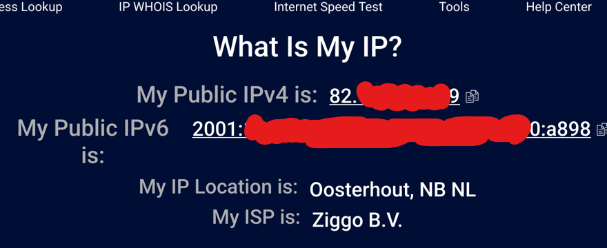

# IP addresses

IP addresses, short for Internet Protocol, are unique numerical addresses used to distinguish devices on a network, allowing them to communicate and exchange data. All devices you own that connect to your home network and the internet have an IP address.

There are two main versions of IP addresses in use today:

1. **IPv4**: this is the fourth version of the Internet Protocol. The protocol was first described in 1981 in IETF publication RFC 791. IPv4 uses 32-bit addresses for a total of 232 addresses. It is most often written in a dot-decimal notation of 4 groups of 8 bits, e.g.: 192.0.2.235

2. **IPv6**: this is the sixth and most recent version of the Internet Protocol. It was developed to deal with the long anticipated problem of IPv4 address exhaustion. This protocol uses 128-bit address and as such should increase the number of available addresses significantly. IPv6 is written in 8 groups of 16 bits, e.g.: 2001:0db8:0000:0000:0000:ff00:0042:8329

IP addresses can be either public or private.

1. **Public IP Address**: this is an address usually assigned to you by an Internet Service Provider and is globally unique. It is used to identify you on the internet and allows you to connect across different networks.

2. **Private IP Address**: this is an address used within a network and allows communication between devices on that network. They are not directly accessible through the internet. There are three IPv4 address ranges that are reserved for private use:

	1. 10.0.0.0/8 (10.0.0.0 to 10.255.255.255)
	2. 172.16.0.0/12 (172.16.0.0 to 172.31.255.255)
	3. 192.168.0.0/16 (192.168.0.0 to 192.168.255.255)

If private IP addresses are not unique and can't directly access the internet, then how can two hosts using these addresses communicate over the internet? That's where Network Address Translation (NAT) helps out. NAT is used to modify the source and/or destination addresses of packets.

Static IP Addresses are manually assigned to a device and remain constant. Dynamic IP Addresses are automatically assigned, usually by a DHCP server.

## Key-terms
- **ISP**: An Internet service provider (ISP) is an organization that provides services for accessing, using, managing, or participating in the Internet.
- **DHCP**: is a client/server protocol that automatically provides an Internet Protocol (IP) host with its IP address and other related configuration information such as the subnet mask and default gateway.

## Assignments

### Assignment 1
- [x] Ontdek wat je publieke IP adres is van je laptop en mobiel op wifi.

### Assignment 2
- [x] Zijn de adressen hetzelfde of niet? Leg uit waarom.

### Assignment 3
- [x] Ontdek wat je privé IP adres is van je laptop en mobiel op wifi.

### Assignment 4
- [x] Zijn de adressen hetzelfde of niet? Leg uit waarom.

### Assignment 5
- [x] Verander het privé IP adres van je mobiel naar dat van je laptop. Wat gebeurt er dan?

### Assignment 6
- [x] Probeer het privé IP adres van je mobiel te veranderen naar een adres buiten je netwerk. Wat gebeurt er dan?

### Sources
- [IP address](https://www.javatpoint.com/ip-address)
- [Understanding IP Address: An Introductory Guide](https://geekflare.com/understanding-ip-address/)
- [Internet Protocol versie 4](https://nl.wikipedia.org/wiki/Internet_Protocol_versie_4)
- [IPv6](https://en.wikipedia.org/wiki/IPv6)
- [Public and Private IP Addresses](https://www.scaler.com/topics/computer-network/public-and-private-ip-address/)
- [Network address translation](https://en.wikipedia.org/wiki/Network_address_translation)

### Problems
No problems.

### Result

## Assignment 1

There are several ways you can find out what you public IP address is. For this assignment I used an online IP address lookup tool for both my laptop and my tablet. (censored for privacy :-)

Laptop:

Tablet:

## Assignment 2

The IPv4 addresses for both the tablet and laptop are identical. That's because the NAT translates the unique private IP addresses that both devices have to the one public IP address that my ISP provided for accessing the internet. The IPv6 addresses are not identical since they are supposed to fix the problem of IPv4's IP address exhaustion by allowing all device to have unique addresses.

## Assignment 3

The private IPv4 address for my laptop can be found by using `ipconfig` in the CMD line:

The private IPv4 address for my tablet can be found in Wifi connection settings:

The IPv6 addresses are unique for both public and private.

## Assignment 4

Both private IPv4 and IPv6 addresses are unique as they are needed on the local network for correct communication with each other and other devices on the network.

## Assignment 5

After changing the IP address of my tablet to that of my router I started experiencing slow connection on both devices.

## Assignment 6

Changing the IP address of my tablet to a random address outside the network caused the internet to stop working entirely on that device.