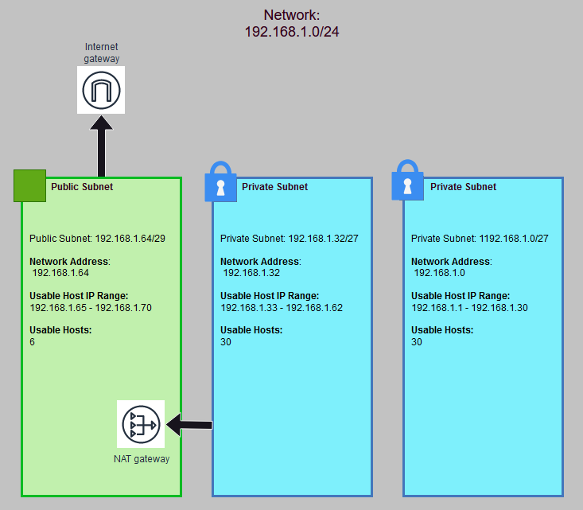

# Subnetting

Subnetting is the practice of dividing one network into two or more smaller subnetworks. There are several reasons why you would want to do this:

1. A measure to counter IPv4 exhaustion: subnetting allows you to be more efficient with IP addresses but reducing the amount of addresses that are wasted. Although the implementation of IPv6 will make this less relevant in the future.
2. Relieving network congestion: putting hosts that communicate a lot with each other in the same subnet will increase network performance.
3. Enhanced security: subnets can be isolated from each other using firewalls and routers.

Subnetting requires you to determine how many subnets need to be created and how many hosts each of these subnets has to accommodate. In order to identify which part of an IPv4 address is the network portion and which part the host portion, you can use a subnet mask using a bitmask.

Using IP address 198.51.100.0 as an example: applying a 255.255.255.0 subnet mask tells you that 198.51.100 is the network portion of the address and .0 the host portion. This can also be done using the CIDR method to express the same information in dot-decimal notation: 198.51.100.0/24. Here the /24 shows us that the first 24 bits of the IP address are the host portion and the final 8 bits the host portion.

In a subnet the first and last address are reserved for respectively the network address and the broadcasting address.

Subnets can be private or public. Private subnets do not have a public IP. In order to allow private subnets to communicate via the internet we use a NAT gateway that is located within a public subnet.

## Key-terms
- **Subnet**: a smaller network inside a bigger network.
- **LAN**: Local Area Network. A collection of devices connected together in one physical location.
- **Host**: A device that communicates with other hosts on a network.
- **Subnet Mask**: A 32-b number created by setting an IPs bits to 0 and setting network bits to 1.
- **CIDR**: Classless Inter-Domain Routing. An IP addressing model used to improve the allocation of IP addresses.
- **NAT Gateway**: A network address translation service.

## Assignments

### Assignment 1
- [x] Maak een netwerkarchitectuur die voldoet aan de volgende eisen:
	- 1 private subnet dat alleen van binnen het LAN bereikbaar is. Dit subnet moet minimaal 15 hosts kunnen plaatsen.
	- 1 private subnet dat internet toegang heeft via een NAT gateway. Dit subnet moet minimaal 30 hosts kunnen plaatsen (de 30 hosts is exclusief de NAT gateway).
	- 1 public subnet met een internet gateway. Dit subnet moet minimaal 5 hosts kunnen plaatsen (de 5 hosts is exclusief de internet gateway).

### Assignment 2
- [x] Plaats de architectuur die je hebt gemaakt inclusief een korte uitleg in de Github repository die je met de learning coach hebt gedeeld.

### Sources
- [Subnetting Tutorial Guide – What is Subnet?](https://www.dnsstuff.com/subnet-ip-subnetting-guide)
- [subnet (subnetwork)](https://www.techtarget.com/searchnetworking/definition/subnet)
- [IP Subnet Calculator](https://www.calculator.net/ip-subnet-calculator.html)
- [What is an Internet Gateway? AWS VPC Essentials](https://www.youtube.com/watch?v=u7obme-h3bc)
- [Classless Inter-Domain Routing](https://nl.wikipedia.org/wiki/Classless_Inter-Domain_Routing)
- [Subnetwork](https://en.wikipedia.org/wiki/Subnetwork)
- [Subnet Masks Reference Table](https://www.cloudaccess.net/cloud-control-panel-ccp/157-dns-management/322-subnet-masks-reference-table.html)

### Problems
No problems.

### Result

## Assignment 1

For this assignment I used the [IP Subnet Calculator](https://www.calculator.net/ip-subnet-calculator.html) and the [Subnet Masks Reference Table](https://www.cloudaccess.net/cloud-control-panel-ccp/157-dns-management/322-subnet-masks-reference-table.html) to determine per subnet what the optimal number of hosts would be:

- Private subnet 1: the smallest subnet that would fit 15 hosts would be /27 for a total of 30 available hosts. /28 has 16 addresses but 2 IPs are reserved for the network and broadcasting addresses.

- Private subnet 2: the smallest subnet that would fit 30 hosts would be /27 for a total of 30 available hosts. Even though the assignment states that the 30 hosts do not include the NAT gateway, the latter has to be placed in a public network to function and thus has no effect on the number of hosts in this private subnet.

- Public subnet 3: the smallest subnet that would fit 5 hosts would be /29 for a total of 6 available hosts. This includes the IP for the NAT gateway.

Here is some additional information per subnet from the subnet calculator:

private subnet 1: 15 hosts

| | Value|
|---|---|
|IP Address|192.168.1.0|
|Network Address|192.168.1.0|
|Usable Host IP Range|192.168.1.1 - 192.168.1.30|
|Broadcast Address|192.168.1.31|
|Total Number of Hosts|32|
|Number of Usable Hosts|30|
|Subnet Mask|255.255.255.224|
|Wildcard Mask|0.0.0.31|
|Binary Subnet Mask|11111111.11111111.11111111.11100000|
|IP Class|C|
|CIDR Notation|/27|

private subnet 2: 30 hosts

| | Value|
|---|---|
|IP Address|192.168.1.32|
|Network Address|192.168.1.32|
|Usable Host IP Range|192.168.1.33 - 192.168.1.62|
|Broadcast Address|192.168.1.63|
|Total Number of Hosts|32|
|Number of Usable Hosts|30|
|Subnet Mask|255.255.255.224|
|Wildcard Mask|0.0.0.31|
|Binary Subnet Mask|11111111.11111111.11111111.11100000|
|IP Class|C|
|CIDR Notation|/27|

public subnet 3: 5 hosts + NAT gateway

| | Value|
|---|---|
|IP Address|192.168.1.64|
|Network Address|192.168.1.64|
|Usable Host IP Range|192.168.1.65 - 192.168.1.70|
|Broadcast Address|192.168.1.71|
|Total Number of Hosts|8|
|Number of Usable Hosts|6|
|Subnet Mask|255.255.255.248|
|Wildcard Mask|0.0.0.7|
|Binary Subnet Mask|11111111.11111111.11111111.11111000|
|IP Class|C|
|CIDR Notation|/29|

## Assignment 2

