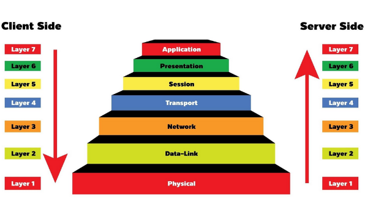
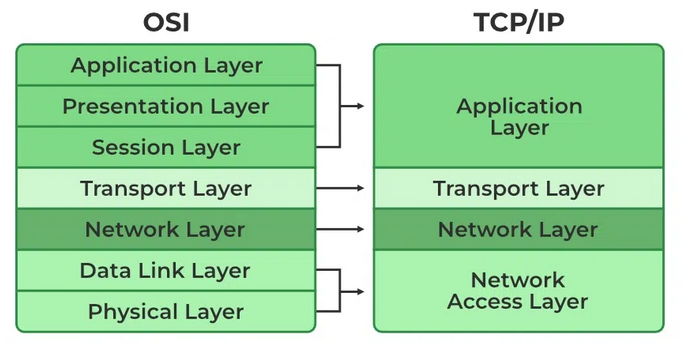
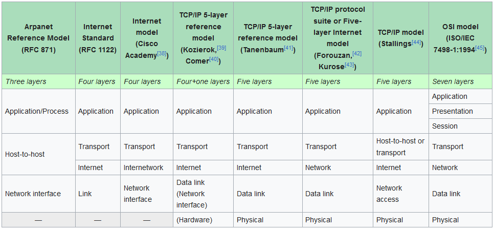

# OSI Stack
The OSI Model is a logical and conceptual model that defines network communication used by systems open to interconnection and communication with other systems. TCP/IP helps you to determine how a specific computer should be connected to the internet and how you can transmit data between them.

## Key-terms
- **Protocol**: a set of rules that determine how data is transmitted between different devices.
- **Protocol stack (network stack)**: a group of concurrently running protocols that are part of the same protocol family or suite.
- **Encapsulation**: the attaching of new information as it passes down the layers in the source device.
- **De-encapsulation**: the removal of the encapsulated data as it moves up the layers in the destination device.
- **Adjacent-layer interaction**: interaction between layers adjacent to each other, e.g.: encapsulation and de-encapsulation
- **Same-layer interaction**: interaction between the two systems on the same layer. This is used for things like: identifying communication partners and synchronizing communications.
- **Protocol Data Units (PDU)**: these are the data units created by the level 2 to level 7 layers of the OSI stack. These are: data, segment, packet and frame.

## Assignments

### Assignment 1
- [x] Study the OSI model and its uses.

### Assignment 2
- [x] Study the TCP/IP model and its uses.

### Sources
- [OSI model](https://en.wikipedia.org/wiki/OSI_model)
- [TCP/IP Protocol Architecture Model](https://docs.oracle.com/cd/E19683-01/806-4075/ipov-10/index.html)
- [Free CCNA | OSI Model & TCP/IP Suite | Day 3 | CCNA 200-301 Complete Course](https://www.youtube.com/watch?v=t-ai8JzhHuY)
- [Difference between encapsulation and decapsulation](https://www.geeksforgeeks.org/difference-between-encapsulation-and-decapsulation/)
- [TCP/IP vs OSI Model – Difference Between Them](https://www.guru99.com/difference-tcp-ip-vs-osi-model.html)

### Problems
No problems.

### Result

- OSI Model

Networking models describe the design and architecture of how different components and protocols interact within a network. If the components within a network all used a different set of protocols, they would have a hard time communicating with each other. The OSI Model is one of several efforts to try and standardize communications.

OSI stands for Open Systems Interconnection and the model was developed by the International Organization for Standardization (ISO) in the 1970s to support the emergence of various computer networking methods that were competing for application in the large national networking efforts in the world.

The OSI model divides network functions into 7 different layers:

- 7. Application Layer: interacts with software applications like Firefox, Chrome etc.
- 6. Presentation Layer: translates data between application and network formats. E.g.: encryption and decryption of data.
- 5. Session: controls sessions between hosts.
- 4. Segments and reassembles data for communications between end hosts and provides host-to-host communication. A L4 header is also added to the data. This data is referred to as a segment.
- 3. Provides connectivity between end hosts on different networks and path selection between source and destination. A L3 header is also added to the data. This data is referred to as a packet.
- 2. Provides node-to-node connectivity and data transfer (PC to switch, router to router etc.) A L2 header and L2 trailer is also added to the data. This data is referred to as a frame.
- 1. Defines physical characteristics, e.g.: voltage level, cable specifications.

Application developers usually work with layers 5-7, whereas network engineers focus more on layers 2-4.

As data moves through the OSI stack from one system to the other each layer will add something in a process called encapsulation and then remove it again, which we call de-encapsulation.

The OSI model however is no longer in use in modern networks.

- TCP/IP Model

The TCP/IP model or TCP/IP suite is another set of communications protocols that is currently being used in the internet and other networks. The name (Transmission Control Protocol/Internet Protocol) comes from the two foundational protocols used in this model. It was developed in the 70s by the United States Department of Defence via DARPA (Defense Advanced Research Project Agency).

The TCP/IP model is similar to the OSI model but with fewer layers:

The TCP/IP model does not concern itself with strict hierarchical encapsulation and layering, but it does recognize four broad layers of functionality derived from the operating scope of their contained protocols:

- The Internet application layer maps to the OSI application layer, presentation layer, and most of the session layer.
- The TCP/IP transport layer maps to the graceful close function of the OSI session layer as well as the OSI transport layer.
- The internet layer performs functions as those in a subset of the OSI network layer.
- The link layer corresponds to the OSI data link layer and may include similar functions as the physical layer, as well as some protocols of the OSI's network layer.

It is important to note that the TCP/IP suite evolved through research and development funded over a period of time. As a result, thanks to parallel research and commercial interests, the specifics of protocol components and their layering changed:

