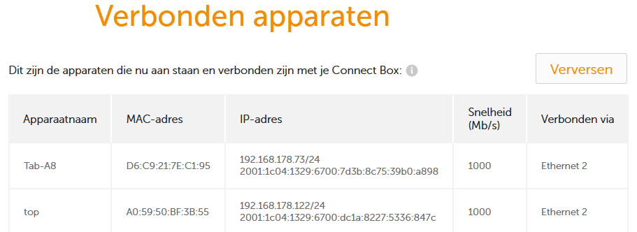
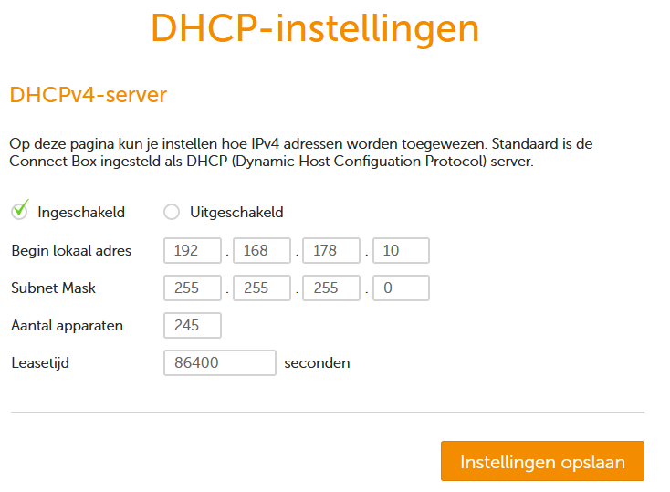

# Network Devices
Network devices are components that facilitate communications between different devices on the network. These can be physical or virtual. The size of the network indicates how many of these devices are required for a well functioning network. A home network for example may only need 2 network devices whilst an enterprise network may require hundreds.

Network devices operate in different layers of the OSI model. Some devices can operate in multiple different layers:

1. Physical: Gateway, Hub, Modem, Repeater, Cables
2. Data-link: Access Point, Bridge, Gateway, Modem, Switch
3. Network: Gateway, Router
4. Transport: Gateway, Firewall
5. Session: Gateway
6. Presentation: Gateway
7. Application: Gateway

## Key-terms
- **Network**:  a collection of interconnected devices or nodes that communicate and share resources with each other.
- **Network Device**: hardware or software components that enable communication and connectivity between different devices in a computer network.
- **LAN**: Local Area Network; a computer network that shares a small geographic area, usually within a building.

## Assignments

### Assignment 1
- [x] Benoem en beschrijf de functies van veel voorkomend netwerkapparatuur.

### Assignment 2
- [x] De meeste routers hebben een overzicht van alle verbonden apparaten, vind deze lijst. Welke andere informatie heeft de router over aangesloten apparatuur?

### Assignment 3
- [x] Waar staat je DHCP server op jouw netwerk? Wat zijn de configuraties hiervan?

### Sources
- [Network Devices Explained](https://blog.netwrix.com/2019/01/08/network-devices-explained/)
- [DHCP on Home Networks](https://stevessmarthomeguide.com/understanding-dhcp-home-networks/)
- [The Most Common Types of Network Devices](https://www.lepide.com/blog/the-most-common-types-of-network-devices/)
- [Devices used in each layer of TCP/IP model](https://www.geeksforgeeks.org/devices-used-in-each-layer-of-tcp-ip-model/)
- [An introduction to 8 types of network devices](https://www.techtarget.com/searchnetworking/tip/An-introduction-to-8-types-of-network-devices)
- [Network+/Standards/OSI Model/OSI Components](https://en.wikiversity.org/wiki/Network%2B/Standards/OSI_Model/OSI_Components)

### Problems
No problems.

### Result

## Assignment 1

- **Hub**: a physical device that is used in a LAN to connect multiple devices together. Hubs must be connected to a router or switch in order to communicate outside the LAN. Hubs can also be connected to each other to expand the network. A hub does not use MAC or IP address to guide data to a destination device. Instead it broadcasts this data to all the devices that are connected to the hub. For this reason hubs are mostly obsolete in modern networks and have been replaced by switches.

- **Switch**: an intelligent multiport network device used to improve network efficiency and communication between other network devices. It uses devices MAC addresses, which it stores in an address table, to forward packets to the appropriate device. Unlike a hub, which shares bandwidth among all its ports, a switch allocates bandwidth for each port.

- **Router**: directs data requests from one network to another. Routers are even more intelligent than hubs and switches because they store information about other connected network devices. They can also prove various other functions like packet-filtering firewalls, filtering authorized traffic and to create subnets.

- **Modem**: a piece of hardware used to modulate and demodulate signals or to convert signals between devices (hence it's name MOdulate, DEModulate). The most common type of modem is an Internet Modem which typically connects to a router, which then sends the internet traffic to other devices on the network.

- **Repeater**: simple network device that strengthens a signal and resends it to its destination. It can be used to increase the range of a network.

- **Access Point**: a device that sends and receives data wirelessly over radio frequencies. It provides a similar function to a router but also allows devices like laptops or smartphones to connect wirelessly to the network. It is usually connect via ethernet cable to a router or switch.

- **Bridge**: this device can connect two or more LANs together. While a router would consider two different LANs as separate systems, a bridge essentially creates a single domain for these systems. Bridges also have the ability to filter data packets (frames). They are slowly being replaced by switches as they provide better functionality.

- **Gateway**: allows networks or systems that use different technologies to work together. It for example allows data flow between OSI and TCP/IP environments. It acts like a router but with a protocol translation function.

## Assignment 2

List of connected devices in my home network:

The list contains information about the device name, MAC-Addresss, IP Address, connection speed and the type of connection.

## Assignment 3

The DHCP on my network is located in the ziggo connectbox:

