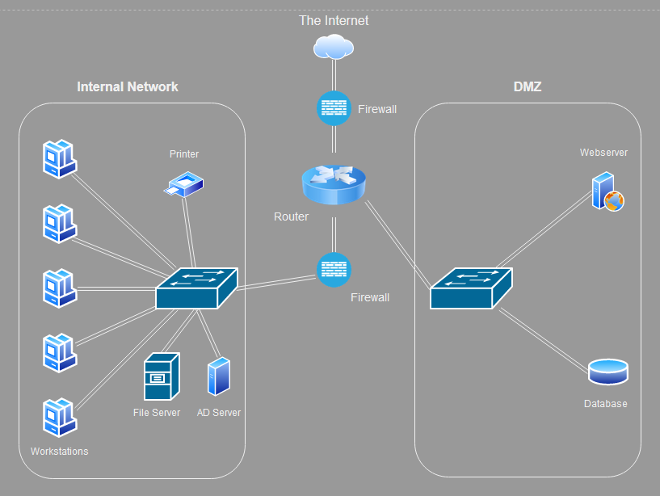

# Networking case study

Network of a small e-commerce company:

- A web server where our webshop is hosted
- A database with login credentials for users on the webshop
- 5 workstations for the office workers
- A printer
- An AD server
- A file server containing internal documents

Note: network security is extremely important.

## Key-terms
- **Network Topology**: how we describe the arrangement of nodes, like routers or switches, in a network diagram.
- **DMZ**: DeMilitarized Zone network: a subnet that creates and extra layer of security.
- **AD Server**:  a network service provided by Microsoft that acts as a centralized database and authentication mechanism for managing and organizing a Windows domain network.

## Assignments

### Assignment 1
- [x] Design a network architecture for the above use case.

### Assignment 2
- [x] Explain your design decisions.

### Sources
- [A Small Business Guide to Creating Network Diagrams](https://www.fool.com/the-ascent/small-business/it-management/articles/network-diagram/)
- [Network Topology: 6 Network Topologies Explained & Compared](https://www.comparitech.com/net-admin/network-topologies-advantages-disadvantages/)
- [DMZ Network: What Is a DMZ & How Does It Work?](https://www.okta.com/identity-101/dmz/)
- [DMZ Networks](https://www.fortinet.com/resources/cyberglossary/what-is-dmz)

### Problems
Originally I thought the AD server was an advertisement server since the case study was about an e-commerce company. I therefore placed it in the DMZ subnet. Found out later it was actually referencing an Active Directory server so I changed the location of the server to the LAN and fixed the name.

### Result

## Assignment 1

E-commerce company Case Study diagram made with [draw.io](https://app.diagrams.net/):

## Assignment 2

For the network topology I decided to use Star Topology, since it is only a small company with 5 workstations and a few other devices inside the internal network. This makes it easy to add new nodes, administer and makes for efficient use of cables.

Security is extremely important for this company, so it is important to separate the webserver and database server from the rest of the companies' internal network by putting these services in a DMZ. A DMZ network provides a buffer between the internet and the companies' sensitive files and system.

Benefits of using a DMZ include:

1. Enabling access control.
2. Preventing network reconnaissance.
3. Blocking IP spoofing.

To accomplish this in the Case Study diagram I linked the DMZ subnet to the router via a switch and placed 2 firewalls, one between the router and the internet and another between the router and the internal network.