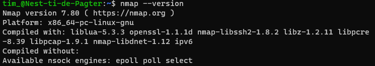
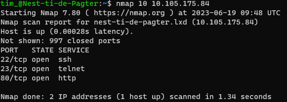
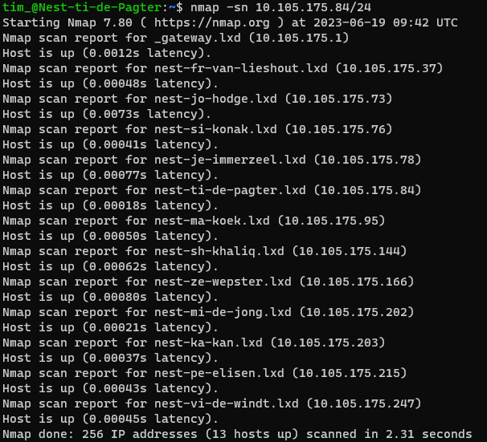
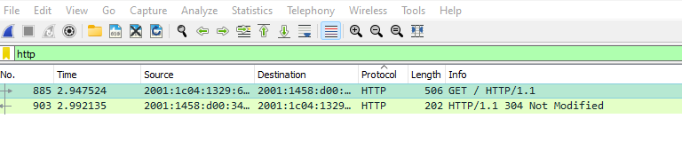
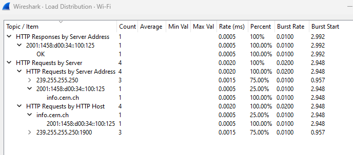

# Network detection

In order to better secure a network its important to understand the relationships, connections and interactions within a network. There are several tools we can use to achieve this, two common ones being Wireshark and Nmap.

**Wireshark** is one of the most popular packet capture tools used by IT professionals today. It presents captured packet data in as much detail as possible. IT professionals can use this tool to accomplish a variety of tasks:

- Network administrators use it to troubleshoot network problems.
- Network security engineers use it to examine security problems.
- QA engineers use it to verify network applications.
- Developers use it to debug protocol implementations.
- People use it to learn network protocol internals.

Its features range from live packet capture to displaying packets with detailed filtered protocol information to the creation of various statistics and is available for UNIX and Windows.

**Nmap** is a free and open-source utility for network discovery and security auditing. Some of its main features are:

- Host discovery.
- Portability.
- Port scanning.
- Services and version detection.
- Ease of use.
- OS Identification.
- Output and reporting.
- Well documented.

Whilst both fall under the same category as network troubleshooters, they differ in the toolset they provide to accomplish this. Network is more akin to a network scanner and falls more under the network scanning umbrella of troubleshooting. Wireshark is more apt at analyzing network packets.

Troubleshooting a network problem could be done using only one or the other tool, or by using both tools in conjunction. Nmap uses targeted scanning whereas Wireshark uses more generic scanning.

## Key-terms
- **NMAP**: Network Mapper. An open-source network scanning and reconnaissance tool.
- **Wireshark**: popular open-source network tool that allows you to capture and analyze network traffic in real-time.
- **Network troubleshooting**: the systematic identification, localization and resolving of various network problems.
- **Port**: a logical construct used to identify specific processes or services on a networked device.

## Assignments

### Assignment 1
- [x] Scan the network of your Linux machine using nmap. What do you find?

### Assignment 2
- [x] Open Wireshark in Windows/MacOS Machine. Analyse what happens when you open an internet browser. (Tip: you will find that Zoom is constantly sending packets over the network. You can either turn off Zoom for a minute, or look for the packets sent by the browser between the packets sent by Zoom.)

### Sources
- [Wireshark User’s Guide](https://www.wireshark.org/docs/wsug_html_chunked/)
- [Nmap](https://nmap.org/)
- [How to Use Nmap: Commands and Tutorial Guide](https://www.varonis.com/blog/nmap-commands)
- [What Is Wireshark and How Is It Used?](https://www.comptia.org/content/articles/what-is-wireshark-and-how-to-use-it)
- [Nmap vs Wireshark](https://www.educba.com/nmap-vs-wireshark/)
- [Top 16 Nmap Commands to Scan Remote Hosts - Tutorial Guide](https://securitytrails.com/blog/nmap-commands)

### Problems
No problems.

### Result

## Assignment 1

First we need to install nmap on linux:

```sudo apt-get install nmap```

Then we can do a quick `nmap --version` check to see if it installed correctly:



To find the IP we use `ip addr` to get `10.105.175.84/24`. We can then use the basic nmap scan using `nmap 10.105.175.84`:



This gives us information on host status, latency, closed ports and open ports.

We can also have nmap do a host scan of all systems on `10.105.175.84/24` by using `nmap -sn 10.105.175.84/24`:



Here we can see the containers of our fellow students.

## Assignment 2

Using Firefox we can visit the first website that went live on august 6, 1991: http://info.cern.ch/. We can filter out the packets in Wireshark using the `HTTP` display filter:



Here we can see the GET request the browser sends to the website and the HTTP 304 response. We can also have a look at the load distribution via Statistics->HTTP->Load Distribution:

