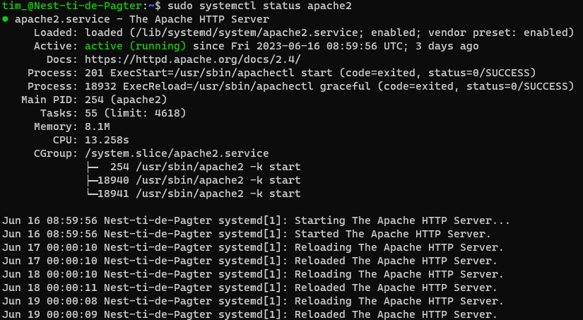
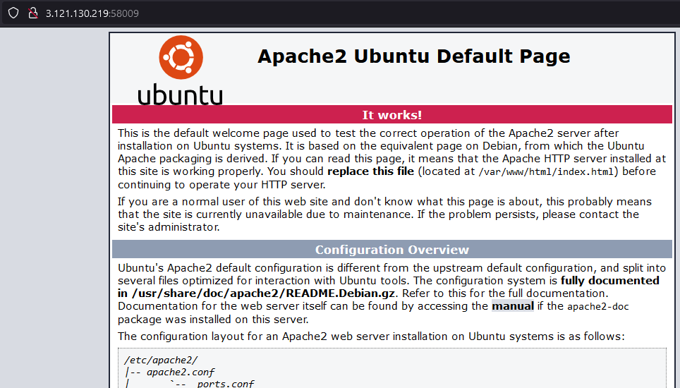
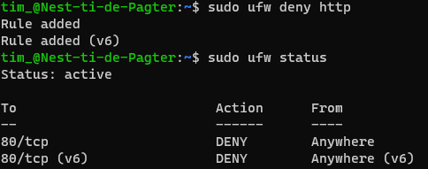
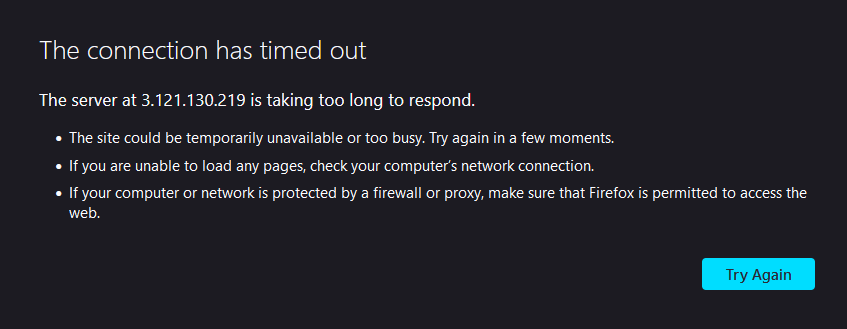

# Firewalls
The internet can be a dangerous place. It houses many less than savory individuals who will try and gain access to systems to which they really shouldn't have access. In order to combat these kinds of unwanted intrusions into a network firewalls were invented.

The word firewall originally meant to contain a fire within the walls of two adjacent buildings. The term was adopted into network technology in the late 80s. A firewall in this context refers to a network security system that monitors and controls network traffic based on a set of security rules.

Firewalls can be found working on five layers of the OSI model, though most only run on four: the application, transport, network and data-link layers.

We distinguish between stateless and stateful firewalls:

- Stateless Firewall

	This type of firewall looks at data packets in isolation deciding what to do based on the packet header alone. It is less complex than a stateful firewall and provides more basic functionality but it is also less resource heavy.

- Stateful Firewall

	This type of firewall also looks at information regarding the session: IP destinations, ports, sequence numbers etc. and as such is much more context aware. It is more complex than a stateless firewall and allows for more features such as NAT, intrusion detection and prevention and application layer inspection. It does however also consume more resources to run.

Firewalls can be either hardware or software:

- Hardware Firewalls

	A hardware firewall is a physical device that is usually placed between an internal and an external network. These are dedicated devices that can operate independent of the operating status of the computers or servers it is protecting. They tend to be used in large scale network deployments.

- Software Firewalls

	A software firewall is an application that runs on a computer or server and provides firewall functionality with the operating system. These are more flexible than hardware firewalls and can provide application level filtering.

## Key-terms
- **Stateful Firewall**: simple packet filter firewall. Does not consider packet context.
- **Stateless Firewall**: more advanced packet inspection. Considers packet context.
- **Hardware Firewall**: Physical device.
- **Software Firewall**: Runs as an application.

## Assignments

### Assignment 1
- [x] Installeer een webserver op je VM.

### Assignment 2
- [x] Bekijk de standaardpagina die met de webserver geïnstalleerd is.

### Assignment 3
- [x] Stel de firewall zo in dat je webverkeer blokkeert, maar wel ssh-verkeer toelaat.

### Assignment 3
- [x] Controleer of de firewall zijn werk doet.

### Sources
- [UFW Essentials: Common Firewall Rules and Commands](https://www.digitalocean.com/community/tutorials/ufw-essentials-common-firewall-rules-and-commands)
- [A Beginners Guide to Linux firewall](https://www.safe.security/assets/img/research-paper/pdf/A%20Beginners%20Guide%20to%20Linux%20firewall.pdf)
- [Firewalls: Stateless vs. Stateful](https://www.baeldung.com/cs/firewalls-stateless-vs-stateful)
- [A Complete Guide to Firewall: How to Build A Secure Networking System](https://www.softwaretestinghelp.com/firewall-security/)
- [Firewall (Computing)](https://en.wikipedia.org/wiki/Firewall_(computing))
- [Hardware vs. Software Firewalls: A Guide for SMBs in 2022](https://www.trustradius.com/buyer-blog/hardware-vs-software-firewalls)
- [Why You Need Both a Hardware and Software Firewall](https://www.securitymetrics.com/blog/why-you-need-both-hardware-and-software-firewall)
- [Enable firewall on server without SSH disconnect](http://www.beginninglinux.com/home/server-administration/firewall/enable-firewall-on-server-without-ssh-disconnect)

### Problems
I forgot to set the default policy of UFW to allow, which caused my SSH connection to fail. Next time I should use

```sudo ufw default allow```

before using

```sudo ufw enable```

### Result

## Assignment 1

The appache2 server was already installed for a previous assignment. Using `sudo systemctl status apache2` we can check if the server is still up and running:



## Assignment 2

We can put the IP address + port number in the web brower to have a look at the Apache2 Ubuntu Default Page:



## Assignment 3

Our current distribution of ubuntu already has both UFW and iptables installed. For simplicity we will use UFW to try and block http traffic. To accomplish this we will need to block http traffic using the following UFW command:

```sudo ufw deny http```

To check if the rule was set correctly we can use `sudo ufw status`:



## Assignment 4

Refreshing the default apache2 page now gives a time-out:

