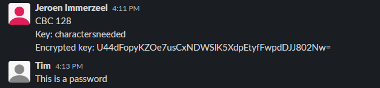

# Symmetric encryption
Keeping our data private is an important subject in the field of IT. One of the ways we can accomplish this is by encrypting this data. Encryption is the process of converting readable data into a scrambled version that can only be unscrambled by people that know the decryption algorithm or cipher.

There are two main cryptographic techniques used today: symmetric and asymmetric encryption:

1. **Symmetric encryption** uses a single shared key to both encrypt and decrypt data. This technique is efficient and simpler than asymmetric encryption, but the requirement to exchange keys can make it less secure.

2. **Asymmetric encryption** uses a pair of mathematically linked keys (a private and public key) to encrypt and decrypt data. The public key can be shared freely as it is only used to encrypt data. The private key never has to be shared and is used to decrypt the data. This is more secure, but less efficient than symmetric encryption due to the more complex calculations that have to be made.

To solve the problem of key sharing for symmetric encryption and lower efficiency for asymmetric encryption we can combine both methods. We can use the symmetric technique to encrypt a large amount of data and then use the asymmetric technique to encrypt the symmetric key for save key sharing.

## Key-terms
- **Encryption**: converting plaintext or readable data into an encoded for using an encryption algorithm.
- **Decryption**:  reverse process of encryption, which involves converting ciphertext back into plaintext using a decryption algorithm and a secret key.
- **Asymmetric**: using a pair of mathematically related keys: a public key and a private key.
- **Symmetric**: using a single shared secret key for both the encryption and decryption processes.
- **Key**: secret value used in conjunction with a cipher to encrypt and decrypt data.

## Assignments

### Assignment 1
- [x] Find one more historic cipher besides the Caesar cipher.

### Assignment 2
- [x] Find two digital ciphers that are being used today.

### Assignment 3
- [x] Send a symmetrically encrypted message to one of your peers via the public Slack channel. They should be able to decrypt the message using a key you share with them. Try to think of a way to share this encryption key without revealing it to everyone. You are not allowed to use any private messages or other communication channels besides the public Slack channel. Analyse the shortcomings of symmetric encryption for sending messages.

### Sources
- [What Is Encryption](https://www.cisco.com/c/en/us/products/security/encryption-explained.html)
- [Protecting your data](https://www.ibm.com/topics/encryption)
- [Cipher](https://en.wikipedia.org/wiki/Cipher)
- [Ciphers](http://practicalcryptography.com/ciphers/)
- [Real Life Applications of CRYPTOGRAPHY](https://medium.com/@prashanthreddyt1234/real-life-applications-of-cryptography-162ddf2e917d)
- [Online AES Encryption and Decryption Tool](https://www.javainuse.com/aesgenerator)
- [How to Share a Key in Symmetric Cryptography?](https://www.baeldung.com/cs/symmetric-cryptography)
- [Auto Key Cipher](http://practicalcryptography.com/ciphers/classical-era/autokey/)
- [RSA (cryptosystem)](https://en.wikipedia.org/wiki/RSA_(cryptosystem))
- [Online RSA Encryption, Decryption And Key Generator Tool](https://www.javainuse.com/rsagenerator)

### Problems
No problems.

### Result

## Assignment 1

In 1586 Blaise de Vigenere invented the Autokey Cipher which is a more secure version of his earlier Vigenere cipher.

Lets try and use this algorithm to encrypt and then decrypt the message: `All people seem to need data processing`

The autokey cipher uses the following tableau:

```
    A B C D E F G H I J K L M N O P Q R S T U V W X Y Z
    ---------------------------------------------------
A   A B C D E F G H I J K L M N O P Q R S T U V W X Y Z
B   B C D E F G H I J K L M N O P Q R S T U V W X Y Z A
C   C D E F G H I J K L M N O P Q R S T U V W X Y Z A B
D   D E F G H I J K L M N O P Q R S T U V W X Y Z A B C
E   E F G H I J K L M N O P Q R S T U V W X Y Z A B C D
F   F G H I J K L M N O P Q R S T U V W X Y Z A B C D E
G   G H I J K L M N O P Q R S T U V W X Y Z A B C D E F
H   H I J K L M N O P Q R S T U V W X Y Z A B C D E F G
I   I J K L M N O P Q R S T U V W X Y Z A B C D E F G H
J   J K L M N O P Q R S T U V W X Y Z A B C D E F G H I
K   K L M N O P Q R S T U V W X Y Z A B C D E F G H I J
L   L M N O P Q R S T U V W X Y Z A B C D E F G H I J K
M   M N O P Q R S T U V W X Y Z A B C D E F G H I J K L
N   N O P Q R S T U V W X Y Z A B C D E F G H I J K L M
O   O P Q R S T U V W X Y Z A B C D E F G H I J K L M N
P   P Q R S T U V W X Y Z A B C D E F G H I J K L M N O
Q   Q R S T U V W X Y Z A B C D E F G H I J K L M N O P
R   R S T U V W X Y Z A B C D E F G H I J K L M N O P Q
S   S T U V W X Y Z A B C D E F G H I J K L M N O P Q R
T   T U V W X Y Z A B C D E F G H I J K L M N O P Q R S
U   U V W X Y Z A B C D E F G H I J K L M N O P Q R S T
V   V W X Y Z A B C D E F G H I J K L M N O P Q R S T U
W   W X Y Z A B C D E F G H I J K L M N O P Q R S T U V
X   X Y Z A B C D E F G H I J K L M N O P Q R S T U V W
Y   Y Z A B C D E F G H I J K L M N O P Q R S T U V W X
Z   Z A B C D E F G H I J K L M N O P Q R S T U V W X Y
```

Encrypting data first requires us to create a key. For this example we will use `techgrounds`.

To start the encryption we first write the key followed by the message. We place this above the message we want to encrypt until we reach the end of the message:

```
TECHGROUNDSALLPEOPLESEEMTONEEDDAT
ALLPEOPLESEEMTONEEDDATAPROCESSING
```

We then take the first letter we will be encoding (A) and find the row starting with that letter. Then we proceed along the row until we reach the letter (T) column and find the corresponding letter (T). We continue this until we reach the last letter of the message.

```
TECHGROUNDSALLPEOPLESEEMTONEEDDAT
ALLPEOPLESEEMTONEEDDATAPROCESSING
---------------------------------
TPNWKFDFRVWEXEDRSTOHSXEBKCPIWVLNZ
```

Now we have our scrambled data: `TPNWKFDFRVWEXEDRSTOHSXEBKCPIWVLNZ`

To decrypt the message simply take the first letter of the key (T), go down the column until you reach letter (T) and you will find the letter of that row (A).

## Assignment 2

1. **Advanced Encryption Standard(AES)** is a symmetric encryption algorithm that is currently an industry standard. It was developed by the Rijndael group and officially published on November 26, 2001. It uses 128 bit, 192 bit and 256 bit encryption and is used in many applications today for governments, companies and private users. Examples are:

	- Wireless security
	- File encryption
	- SSL/TLS
	- Encrypted browsing

2. **RSA** is an asymmetric public-key cryptosystem developed in 1977. Its name comes from the first letters of the surnames of the three people who first described the algorithm: Ron Rivest, Adi Shamir and Leonard Adleman. RSA is a relatively slow algorithm and is therefor not commonly used to encrypt user date, but instead to encrypt shared keys for symmetric-key cryptography.

## Assignment 3

Using an [Online AES Encryption and Decryption Tool](https://www.javainuse.com/aesgenerator), I encrypted the following message:

`jeroen shamin micha en tim`

using these parameters:

- Key Size in Bits: 128
- Mode: ECB
- Secret Key: ubuntuttifruttis
- Output Text Format: Base 64

Resulting encrypted message:

`jZziP7ZZzykms1bKZ2F0t4BtfZ0f0Vg1NYvCoxCQUfg=`

My peer Jeroen also send me a message to be decrypted, but using CBC mode instead:



There are several strategies that can be used to securely send a key for symmetric decryption to someone else:

- **Key Agreement Protocol**: The Diffie-Hellman key exchange uses a mathematical method using prime numbers to exchange cryptographic keys over a public channel.
- **Key Encapsulation Mechanism**: a key encapsulation mechanism creates a special envelope by using public and private keys of asymmetric cryptography.
- **Out-of-Band Procedures**: uses a secondary communication channel to submit the key to the other side.

Of these three methods the first two could be used to satisfy the conditions of the "You are not allowed to use any private messages or other communication channels besides the public Slack channel." part of the assignment