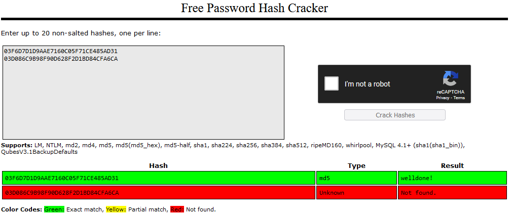

# Passwords
Passwords are the most common form of authentication credentials used to verify the identity of a user. They are also one of the least secure and vulnerable to various attack techniques:

- **Brute force attacks**: systematically trying all combinations of characters to guess the password.
- **Dictionary attacks**: using a precompiled lost of common words and phrases to guess the password.
- **Shoulder surfing**: watching a person enter their password by 'looking over their shoulder'.
- **Credential stuffing**: trying password for a specific website obtained through a data breach on other websites.
- **Phishing**: tricking the user into handing over their password through a fake login page.
- **Keylogging**: using software or hardware that maliciously records keystrokes to obtain a password.
- **Rainbow table attack**: guessing the original password from a hash by using a list of commonly used hashed passwords.
- **Cracking security questions**: guessing answers to security questions based on information from the victim (spouses, kids, pets)

Many of these attacks are easier to accomplish when the password is "simple". Therefor the strength of a password is paramount to network security. The [RFC 1244](https://datatracker.ietf.org/doc/html/rfc1244) gives some tips on how to create a strong password:

```
         - DON'T use your login name in any form (as-is,
           reversed, capitalized, doubled, etc.).

         - DON'T use your first, middle, or last name in any form.

         - DON'T use your spouse's or child's name.

         - DON'T use other information easily obtained about you.
           This includes license plate numbers, telephone numbers,
           social security numbers, the make of your automobile,
           the name of the street you live on, etc..

         - DON'T use a password of all digits, or all the same
           letter.

         - DON'T use a word contained in English or foreign
           language dictionaries, spelling lists, or other
           lists of words.

         - DON'T use a password shorter than six characters.

         - DO use a password with mixed-case alphabetics.

         - DO use a password with non-alphabetic characters (digits
           or punctuation).

         - DO use a password that is easy to remember, so you don't
           have to write it down.

         - DO use a password that you can type quickly, without
           having to look at the keyboard.

      Methods of selecting a password which adheres to these guidelines
      include:

         - Choose a line or two from a song or poem, and use the
           first letter of each word.

         - Alternate between one consonant and one or two vowels, up
           to seven or eight characters.  This provides nonsense
           words which are usually pronounceable, and thus easily
           remembered.

         - Choose two short words and concatenate them together with
           a punctuation character between them.
```

Site Security Policy Handbook Working Group, Page 58 - 59

There are also some more general password security best practices for individuals and organizations:

1. Change passwords frequently.
2. Safely store passwords (like in a password manager).
3. Use multifactor authentication.
4. Use different passwords for different accounts.

## Key-terms
- **Hashing**: mapping data of arbitrary size to fixed-size values, creating a more secure way to store passwords.
- **Salting**: using random data (a salt) as additional unput when hashing a password.
- **Rainbow table**: a precomputed table for caching the outputs of a cryptographic hash function for cracking password hashes.

## Assignments

### Assignment 1
- [x] Find out what hashing is and why it is preferred over symmetric encryption for storing passwords.

### Assignment 2
- [x] Find out how a Rainbow Table can be used to crack hashed passwords.

### Assignment 3
- [x] Below are two MD5 password hashes. One is a weak password, the other is a string of 16 randomly generated characters. Try to look up both hashes in a Rainbow Table. 03F6D7D1D9AAE7160C05F71CE485AD31 03D086C9B98F90D628F2D1BD84CFA6CA

### Assignment 4
- [x] Create a new user in Linux with the password 12345. Look up the hash in a Rainbow Table.

### Assignment 5
- [x] Despite the bad password, and the fact that Linux uses common hashing algorithms, you won’t get a match in the Rainbow Table. This is because the password is salted. To understand how salting works, find a peer who has the same password in /etc/shadow, and compare hashes.

### Sources
- [What is a Password?](https://www.beyondtrust.com/resources/glossary/password)
- [What Are Password Security and Protection?](https://www.cisco.com/c/en/us/products/security/what-are-password-security-and-protection.html)
- [Hash Function](https://en.wikipedia.org/wiki/Hash_function)
- [Passwords - strengths and weaknesses](https://www.garykessler.net/library/password.html)
- [Top 15 Password Management Best Practices ](https://www.beyondtrust.com/blog/entry/top-15-password-management-best-practices)
- [Hashing Passwords: One-Way Road to Security](https://auth0.com/blog/hashing-passwords-one-way-road-to-security/)
- [Rainbow Table](https://www.techtarget.com/whatis/definition/rainbow-table)
- [Understanding /etc/shadow file](https://www.cyberciti.biz/faq/understanding-etcshadow-file/)
- [Password salting](https://www.techtarget.com/searchsecurity/definition/salt)

### Problems
No problems.

### Result

## Assignment 1

Hashing refers to a hash function in cryptography where data of arbitrary size is mapped to fixed-size values. The input can be a message or password and the output is called a hash or message digest. Hashing has two key features making it valuable for storing passwords:

1. It's easy to compute a hash, but difficult to reverse engineer the original input from the hash.
2. It's difficult to create an input that matches a specific hash.

In practical terms this means that cryptographic hash functions are irreversible and thus used in password storage since there is no need to unhash a password to login. One can simply compare the stored hashed password of a user to the hashed password they just entered to gain access to the system.

Some common hashing algorithms are: MD5, SHA-1, SHA-2, NTLM, and LANMAN.

Hashing is preferred over symmetric encryption since the latter can still be decrypted using the secret key, whereas hashed passwords can not (or at least its almost impossible).

## Assignment 2

A rainbow table refers to a list of commonly used passwords in hash form. Attackers that have access to a database of hashed passwords can use this table to target users with commonly used passwords. This attack can be (more) easily defended against by adding a salt to each password before it is hashed.

## Assignment 3

Using [CrackStation](https://crackstation.net/) we find that the `03F6D7D1D9AAE7160C05F71CE485AD31` is a weak password, revealed to be `welldone!`. `03D086C9B98F90D628F2D1BD84CFA6CA` however is a strong password and does not appear in the rainbow table:



## Assignment 4

First we add user rainbow to our VM using `sudo useradd rainbow`, followed by a password `sudo passwd rainbow`. We can then delve into the /etc/shadow file to find our new user and hashed password:

```
rainbow:$6$v0t0bDcdUvmtGxWn$VVjg/bO9aarL0nkfD2xjrcDKA9CFkE/aZBaGR74pUTzaPfAafxr0yPavIrcawhZikpp7flRs0TSpNQGpZGJMj.:19529:0:99999:7:::
```

The \$6\$ is the algorithm prefix:

1. \$1\$ is MD5
2. \$2a\$ is Blowfish
3. \$2y\$ is Blowfish
4. \$5\$ is SHA-256
5. \$6\$ is SHA-512
6. \$y\$ is yescrypt

So our password was hashed using the SHA-512 algorithm. Entering the hash in the rainbow table does not provide a result.

## Assignment 5

Passwords can be salted by adding a string of 32 or more characters to the password and then salting it. This prevents hackers from reverse engineering the original password from the hash by using e.g. rainbow tables.

Comparing the hash of my Linux user to that of my peer, its clear that while we both entered the same password, the salting on our Linux machines is different and thus resulted in two different hashes.