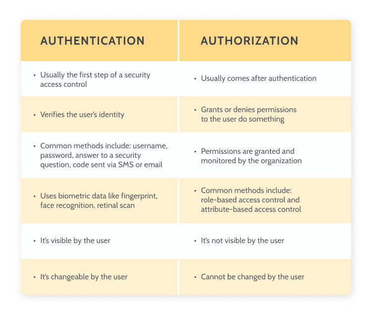

# Identity and Access Management
Authentication and authorization in computer systems are part of the Identity and Access Management (IAM) discipline. In network security ascertaining the identity of its users and giving them the required privileges as well as restricting their access as need are the hallmarks of these two fundamental concepts.

Both are vital security measures for protecting data and systems from unauthorized access and destruction. Costs for organizations can be immense, ranging from large costs to destroyed brand credibility. Adequately increasing security can decrease the risk of these factors immensely and will help with regulatory compliance.

We will study various increased security techniques today, such as : Multi-Factor Authentication, Authorization, 3 factors of authentication and the principle of lease privilege.

## Key-terms
- **Authentication**: verifying the identity of a user.
- **Authorization**: resources a user should have access to.
- **MFA**: Multi Factor Authentication.
- **PoLP**: Principle of Least Privilege.
- **Permission**: specific access rights to a resource.
- **Privilege**: permission(s) assigned to someone.

## Assignments

### Assignment 1
- [x] Study the difference between authentication and authorization.

### Assignment 2
- [x] Study the three factors of authentication and how MFA improves security.

### Assignment 3
- [x] Study what the principle of least privilege is and how it improves security.

### Sources
- [Authentication vs. Authorization](https://auth0.com/docs/get-started/identity-fundamentals/authentication-and-authorization)
- [Authentication](https://www.techtarget.com/searchsecurity/definition/authentication)
- [The Importance of User Authentication Methods in CyberSecurity](https://www.tutorialspoint.com/the-importance-of-user-authentication-methods-in-cybersecurity)
- [What Is 3FA (Three-Factor Authentication)?](https://rublon.com/blog/what-is-3fa-three-factor-authentication/)
- [Principle of least privilege](https://en.wikipedia.org/wiki/Principle_of_least_privilege)
- [What is the Principle of Least Privilege (POLP)?](https://www.digitalguardian.com/blog/what-principle-least-privilege-polp-best-practice-information-security-and-compliance)
- [8 Benefits of Multi-Factor Authentication (MFA)](https://www.pingidentity.com/en/resources/blog/post/eight-benefits-mfa.html)
- [What is Authorization?](https://auth0.com/intro-to-iam/what-is-authorization)

### Problems
No problems.

### Result

## Assignment 1

Whilst providing different functions, both authentication and authorization are two of the main concepts in network security that work together to control access to data and resources. Authentication is the process of verifying your identity; authorization is the process of determining what areas of the network you should have access to.

Authentication is a process that is visible to the user and also has control over. Authorization is invisible and can also not be changed by the user.

### Authentication ###

This security concept attempts to determine you are who you say you are using one or more authentication methods. Some common methods of authentication are:

- **Passwords**
	This is still the most common form of authentication in use in various systems today. Passwords are a combination of letters, numbers and special characters used as a unique hidden identifier for a user to gain access to a system. It is a fairly cheap and easy to implement form of authentication and because it has been around for so long it remains popular with users due to its familiarity. User also have control over the password they want to use.

	There are some problems with this type of authentication however:

	1. They are vulnerable to being stolen and sold on the internet.
	2. They can be predicted.
	3. They can be forgotten.

- **Multi Factor Authentication**
	In this method we use not one but two or more different types of authentication in conjunction. For example a password combined with a fingerprint and an app on your smartphone. This is a much more secure type of authentication and we will discuss this more in the following assignment.

- **Biometrics**
	Using a persons physical or behavioral characteristics to determine their identity is called biometric authentication. Many of your body characteristics are unique to you as an individual and can therefor be a fairly secure authentication method. There are several common biometrics that can be used:

	- Fingerprints: unique patterns in a persons fingerprints.
	- Iris recognition: patterns in the colored portion of the eye.
	- Facial recognition: matching of facial features such as shape, distance and contour.
	- Voice recognition: matching of unique vocal features such as pitch, tone and pronunciation.
	- Retina recognition: blood vessel patterns in the back of the eye.

- **Certificates**
	A certificate is a digital document that binds cryptographic keys to an entity's identity. These are issued by a third party called a Certificate Authority that vouches for the authenticity of the information contained within the certificate. These certificates are very good at helping protect the privacy of sensitive data and establishing secure connections.

	There are some drawbacks however: costs and maintenance. Well maintained certificates are often not free and require regular renewal and updates.

- **Tokens**
	A token is a unique digitally signed string that is generated after users enter their credentials into the system. This token can then be used access various resources based on the authorization information tied to this particular token.

### Authorization ###

Authorization is the process of giving a user access to a particular resource and is also a main part of the computer systems discipline Identity and Access Management. This involves setting specific permissions to access resources on a system and then assigning those permissions to a user as a privilege.

There are several different strategies used for the implementation of authorization. Some common ones are:

- **Attribute-Based Access Control (ABAC)**
	Access to a resource is granted based on one or more characteristics of the user. E.g.: buying alcohol at a store requires the user to be a certain age.

- **Role-Based Access Control (RBAC)**
	Access to a resource is granted based the role of a user. E.g.: the owner of a store can access the storage area to gather and refill products.

- **Relationship-Based Access Control (ReBAC)**
	Access to a resource is granted based on the relationship the user has to this resource. This can be determined via user attributes, roles or by having a direct relationship to the object.

- **Discretionary Access Control (DAC)**
	Access to a resource is granted based on the identity of users or groups to which the resource belongs. The 'discretionary' part refers to the ability of the owner of the resource to pass access to the resource on to other subjects. E.g.: a store owner gives his employees access to his own working computer.

An important aspect of authorization in modern computer security is limiting access to resources only to users or systems that need the access to properly function. We will discuss this the Principle of Least Privilege (POLP) in a later assignment.

To more easily visualize the differences between authentication and authorization:

## Assignment 2

### Three Factors of Authentication and MFA

Authentication methods are divided into three subcategories:

- **Knowledge Factor**
	This is something that you know. Examples: password, security question, PIN. The knowledge factor is the most common factor but also the easiest one to beat.

- **Possession Factor**
	This is something you possess. Examples: authenticator app, security key, hand-held tokens. A common form is the token you can use to sign into your banking app/website using a card scanning devices and a time sensitive string of numbers you need to enter to gain assess.

- **Inherence Factor**
	This is something you are. Examples are the biometrics we discussed earlier: fingerprint, retina, facial. This is the strongest form of authentication, but also prone to errors.

Multi Factor Authentication uses two or more of the above methods to identify a user. Implementing MFA provides several security benefits:

- **Increased security**: should one of the methods be compromised, the others will still prevent access to unauthorized people.
- **Less risk from compromised passwords**: since they are the least secure, this adds another layer of protection against the many passwords that are compromised.
- **Compatible with Single Sign-On (SSO)**: this makes authentication easier for users by not requiring them to enter longwinded strong password for every application that requires it.
- **Regulatory compliance**: many industries require MFA already, such as the banking card industry.
- **Adaptable and scalable**: different situations may require levels of security or different needs based on the user base. MFA is both adaptable and scalable.

## Assignment 3

### Principle of Least Privilege (PoLP)

The concept of Principle of Least Privilege involves only giving out access to a resource to users or programs that really need to to perform their functions or duties. The idea here is that giving access to a resource that isn't need only decreases security and provides no real benefit.

For the security of a system this provides various benefits:

- **Reduced attack surface**: a compromised user account can do a lot less damage if the systems they have access to is limited.
- **Reduced privilege escalation attacks**: reduces the risk of hackers gaining access to privilege elevating permissions.
- **Reduced chance of accidents**: even if there is no malicious intent, PoLP prevents authorized users from causing accidents in systems or resources they don't need access to anyways.
- **Accountability and auditing**: limited user privileges are easier to track and audit should something happen, malicious or otherwise.