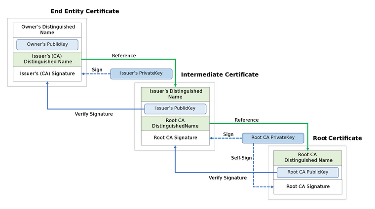
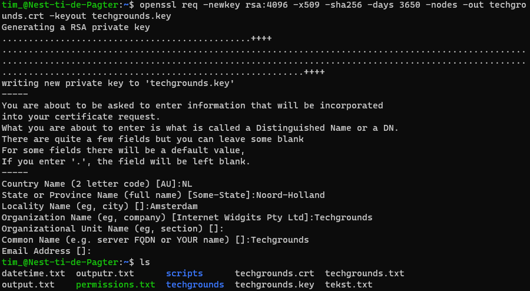
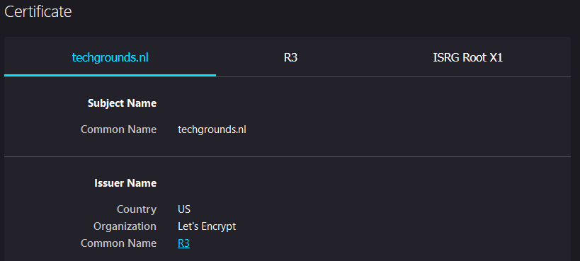
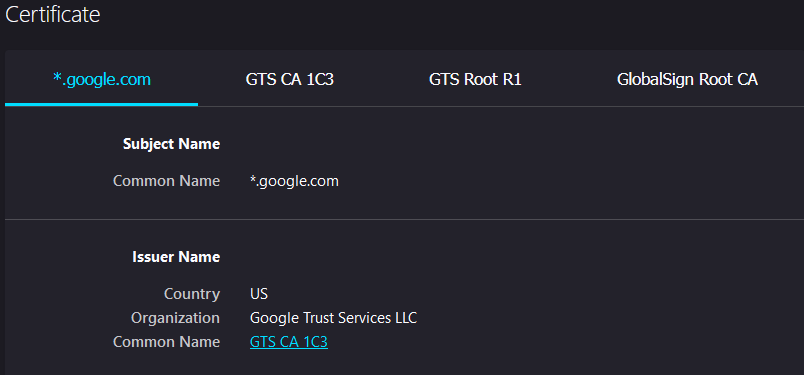
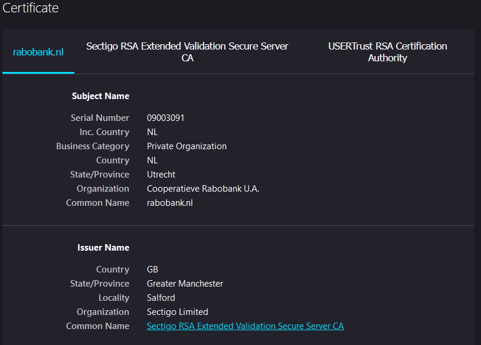
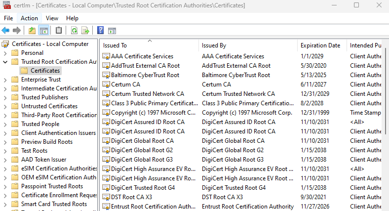
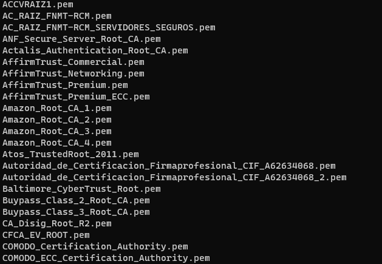

# Public Key Infrastructure
Public Key Infrastructure (PKI) is a framework containing roles, policies, hardware, software and procedures needed to manage digital certificates and encryption keys. In a network setting it provides ways to securely authenticate the identity of users, devices and services and facilitates the secure transfer of data.

The Certificate Authority (CA) is a trusted entity that issues these digital certificates. Its main purpose is to verify the identity of a user (individuals, organizations or devices) and link their public key to a digital certificate. This linking can be caried out by an individual or automatically. Some examples of CA's are:

- Comodo CA
- Let's Encrypt
- GlobalSign
- DigiCert
- VeriSign

The Registration Authority (RA) is a an entity delegated by the CA to handle various administrative tasks, such as processing certificate requests, information and identity validation and the issuing of certificates. Some examples of RA's are:

- Thawte RA
- GoDaddy RA
- Entrust RA
- Sectigo RA
- GeoTrust RA

The Validation Authority (VA) is an entity that provides a service used to verify the validity or revocation status of a digital certificate using the X.509 standard. Some examples of VA's are:

- GlobalSign VA
- OpenTrust VA
- Trustwave VA
- SSL.com VA

X.509 is a certificate standard developed by the International Telecommunication Union on July 3, 1988. This standard requires a strict hierarchical system of Certificate Authorities for the issuing of certificates.

Secure Socket Layer (SSL) certificates are one of the most common uses of PKI. Whenever you visit a https:// website it uses the SSL security protocol to secure the data transfer. The newer version used by websites is TLS (Transport Layer Protocol).

Browsers verify certificates through this hierarchy called a **chain of trust** which defines the structure needed to verify certificate integrity. This structure is made of a root certificate, one or more intermediate certificates and an end entity certificate.



The root certificate belongs to the Certificate Authority and is referred to as the trust anchor, which is inherently trusted by the browser. Intermediate certificates gain their trustworthiness from the CA and the end entity certificate, which is the website administrators certificate, gains trustworthiness from the intermediate.

## Key-terms
- **Certificate Authority (CA)**: a trusted entity that issues digital certificates.
- **Registration Authority (RA)**: assists the Certificate Authority in verifying the identity and information of certificate applicants.
- **Validation Authority (VA)**: verifies the validity or revocation status of a digital certificate.
- **X.509**: is an International Telecommunication Union (ITU) standard defining the format of public key certificates.
- **Digital Certificate**: an electronic document used in PKI to verify the authenticity, integrity, and ownership of public keys.

## Assignments

### Assignment 1
- [x] Create a self-signed certificate on your VM.

### Assignment 2
- [x] Analyze some certification paths of known websites (ex. techgrounds.nl / google.com / ing.nl).

### Assignment 3
- [x] Find the list of trusted certificate roots on your system (bonus points if you also find it in your VM).

### Sources
- [What are Root Certificates for Windows 11/10?](https://www.thewindowsclub.com/what-are-root-certificates-windows)
- [Secure website certificate](https://support.mozilla.org/en-US/kb/secure-website-certificate)
- [What is PKI (Public Key Infrastructure)?](https://www.ssh.com/academy/pki)
- [X.509](https://en.wikipedia.org/wiki/X.509)
- [Validation authority](https://en.wikipedia.org/wiki/Validation_authority)
- [3 types of PKI certificates and their use cases](https://www.techtarget.com/searchsecurity/feature/3-types-of-PKI-certificates-and-their-use-cases)
- [Trust Anchor](https://en.wikipedia.org/wiki/Trust_anchor)
- [Creating a Self-Signed SSL Certificate](https://linuxize.com/post/creating-a-self-signed-ssl-certificate/)

### Problems
No problems.

### Result

## Assignment 1

We can create a self-signed certificate using OpenSSL which was already preinstalled on our VM. To do this we type the following command:

```
openssl req -newkey rsa:4096 -x509 -sha256 -days 3650 -nodes -out techgrounds.crt -keyout techgrounds.key
```

`-newkey rsa:4096`: new certificate request with a 4096 bit RSA key.
`-x509`: using the X.509 certificate standard.
`-sha256`: 265 bit secure hash.
`-days 3650`: valid for one year.
`-nodes`: no password.
`-out`: where to place the new certificate.
`-keyout`: where to place the new private key.

We are then asked to enter some more information before the certificate is created:



Certificate and private key successfully created.

## Assignment 2

We can view website certificates and hierarchy in the browser:

1. **techgrounds.nl**



The root (trust anchor) certificate: ISRG Root X1, issued by: ISRG Root X1 (Internet Security Research Group)
The intermediate certificate: R3, issued by: ISRG Root X1 (Internet Security Research Group)
The server (end entity) certificate: techgrounds.nl, issued by: R3 (Let's Encrypt)



The root (trust anchor) certificate: GlobalSign Root CA, issued by: GlobalSign Root CA (GlobalSign nv-sa)
The intermediate certificate 1: GTS Root R1, issued by: GlobalSign Root CA (GlobalSign nv-sa)
The intermediate certificate 2: GTS CA 1C3, issued by: GTS Root R1 (Google Trust Services LLC)
The server (end entity) certificate: *.google.com, issued by: GTS CA 1C3 (Google Trust Services LLC)



The root (trust anchor) certificate: USERTrust RSA Certification Authority, issued by: USERTrust RSA Certification Authority (The USERTRUST Network)
The intermediate certificate: Sectigo RSA Extended Validation Secure Server CA, issued by: USERTrust RSA Certification Authority (The USERTRUST Network)
The server (end entity) certificate: rabobank.nl, issued by: Sectigo RSA Extended Validation Secure Server CA (Sectigo Limited)

The root certificates are the trust anchors issued by CA's that are inherently trusted by the browser/OS: ISRG Root X1, GlobalSign Root CA and USERTrust RSA Certification Authority.

## Assignment 3

To find the trusted root certificates in windows 11 we can open the Certificate Management tool certlm.msc:

We can find the trusted root certification authorities that we inspected in assignment 3 here:



For our Linux VM, the trusted root certificates are located in `/etc/ssl/certs`

