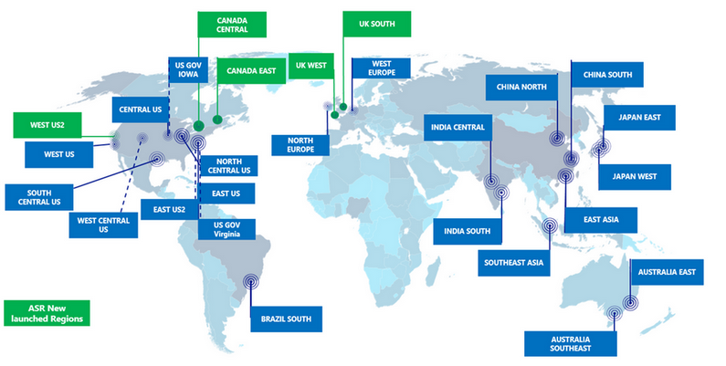

# Azure Global Infrastructure

Azure Global Infrastructure is an extensive global datacenter network made up of two major components:

1. Physical Infrastructure.
2. Connective network.

Together these components connect over 200 physical datacenters together. These datacenters are grouped into geographic regions. This global infrastructure allows customers to deploy applications and services closer to their target audience resulting in lower latency and increased performance.

Additionally Azure Global Infrastructure offers customers even more options in the form of data redundancy, disaster recovery and regulation compliance.

## Key-terms
- **Physical Infrastructure**: the physical components (hardware, facilities etc.) that make up a system or network.
- **Datacenters**: specialized facilities that house servers, network equipment, storage systems etc.
- **Azure Regions**: geographically nearby areas where Azure datacenters are located.
- **Availability Zones**: physically separate datacenter zones within a region group.
- **Edge Locations**: point of presence (PoP) or data center(s) located closer to the end user.
- **Failover**: a system that automatically detects a failure and transfers control to a duplicate system.
- **Replication**: reproducing the application and/or services from one cloud location to another.

## Assignments

### Assignment 1
- [x] Wat is een Azure Region?

### Assignment 2
- [x] Wat is een Azure Availability Zone?

### Assignment 3
- [x] Wat is een Azure Region Pair?

### Assignment 4
- [x] Waarom zou je een regio boven een andere verkiezen?

### Sources
- [Azure global infrastructure](https://azure.microsoft.com/en-us/explore/global-infrastructure)
- [What are Azure regions and availability zones?](https://learn.microsoft.com/en-us/azure/reliability/availability-zones-overview)
- [Microsoft Azure](https://nl.wikipedia.org/wiki/Microsoft_Azure)
- [AZ-900 Episode 7 | Geographies, Regions & Availability Zones | Microsoft Azure Fundamentals Course](https://www.youtube.com/watch?v=C-nNw1mGwzE)
- [Azure Speed Test](https://www.azurespeed.com/Azure/Latency)
- [Azure Availability Zones, Azure Regions, Availability sets, Fault & Update domain](https://k21academy.com/microsoft-azure/architect/azure-availability-zones-and-regions/)
- [What is Azure Load Balancer?](https://learn.microsoft.com/en-us/azure/load-balancer/load-balancer-overview)
- [Azure regions decision guide](https://learn.microsoft.com/en-us/azure/cloud-adoption-framework/migrate/azure-best-practices/multiple-regions)

### Problems
No problems.

### Result

## Assignment 1

In Azure a region is one or a collection of datacenters that are geographically close to each other and connected in a dedicated low-latency network (under 2 milliseconds latency). These datacenter regions are globally distributed in a way that allows for a high coverage around the world.

This global spread allows customers to pick a specific geographic region to ensure that the applications and services are deployed as close to their clients as possible. Whenever a customer deploys a service through Azure they will be asked to pick a location, referring to a geographic region, where the datacenters are located.

It is important to note that some services are locked to specific regions, whilst others are global services and can be deployed anywhere. There are also some special regions like government regions or partner regions where the datacenters aren't run by Microsoft themselves.

Using a tool like [Azure Speed Test](https://www.azurespeed.com/Azure/Latency) you can check the latency from your IP locations to various Azure datacenters around the world.

## Assignment 2

Availability Zones are unique physical locations with a specific Azure region that are independent from other zones in the region. These zones exist to make sure customer' services and application have a high amount of availability and redundancy. They offer protection against failure at the infrastructure level because of the following characteristics:

1. Independent Infrastructure: all availability zones have their own networking, power supply and cooling. In case any of these fail in one zone, the others won't be affected.

2. Data Replication: customers can set their applications and services up in a way that they can be mirrored across availability zones. If a disaster strikes one of the zones, the others can take over and enable failover.

3. Load balancing (Azure Load Balancer): Azure Load Balancer operates at layer 4 of the OSI model and allows network traffic to be distributed across availability zones, ensuring high availability.

These are just some of the services customers can make use of in Azure, but there are many more. They are grouped into two different categories:

1. Zonal services (Virtual Machines, Disks, etc.)
2. Zone-redundancy services (SQL, Storage, etc.)

Each availability zone within a region has it's own number that a customer can select when deploying applications and services. Not all regions support availability zones, but a region that does will support at least three zones.

## Assignment 3

But what happens if an entire region suffers a catastrophic disaster? For this eventuality Azure has created region pairs. A region pair consists of two different regions that are at least 300 miles away from each other to ensure natural level disasters don't affect both at the same time. Whilst they are separated by many miles, these region pair do still reside within the same geography.

Azure provides customers with tools allowing them to replicate their data across these region pairs, ensuring high availability. Which regions are paired to each other is set and can not be chosen by the customer.

When rolling out updates to services or application, Azure will first roll them out to one region of a region pair, followed by the other region once everything seems to be working fine. This prevents update errors causing system failures in both regions simultaneously.

## Assignment 4

There are several factors to consider when deciding to pick one region over another:

1. **Service Availability**: not all services are can be deployed to every region. Some services are global services and can be deployed anywhere, but others are limited to one or more regions. To check services availability per region, use the Microsoft [Products by region](https://azure.microsoft.com/en-us/explore/global-infrastructure/products-by-region/) tool.

2. **Capacity**: regions have a maximum capacity. It is important to check if the services you want to deploy exceed this capacity.

3. **Constraints**: while a service may be available in a particular region, it may still have constraints tied to its use. E.g.: some regions are only available for backup or failover.

4. **Data residency**: there may be regulatory and compliance requirements in a specific region which could affect the deployment of your data and how it is/should be handled.

5. **Network connectivity**: to ensure optimal performance picking a region that is geographically near your clients is very important. This reduces overall latency and bandwidth.

6. **Cost**: Azure pricing may vary across regions. To check changes in pricing you can look inside Azure itself or use a tool like [Average Price Per Azure Region](https://azureprice.net/regions).
