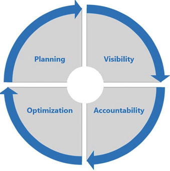
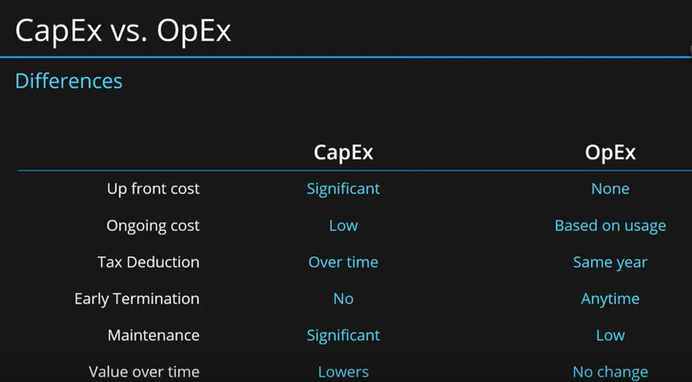
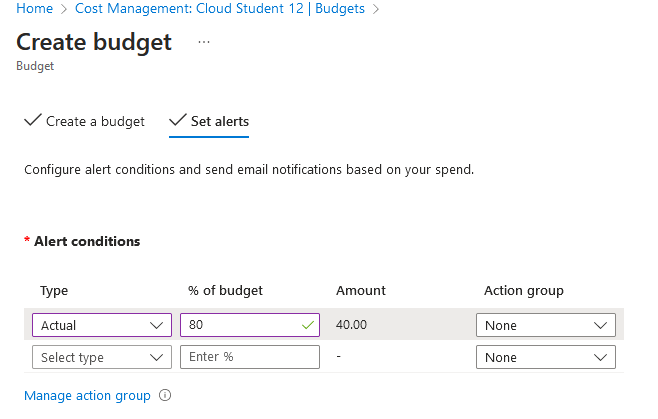
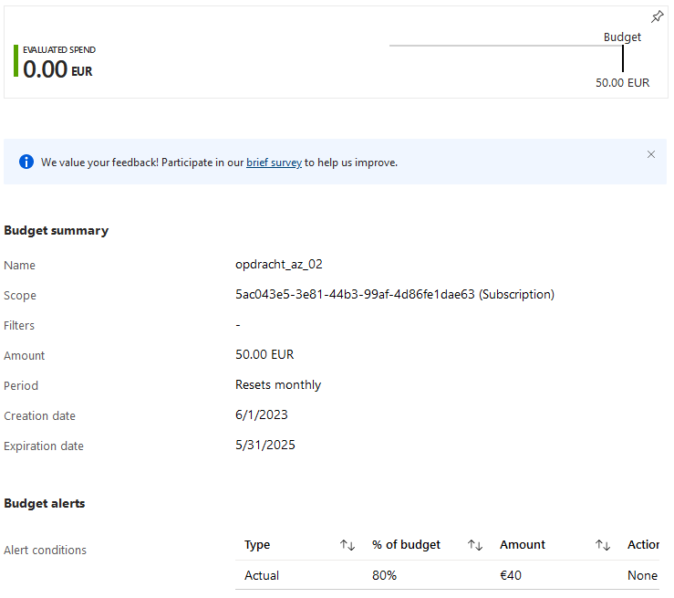
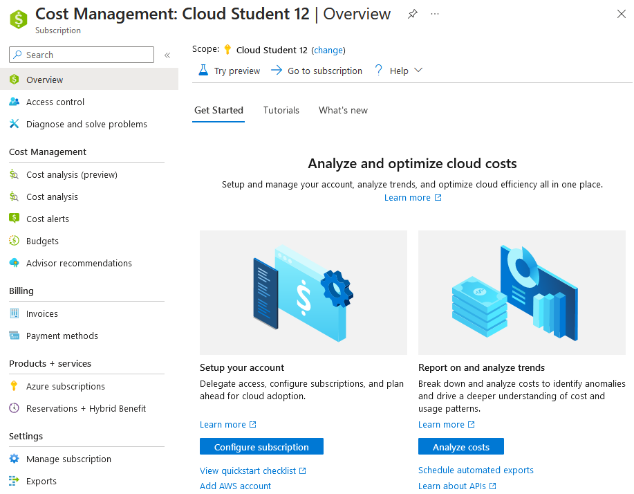

# Cost Management + Billing

Azure offers its users a cost management tool called Azure Cost Management and Billing. This tool gives you a large amount of visibility and control over the costs of your Azure expenses. This is important as costs can quickly get out of hand if not properly monitored and adjusted to fit the users requirements.

### Five principles of Cost Management

Azure uses five key principles when it comes to effective cost management:

1. **Planning**: up-front planning allowing you to tailer cloud usage to your needs and find the right offerings and infrastructure use to maximize your Azure efficiency.

2. **Visibility**: giving you a clear view of the costs associated with the services and application you are running in Azure using the Azures' cost management services. Use these to find resources that are underused, remove waste, and maximize cost-saving opportunities.

3. **Accountability**: the ability to establish clear ownership, oversight and control over Azure subscriptions and services and their costs within your organization. This helps you understand your Azure spending and helps hold people in your organization accountable.

4. **Optimization**: the process of maximizing the efficiency, performance and cost-effectiveness of your Azure services and subscriptions. Using the right resource sizes, implementing auto-scaling, optimizing storage etc.

5. **Iteration**: the process of reviewing and refining your cost management practices over time. The entire organization should participate in evaluating expenditures, finding areas that can be improved and implementing changes to reduce costs and efficiency.

### Free subscription

Azure offers a free subscription which gives you a variety of benefits, but also has limitations. These are some of the services you get with a free subscription and their limitations:

1. Free use of popular services for 12 months. This includes services like:

	- Azure Virtual Machines-Linux; 750 hours B1s burstable virtual machines.
	- Azure SQL database; 250 GB S0 instance with 10 database transaction units.
	- Azure Blob Storage; 5 GB locally redundant storage (LRS) hot block with 20,000 read and 10,000 write operations.

2. Free limited uses of 55+ other services, including but not limited to:

	- Azure Cosmos DB; 1,000 request units per-second provisioned throughput with 25 GB storage.
	- Azure App Service; 10 web, mobile or API apps with 1 GB storage 1 hour per day.
	- Azure Functions; 1 million requests.
	- Azure Event Grid; 100,000 operations per month.

3. 200 dollar Azure credit.

Additionally you now also get Azure Files and Azure Media Services for 12 months when you create a free account.

To continue using these services after you free subscription limitations have been reached you can switch to the pay-as-you-go subscription.

### CapEx and OpEx

Companies have to deal with the costs of running their business. These costs can be a one off investment or they can be recurring. A method of keeping track of these costs is to divide them into different categories, the most common of which are capital expenditures (CapEx) and operational expenditure (OpEx). In relation to 

1. **Capital Expenditure**: upfront purchases of goods and services made to improve the companies performance in the future. In relation to the cloud this involves the purchasing of your own infrastructure, servers, storage, network equipment etc. CapEx is an upfront cost which has a value that reduces over time and usually no recurring cost.

2. **Operational Expenditure**: the costs that a company incurs for running its day-to-day operations. In relation to the cloud this involves the paying for services and subscriptions. OpEx has no upfront cost but does have a recurring cost.

Where the up front costs for CapEx are high, OpEx has practically none making it a very attractive option for running your companies' infrastructure in the cloud. It is also much easier to stop a service or subscription if it is no longer required for your companies' operations.

In IT there are risks associated with the CapEx model:

- Since the future is uncertain, the investment you made may become obsolete, at which point you are stuck with unusable equipment and skills.
- The longer it takes to set everything up, the more costs you will accrue
- You can get stuck in vendor contracts when those create business dependencies and the vendor doesn't follow through.
- Significant initial investment.
- Requires a lot of maintenance.

The OpEx model attempts to remedy these problems:

- Services and subscriptions are instant and on-demand, increasing profits.
- Architecture can be easily and swiftly be reconfigured if problems arise.
- It gives modern businesses the agility and flexibility they require to stay relevant in these constantly changing markets and more quickly and easily meet their clients needs.
- No initial investment, pay for what you use.
- Requires minimal maintenance.

This image visualizes the differences between CapEx and OpEx quite well:

### TCO-calculator

The Total Cost of Ownership (TCO) Calculator is an Azure tool that companies can use to find out how much money they will save by migrating from on-premises infrastructure to Azure. The tool takes various factors into account when calculating costs: hardware, software, networking, electricity, cooling etc. The tool can be found here:

[https://azure.microsoft.com/en-us/pricing/tco/calculator/](https://azure.microsoft.com/en-us/pricing/tco/calculator/)

## Key-terms
- **TCO-calculator**: Total Cost of Ownership Calculator; used to calculate costs of migration from on-premises to Azure Cloud.
- **CAPEX**: Capital Expenditure;  expenses incurred for acquiring, upgrading, or improving long-term assets or investments in a business.
- **OPEX**: Operational Expenditure; ongoing expenses that are necessary for the day-to-day operations and maintenance of a business.
- **Pay-as-you-go**: pay for what you use when you use it.

## Assignments

### Assignment 1
- [x] Maak een alert aan waarmee je eigen kosten kan monitoren.

### Assignment 2
- [x] Begrijp de opties die Azure aanbiedt om je uitgaven in te zien.

### Sources
- [Microsoft Cost Management](https://azure.microsoft.com/nl-nl/products/cost-management)
- [How to optimize your cloud investment with Cost Management](https://learn.microsoft.com/en-us/azure/cost-management-billing/costs/cost-mgt-best-practices)
- [CapEx vs. OpEx: What’s the Difference?](https://www.investopedia.com/ask/answers/112814/whats-difference-between-capital-expenditures-capex-and-operational-expenditures-opex.asp)
- [Total Cost of Ownership (TCO) Calculator](https://azure.microsoft.com/en-us/pricing/tco/calculator/)
- [Use cost alerts to monitor usage and spending](https://learn.microsoft.com/en-us/azure/cost-management-billing/costs/cost-mgt-alerts-monitor-usage-spending)
- [Azure subscription and service limits, quotas, and constraints](https://learn.microsoft.com/en-us/azure/azure-resource-manager/management/azure-subscription-service-limits)
- [CapEx vs OpEx](https://www.azureguru.org/capex-vs-opex/)
- [Capex vs Opex Cloud: Difference Between Capex vs Opex](https://k21academy.com/microsoft-azure/az-900/az-900-microsoft-azure-fundamentals-cloud-computing-capex-vs-opex-model/)
- [Ask the Expert: Azure cost management—8 tools to help optimize spending and maximize potential in the cloud](https://www.nigelfrank.com/insights/azure-cost-management-tools)

### Problems
No problems.

### Result

## Assignment 1

In Azure we can open the `Cost Management` tool and then head into `Budgets`. Here we add a new budget in step (1) following by setting up an alert to go off when the budget exceeds 80% in step (2):

We can do go back to the Budgets section and view our newly added budget + alert:

## Assignment 2

The Cost Management Tool in Azure provides several services that can be used to help manage costs:

- **Cost Analysis**: detailed view of your Azure spending including the ability to group and filter resources.
- **Cost Alerts**: anomaly, budget, credit and department spending quota alerts.
- **Budgets**: creating budgets that span your Azure subscriptions.
- **Advisor Recommendations**: an analyzing tool that provides recommendations on how to better optimize resources and maximize their value for money.

The CMT also provides access to an `Exports` option, letting you export billing data.

There is also a price calculator that can be used to estimate hourly or monthly costs for using Azure:

[https://azure.microsoft.com/en-gb/pricing/calculator/](https://azure.microsoft.com/en-gb/pricing/calculator/)
