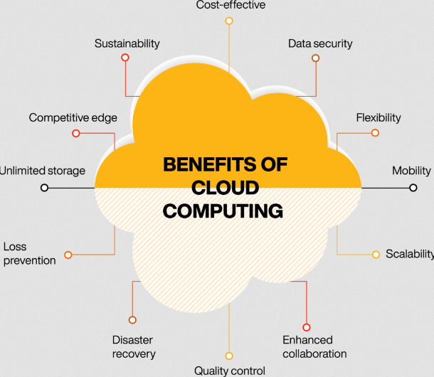
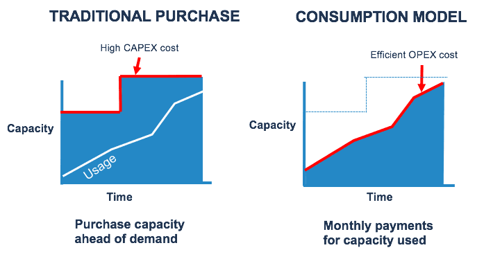

# Advantages of the cloud

Cloud migration has become an increasingly common global practice in the past few years and projections show this will continue to be the case for yours to come, especially because of the recent shift in work practices as more companies adopt the ability of their employees to work from home.

Cloud computing has many advantages and explaining these advantages to companies is paramount to getting more companies to migrate to the cloud. Convincing businesses to replace their legacy, on-premises technology with flexible, scalable and cost-effecting computing power is often done using the **six advantages of cloud** which we will discuss in assignment 2 below.

It can still be challenging especially for small companies to make the giant leap to the Cloud. For this reason its important to explain to them in detail what the total costs and other risks can be minimized and help them see a return on their investment in this switch.

## Key-terms
- **Cloud migration**: switching from legacy applications and IT processes on premises to a cloud computing environment.
- **High availability**: ability to keep services and resources up and running for extended periods of time with little to no downtime.
- **SLA**: Service Level Agreement; a contract or agreement between a customer and a cloud provider detailing the agreed-upon level of service provided.
- **Geo-distribution**: the spreading of cloud datacenters around the world.

## Assignments

### Assignment 1
- [x] Study: De 6 advantages of the cloud.

### Assignment 2
- [x] Study: Het consumption-based model.

### Sources
- [Understand cloud concepts](https://www.microsoftpressstore.com/articles/article.aspx?p=2979073)
- [Advantages and Disadvantages of Cloud Computing](https://www.javatpoint.com/advantages-and-disadvantages-of-cloud-computing)
- [8 Reasons to Migrate to the Cloud in 2023](https://blog.clearscale.com/8-reasons-to-migrate-to-cloud-in-2020/)
- [Cloud Migration: Why (and How) Companies Are Moving to the Cloud](https://www.ntiva.com/blog/cloud-migration-why-companies-are-moving-to-the-cloud)
- [AZ-900: Identify the benefits of cloud computing, such as High Availability, Scalability, Elasticity, Agility, and Disaster Recovery](https://studylearnshare.medium.com/az-900-identify-the-benefits-of-cloud-computing-such-as-high-availability-scalability-e0baf41f2594)
- [Elasticity vs Scalability vs Agility vs High Availability vs Fault Tolerance vs Disaster Recovery](https://kaustubhsharma.com/blog/cloud-key-concepts)
- [Consumption and fixed cost models](https://learn.microsoft.com/en-us/azure/well-architected/cost/design-price)
- [Understanding Azure's Consumption-based Model: A Cost-Effective Solution for Cloud Computing](https://gauravoncloud.hashnode.dev/understanding-azures-consumption-based-model-a-cost-effective-solution-for-cloud-computing)
- [How to Grow Your Storage Without Growing Your CAPEX Spend](https://cloudian.com/blog/how-to-grow-your-storage-without-growing-your-capex-budget/)

### Problems
No problems.

### Result

## Assignment 1

To promote Cloud migration to companies we can show them the 6 advantages of cloud computing:

### **High Availability**

Making sure that your companies' services and applications are available with as little downtime as possible is a primary goal for any successful business. Unfortunately in the real world there are many dangers that can have a significant effect on uptime. Examples are network outages, application failures, natural disasters etc.

Cloud can fix a lot of these concerns by providing various services aiding the concept of High Availability:

- Redundancy: multiple levels of redundant systems, network infrastructure and datacenters as well as the ability of the customer to replicate their data to varies availability zones and regions.
- Load balancing: the ability to distribute network loads across multiple cloud zones and regions.
- Auto-scaling: adjusting the resource usage based on service and application demand.
- Service Level Agreements: cloud service agreements that guarantee a certain level of uptime.

Availability can be calculation using this formula: `Availability = Uptime / (Uptime + Downtime) = Uptime / Lifetime`

### **Scalability**

One of the best features of the Cloud is its scalability, meaning the ability increase access to resources on the fly and with low costs. This approach is split up into two separate forms of scalability:

1. **Horizontal Scalability**: increasing or decreasing the number of instances, like servers or virtual machines, in order to handle larger or smaller workloads or user demand. This can be done by:

	- Scaling-In: adding more instances to the cloud.
	- Scaling-Out: reducing the amount of instances.

2. **Vertical Scalability**: increasing the capacity of existing resources, like CPU or RAM, in order to handle larger or smaller workloads or user demand. This involves:

	- Scaling-Up: adding more capacity to resources.
	- Scaling-Down: reducing the capacity of resources.

This allows you to scale everything up or in during times of high demand or based on the companies' growth and scale down again when business slows down. It is quick and efficient and prevents getting stuck with a large volume of upfront purchased assets that are no longer required.

### **Elasticity**

This refers to the ability of the customer to automatically acquire resources when needed and removing those resources when not needed in the cloud. This process is often referred to as auto-scaling or dynamic scaling and makes it fast and efficient to scale up or down based on the companies' demand.

By dynamically scaling costs can be significantly reduced as unused resources don't need to be paid for unlike in on-premises infrastructure where they are just sitting around.

Automation of the scalability gives users a seamless experience as well with no unexpected downtimes that are often present during infrastructure upgrades. Automation is also what distinguishes Elasticity from Scalability as the latter is more build on predictability and upfront planning.

### **Agility**

The agility in cloud computing refers to its ability to be fast and flexible in the allocation and deallocation of resources. Resource can be deployed in record times (often in minutes) and removed just as quickly based on the needs of the company at any specific time.

Creating a Virtual Machine can take less than a minute in the Cloud, whilst on-premises one would first have to order a physical machine, wait for delivery, have it setup and correctly configured and then hope everything works.

### **Geo-distribution**

Cloud datacenters are located all over the world in various region, often consisting of several datacenters per region. Azure itself has over 60+ regions with multiple availability zones within those regions.

Some of the main advantages of this kind of global geo distribution of datacenters are:

- Reduced latency
- High reliability
- Compliance with local regulations

### **Disaster recovery**

Cloud disaster recovery (DR) is the ability of your applications or services in the cloud te recover from failure in the event of a catastrophic disaster. These disasters can range from hacking, hardware failures, natural disasters etc.

One of the main ways this is accomplished is using data replication and backup that any customer can set up for their resources in Azure.

## Assignment 2

### Consumption-based model

Part of the cost optimization strategy of Azure is the ability of the customer to pay only for what he needs and uses and any particular point in time. Rather than pay for physical systems up front based on predicted usage and potentially getting stuck with unneeded resources, Azure Cloud allows businesses to only use what they need, when they need it.

This has many advantages:

- It is far more cost effective as costs are tied in real-time to the size of the operation conducted by the company and can be reduced just as easily.
- It is far more flexibly by allowing the customers to pick on the fly what resources it does and does not need and what the capacity of these resources need to be.
- It is transparent: costs and resource usage can be monitored in real time, giving greater visibility in their actual expenditure and allow companies to make more informed decisions.

This model ties in directly to CapEx and OpEx:

