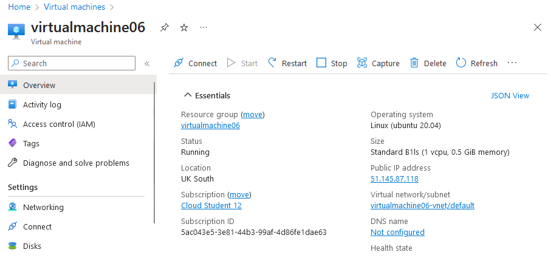
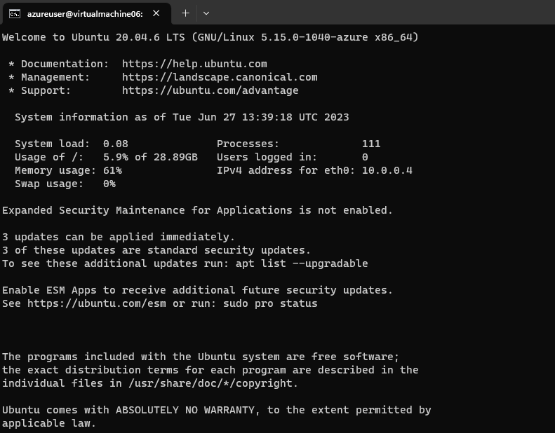
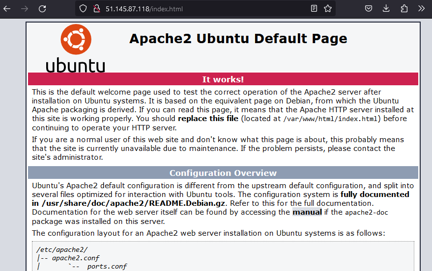

# Azure Virtual Machines

Virtual machines are software-based emulations of physical computers that have the ability to run multiple operating systems and services within a single physical machine. The hardware resources, like CPU and memory, are virtualized and presented to the guest operating system and applications.

Virtual machines have various uses:

- Creation and implementation of apps in the cloud.
- Trying out a new operating system.
- Installing a new environment to help developers with developing and testing.
- Backups of operating systems
- Secure sandbox environments
- Disaster recovery.
- Virtual Desktop Infrastructure.
- Training and education.
- Running legacy or incompatible applications.

Using Virtual Machines in the cloud can be very cost effective as all machines can be created and operated from the same infrastructure. They are also very flexible and can be created in just a couple of minutes. Portability and scalability are also excellent features of VM's in Azure.

## Key-terms
- **Virtual Machine**: a virtualization or emulation of a computer system.
- **Custom data**: is a script or other metadata that can be injected into a Microsoft Azure virtual machine upon provisioning. Custom data is often called 'user data' in other clouds.
- **Apache HTTP Server**: a free and open-source cross-platform web server.
- **Boot diagnostics**: a debugging tool for Azure Virtual Machines that diagnoses boot failures.
- **VM Image**: a complete set of files representing a snapshot of a virtual machines' entire state.

## Assignments

### Assignment 1
- [x] Log in bij je Azure Console.
- [x] Maak een VM met de volgende vereisten:
	- Ubuntu Server 20.04 LTS - Gen1
	- Size: Standard_B1ls
	- Allowed inbound ports: HTTP (80) and SSH (22)
	- OS Disk type: Standard SSD
	- Networking: defaults
	- Boot diagnostics zijn niet nodig
	- Custom data: 
	```
	#!/bin/bash
	sudo su
	apt update
	apt install apache2 -y
	ufw allow 'Apache'
	systemctl enable apache2
	systemctl restart apache2
	```
	- Controleer of je server werkt.
	- Let op! Vergeet na de opdracht niet alles weer weg te gooien. Je kan elk onderdeel individueel verwijderen, of je kan in 1 keer de resource group verwijderen.

### Sources
- [What is a Virtual Machine (VM)](https://azure.microsoft.com/nl-nl/resources/cloud-computing-dictionary/what-is-a-virtual-machine)
- [Virtual Machine](https://en.wikipedia.org/wiki/Virtual_machine)
- [Custom data and cloud-init on Azure Virtual Machines](https://learn.microsoft.com/en-us/azure/virtual-machines/custom-data)
- [Azure boot diagnostics](https://learn.microsoft.com/en-us/azure/virtual-machines/boot-diagnostics)

### Problems
No problems.

### Result

## Assignment 1

Creating the Virtual Machine was fairly straightforward. I entered all the settings provided in the assignment and left everything else on default.

Azure asked to switch the location from West Europe to UK South as it claimed that would be more cost effective. I obliged.

After a few minutes the VM was up and running so I checked it out in the Azure Console:



To double check everything was working correctly I SSHed into the Virtual Machine:



Now to see if the webserver was running properly I opened the default Apache page:

