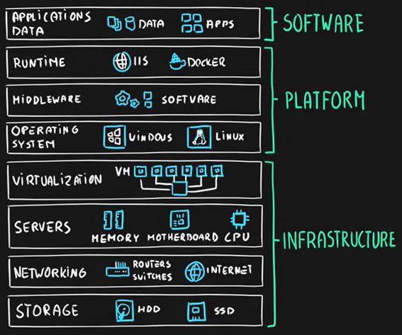
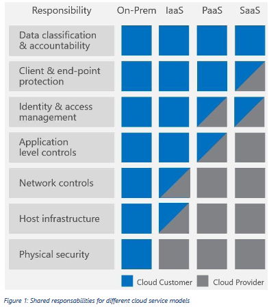

# Shared Responsibility Model

When we talk about the Azure Shared Responsibilities Model we are referring to the division of responsibilities between Microsoft Azure as the cloud service provider and the customers who use Azure services. When organizations begin their move to the cloud it is important to ascertain what the responsibilities are for the cloud provider and what they are for the organization.

By design Cloud Providers should for example provide security for certain infrastructure and network elements, but customers should also know their own responsibilities. What those responsibilities are depends on the cloud delivery mechanism that is being used.

We define three distinct delivery mechanisms for cloud computing:

- **Infrastructure as a Service (IaaS)**

	Cloud Provider manages: Infrastructure.
	Customer manages: Platform and Software.

	This is considered the most basic cloud model as the Cloud Provider is only tasked with managing the infrastructure. The customer handles all the platform and software related responsibilities, e.g.: operating systems, applications and network configurations.

	This service is recommended for customers that want complete control over their Virtual Machines and OS installations and applications.

- **Platform as a Service (PaaS)**

	Cloud Provider manages: Infrastructure and Platform.
	Customer manages: Software.

	In this mechanism the Cloud Provider also takes on the responsibilities of the Platform. Here the customer can focus on the development, deployment and management of applications in the Cloud without having to worry about infrastructure management.

- **Software as a Service (SaaS)**

	Cloud Provider manages: Infrastructure, Platform and Software.

	Here the customer does not have to worry about the infrastructure, platform or software and can focus solely on using software applications hosted on the cloud infrastructure.

The exact distribution of responsibilities is not always binary as some can be shared by both the Cloud Provider and the Customer. In the figure below we can see that depending on the delivery mechanism used the responsibility of the host infrastructure, network controls, application level controls, identity & access management and client & end-point protection can be shared:

Regardless of the type of delivery mechanism, the following responsibilities are always retained by the customer:

- Data
- Endpoints
- Account
- Access management

## Key-terms
- **IaaS**: Infrastructure as a Service.
- **PaaS**: Platform as a Service.
- **SaaS**: Software as a Service.
- **CSP**: Cloud Service Provider.

## Assignments

### Assignment 1
- [x] Study: Het Azure Shared Responsibility model

### Sources
- [Shared responsibility in the cloud](https://learn.microsoft.com/en-us/azure/security/fundamentals/shared-responsibility)
- [Shared Responsibility for Cloud Computing Whitepaper](https://azure.microsoft.com/mediahandler/files/resourcefiles/shared-responsibility-for-cloud-computing/Shared%20Responsibility%20for%20Cloud%20Computing-2019-10-25.pdf)
- [AZ-900 Episode 5 | IaaS vs PaaS vs SaaS cloud service models | Microsoft Azure Fundamentals Course](https://www.youtube.com/watch?v=9CVBohl6w0Q)