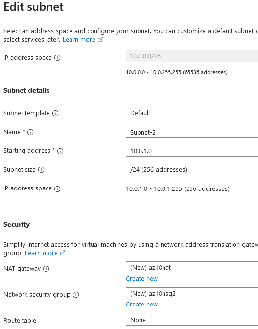
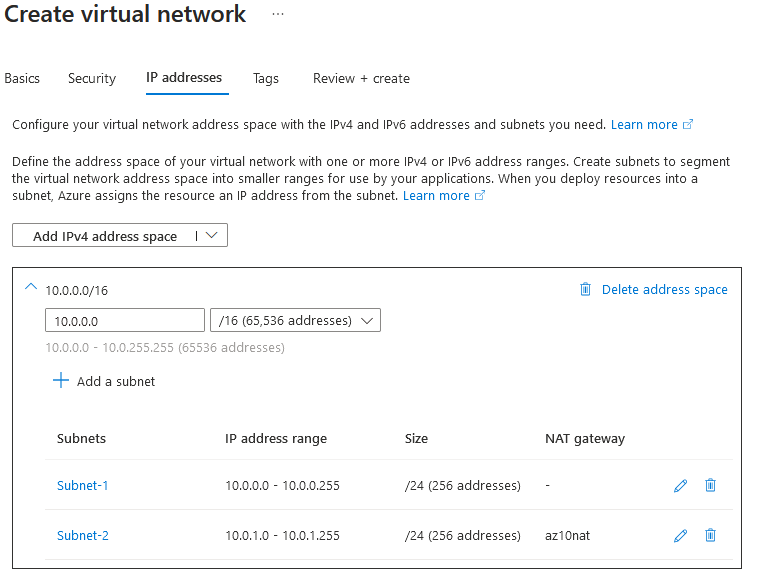
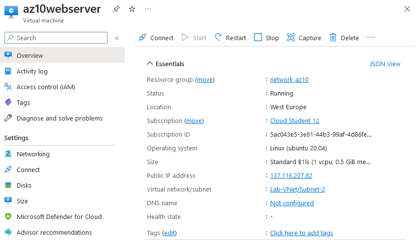
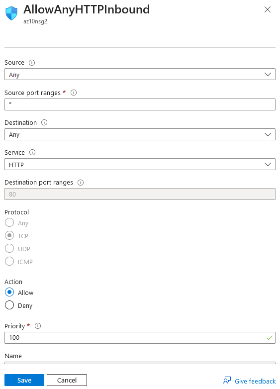
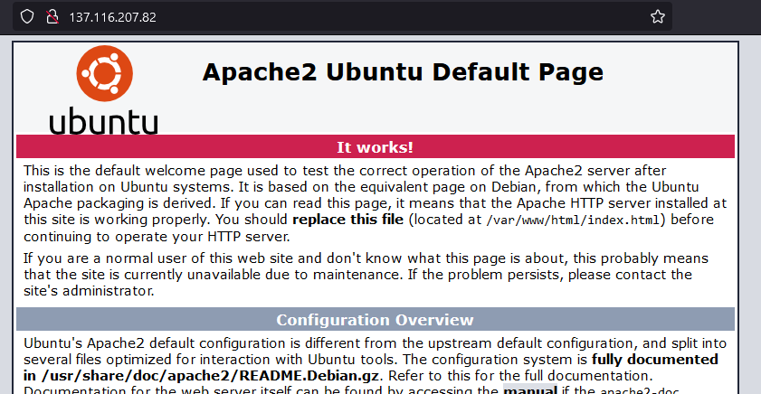

# Azure Virtual Network (VNet)

Azure Virtual Networks allows your resources to securely communicate with each other, the internet and on-premise networks. Some examples of things you can accomplish with Azure Virtual Networks according to the official Azure Documentation are:

- **Communication of Azure resources with the internet**:
	Outbound communication can be done via a public IP, NAT Gateway or public load balancer.
- **Communication between Azure resources**:
	This kind of communication can be done via three routes: through a virtual network, through a virtual network service endpoint or through virtual network peering.
- **Communication with on-premises resources**:
	Connecting on-premises systems to a virtual network can be done in three ways: a point-to-site virtual private network (VPN), a site-to-site VPN or Azure ExpressRoute.
- **Filtering network traffic**:
	you have two options to filter network traffic: Network Security Groups and Network Virtual Appliances.
- **Routing network traffic**:
	Azure routes traffic by default between subnets, connected virtual networks, on-premises networks, but this can be overridden with two services: rout tables and Border Gateway Protocol routes.
- **Integration with Azure services**:
	Azure services can be integrated into your virtual network by either deploying dedicated instances of the services into the virtual network, using Private Link or by using service endpoints.

One of the best things about Azure Virtual Networks: it's free!

## Key-terms
- **Virtual Network**: a software based network that is logically isolated within a cloud infrastructure.
- **NAT Gateway**: guides traffic between resources within the virtual network and external networks.
- **Virtual network service endpoint**: allows you to extend your virtual network private address space and the identity of your virtual network to Azure service resources.
- **virtual network peering**: a service allowing virtual networks to be connected together for resource communication.
- **Point-to-site virtual private network (VPN)**: creates a secure connection to your virtual network from an individual client computer.
- **Site-to-site VPN**: a connection between an on-premises VPN and an Azure VPN Gateway that is deployed in a virtual network.
- **Azure ExpressRoute**: a physical private connection between your on-premises network and the cloud.
- **Network Security Group**: basic firewall functionality through inbound and outbound security rules based on source, destination and port.
- **Network Virtual Appliances**: a Virtual Machine that acts as a network function.
- **Rout Tables**: allows the creation of custom route tables directing traffic for each subnet.
- **Border Gateway Protocol**: allows the propagation of routes from on-premises BGP to your virtual networks.
- **Private Link**: allows access to Azure PaaS services over a private endpoint in a virtual network.
- **Service Endpoints**: provides secure and direct connectivity to Azure services over an optimized route over the Azure backbone network.

## Assignments

### Assignment 1
- [x] Maak een Virtual Network met de volgende vereisten:
	- Region: West Europe
	- Name: Lab-VNet
	- IP range: 10.0.0.0/16
- [x] Vereisten voor subnet 1:
	- Name: Subnet-1
	- IP Range: 10.0.0.0/24
	- Dit subnet mag geen route naar het internet hebben
- [x] Vereisten voor subnet 2:
	- Name: Subnet-2
	- IP Range: 10.0.1.0/24

### Assignment 2

- [x] Maak een VM met de volgende vereisten:
	- Een apache server moet met de volgende custom data geïnstalleerd worden:
	```
	#!/bin/bash
	sudo su
	apt update
	apt install apache2 -y
	ufw allow 'Apache'
	systemctl enable apache2
	systemctl restart apache2
	```
	- Er is geen SSH access nodig, wel HTTP
	- Subnet: Subnet-2
	- Public IP: Enabled
- [x] Controleer of je website bereikbaar is


### Sources
- [What is Azure Virtual Network?](https://learn.microsoft.com/en-us/azure/virtual-network/virtual-networks-overview)
- [Site-to-site VPN](https://learn.microsoft.com/en-us/azure/vpn-gateway/design?toc=%2Fazure%2Fvirtual-network%2Ftoc.json#s2smulti)
- [Deploy dedicated Azure services into virtual networks](https://learn.microsoft.com/en-us/azure/virtual-network/virtual-network-for-azure-services)
- [Microsoft Azure Virtual Network Explained](https://www.dotnettricks.com/learn/azure/what-is-microsoft-azure-virtual-network-and-architecture)

### Problems
No problems.

### Result

## Assignment 1

### Create a Virtual Network.

Creating a virtual network with the following settings:

```
Virtual Network:

- Region: West Europe
- Name: Lab-VNet
- IP range: 10.0.0.0/16

Subnet 1:

- Name: Subnet-1
- IP Range: 10.0.0.0/24
- This subnet should not have internet access.

Subnet 2:

- Name: Subnet-2
- IP Range: 10.0.1.0/24
```

Subnet 1 should not have a NAT gateway as it is not allowed to have internet access. Subnet 2 should have a NAT gateway:



I also added Network Security Groups to both for basic firewall functionality. The resulting virtual network and two subnets:



## Assignment 2

### Make a Virtual Machine

Making a virtual machine with the following requirements:

	- Custom Data:
	```
	#!/bin/bash
	sudo su
	apt update
	apt install apache2 -y
	ufw allow 'Apache'
	systemctl enable apache2
	systemctl restart apache2
	```
	- HTTP access
	- No SSH access
	- Subnet: Subnet-2
	- Public IP: Enabled

Creating the Virtual Machine in Azure was quite simple:



I then had to go into the Network Security Group for the VM and add a rule to allow HTTP traffic:



Opening the public IP in my browser showed the web server was accessible:

