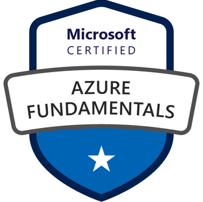

# Azure Core Services

Azure offers many services fundamental to working in the cloud. These services are designed to make the managing of your cloud applications and services easier. Here are some services offered by Azure and a brief explanation of their core functionality:

- **Regions and Region Pairs**: respectively geographic locations where datacenters are located and regions that are paired together for redundancy.

- **Availability Zones**: physically separated datacenters within a region zoned together for redundancy purposes.

- **Resource Groups**: logical containers that organize and manage resources.

- **Subscriptions**: billing and management containers for Azure resources.

- **Management Groups**: can be used to hierarchically manage your Azure subscriptions.

- **Azure Resource Manager**: allows customers to deploy and manage their resources.

- **Virtual Machines**: an environment resource in Azure allowing you to run a virtual computer system.

- **Azure App Services**: a platform that allows customers to manage and deploy web apps, mobile apps and APIs.

- **Azure Container Instances (ACI)**: a lightweight, serverless solution to deploy and run containers without managing the underlying infrastructure.

- **Azure Kubernetes Service (AKS)**: Kubernetes is an open-source platform facilitating the managing of containerized workloads and services.

- **Azure Virtual Desktop**: a Virtual Desktop Infrastructure (VDI) allowing users to access desktops and applications from any device.

- **Virtual Networks**: creation of isolated networks within Azure.

- **VPN Gateway**: allows the connecting of Azure VN with on-premise networks or other Azure virtual networks via a Virtual Private Network.

- **Virtual Network Peering**: allows direct connectivity between different Azure Virtual Networks.

- **ExpressRoute**: a private and dedicated connection between on-premises networks and Azure data centers.

- **Container (Blob) Storage**: a scalable and secure object storage service.

- **Disk Storage**: durable and high-performance block-level storage for Azure virtual machines.

- **File Storage**: a manage file sharing solution in the cloud.

- **Storage Tiers**: helps customers reduce costs of storage by allowing them to pick appropriate storage performance and pricing.

- **Cosmos DB**: a database service.

- **Azure SQL Database**: another fully managed database service.

- **Azure Database for MySQL**:another fully managed database service.

- **Azure Database for PostgreSQL**:another fully managed database service.

- **SQL Managed Instance**: a fully managed instance of an SQL server.

- **Azure Marketplace**: a place to buy all kinds of applications, services and other solutions from either Microsoft or third party vendors.

These and more can be found on the Azure products page: [https://azure.microsoft.com/en-us/products/](https://azure.microsoft.com/en-us/products/)

## Key-terms
- **AZ-900 certificate**: allows you to prove your knowledge of cloud concepts by passing this exam.

## Assignments

### Assignment 1
- [x] Study: De Exam Guide voor Microsoft Azure Fundamentals (AZ-900)

### Sources
- [Azure products](https://azure.microsoft.com/en-us/products/)
- [Microsoft Azure Core Services For Beginners](https://k21academy.com/microsoft-azure/microsoft-azure-core-services-for-beginners/)
- [Exam Guide for Microsoft Azure Fundamentals (AZ-900)](https://query.prod.cms.rt.microsoft.com/cms/api/am/binary/RE3VwUY)
- [Tips and Tricks to pass the Microsoft AZ-900 Exam](https://www.testpreptraining.com/blog/tips-and-tricks-to-pass-the-microsoft-az-900-exam/)
- [Exam AZ-900: Microsoft Azure Fundamentals](https://learn.microsoft.com/en-us/certifications/exams/az-900/)

### Problems
No problems.

### Result

## Assignment 1

The AZ-900: Microsoft Azure Fundamentals has the following characteristics:

| Characteristic | Value |
| --- | --- |
| Exam price | 99 euros |
| Questions | 40-60 |
| Required score to pass | 700 |
| Exam delivery | Pearson VUE, Certiport |

The exam supports the following languages: English, Japanese, Chinese (Simplified), Korean, Spanish, German, French, Indonesian (Indonesia), Arabic (Saudi Arabia), Chinese (Traditional), Italian, Portuguese (Brazil), Russian.

The questions are divided into the following three categories and their respective weight:

- Describe cloud concepts (25–30%)
- Describe Azure architecture and services (35–40%)
- Describe Azure management and governance (30–35%)

Some handy tips to help you pass the exam:

- Review the [Exam Guide for Microsoft Azure Fundamentals (AZ-900)](https://query.prod.cms.rt.microsoft.com/cms/api/am/binary/RE3VwUY)
- Use the Microsoft Learn environment.
- Take practice exams. E.g.: [https://www.itexams.com/info/AZ-900](https://www.itexams.com/info/AZ-900)
- Read the documentation.
- Attend training courses offered by Microsoft.
- Watch Youtube videos, like those from Adam Marczak: [https://www.youtube.com/watch?v=NPEsD6n9A_I&list=PLGjZwEtPN7j-Q59JYso3L4_yoCjj2syrM](https://www.youtube.com/watch?v=NPEsD6n9A_I&list=PLGjZwEtPN7j-Q59JYso3L4_yoCjj2syrM)