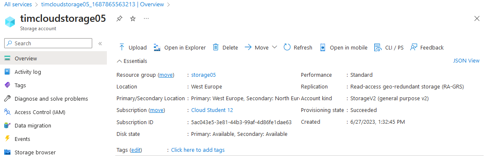
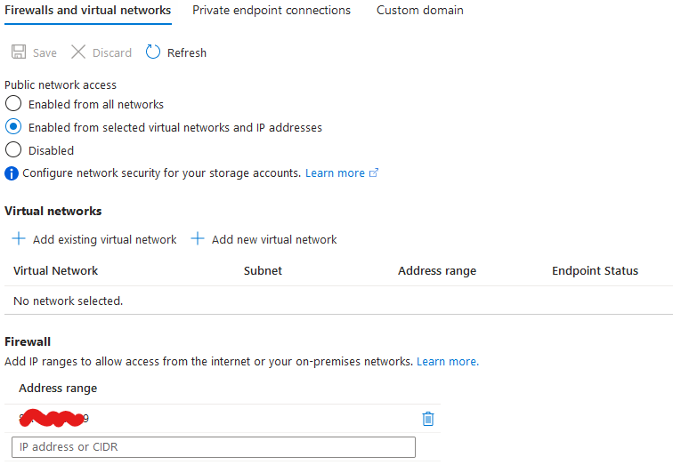
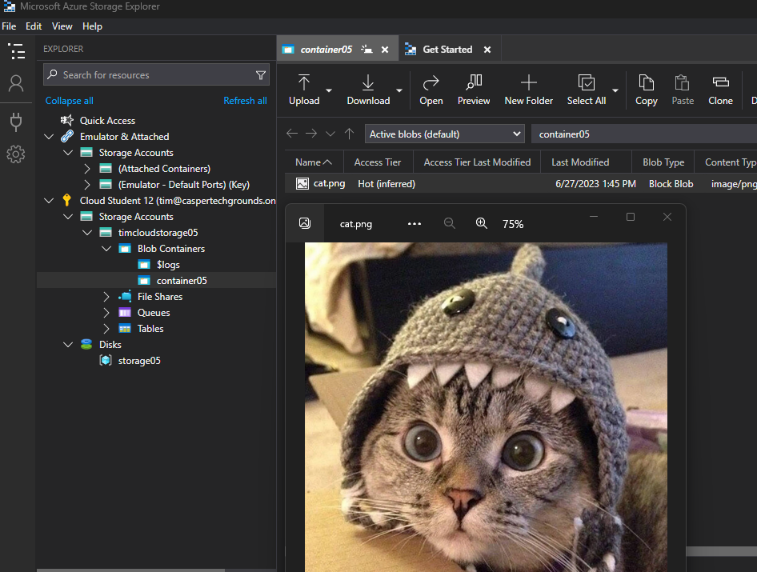
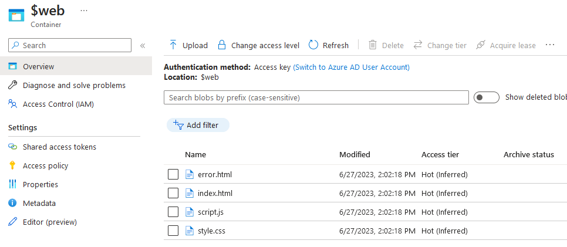
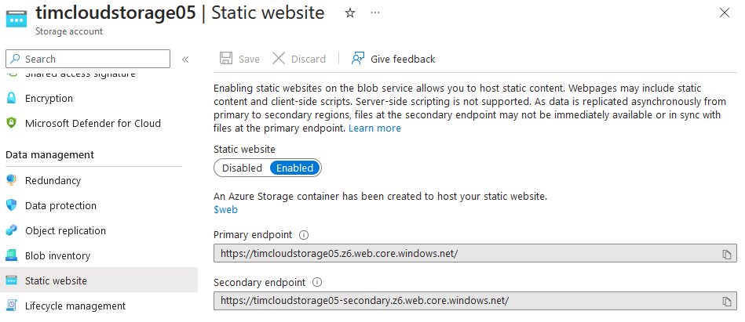
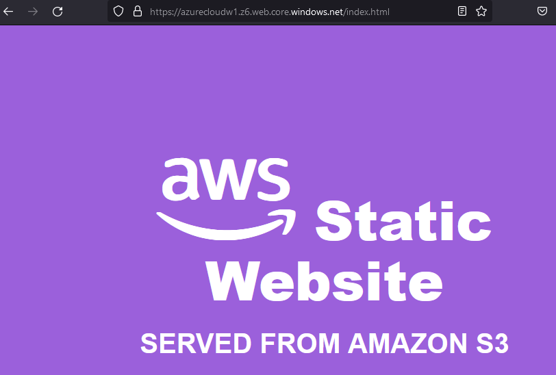

# Azure Storage Account

Azure Storage is a scalable and durable cloud storage service provide to you by Azure. You can use it to safely store various types of data in the cloud, like files, blobs, disks, tables etc.

Azure Storage can host a variety of data, is designed to be highly scalable and has build in redundancy and can be seamlessly integrated with other Azure services.

## Key-terms
- **Container**: an isolated environment for running applications.
- **Blob Storage**: a cloud-based object storage service for storing and retrieving large amounts of unstructured data.

## Assignments

### Assignment 1
- [x] Maak een Azure Storage Account. Zorg dat alleen jij toegang hebt tot de data.
- [x] Plaats data in een storage service naar keuze via de console (bijvoorbeeld een kattenfoto in Blob storage).
- [x] Haal de data op naar je eigen computer door middel van de Azure Storage Explorer.

### Assignment 2

- [x] Maak een nieuwe container aan.
- [x] Upload de 4 bestanden die samen de AWS Demo Website vormen.
- [x] Zorg dat Static Website Hosting aan staat.
- [x] Deel de URL met een teamgenoot. Zorg ervoor dat zij de website kunnen zien.

### Sources
- [Get started with Storage Explorer](https://learn.microsoft.com/en-us/azure/vs-azure-tools-storage-manage-with-storage-explorer?tabs=windows)
- [Static website hosting in Azure Storage](https://learn.microsoft.com/en-us/azure/storage/blobs/storage-blob-static-website)

### Problems
No problems.

### Result

## Assignment 1

### **Make an Azure Storage Account. Make sure only you have access to the data.**

I created a Storage Account called `timcloudstorage05`.

To make sure that I was the only one with access to the date, I opted to select the `Enabled from selected virtual networks and IP addresses` option under `Public network access`:

Adding my own public IP to the firewall whitelist allowed me access to the data. Another option would have been to create a private endpoint.

### **Place data in a storage service of you own choice via the console.**

After a long search I found the perfect cat to put in a storage service:

I used the Storage Browser in the Azure Console to upload the cat.png to container `container05`

### **Retrieve your data using the Azure Storage Explorer app.**

I downloaded the Azure Storage Explorer, logged in, went into `container05` and opened cat.png:

## Assignment 1

### **Make a new container.**

Originally I created a container `container06` but later I found out that turning on Static Website Hosting automatically creates the `$web` container used for website hosting.

### **Upload the 4 AWS Demo Website files.**

Used the Storage Browser again to upload the 4 files to `$web`:

### **Make sure Static Website Hosting is turned on.**

Done via `Data Management` -> `Static website`:

### **Share your URL with a peer. Make sure your peer can view your website**

I had to add my peer's public IP address to the firewall whitelist before he was able to view the website. He did the same on his end and shared his website:

