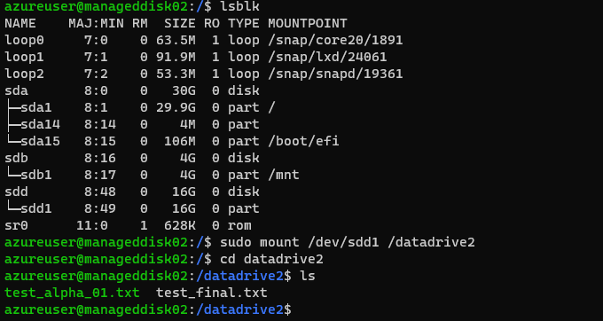

# Azure Disk Storage

Azure allow us to create high-performance, highly durable block storage for out Virtual Machines. The storage is cost-effective and can be run clustered and has a 0% annual failure rate. Using ultra disk storage can help you meet demand without performance disruption. Azure also allows you to secure your data on these storage disks with automatic encryption.

It is also possible to share your managed disks with two or more Virtual Machines as we will attempt to do in this assignment. Trying to make this work on this new Azure feature may require the use of a Cluster Manager however.

## Key-terms
- **Azure Disk Storage**: durable and high performance block-level storage for Azure virtual machines.
- **Disk Snapshot**: a point-in-time capture of the data stored on a disk.
- **Cluster Manager**: a system that allows you to manage resources and tasks within a cluster or distributed computing environment.

## Assignments

### Assignment 1
- [x] Start 2 Linux VMs. Zorgt dat je voor beide toegang hebt via SSH.
- [x] Maak een Azure Managed Disk aan en koppel deze aan beide VMs tegelijk.
- [x] Creëer op je eerste machine een bestand en plaats deze op de Shared Disk.
- [x] Kijk op de tweede machine of je het bestand kan lezen.
- [x] Maak een snapshot van de schijf en probeer hier een nieuwe Disk mee te maken
- [x] Mount deze nieuwe Disk en bekijk het bestand. 

### Sources
- [Azure managed disk types](https://learn.microsoft.com/en-us/azure/virtual-machines/disks-types)
- [Azure Disk Storage](https://azure.microsoft.com/en-us/products/storage/disks)
- [Introduction to Azure managed disks](https://learn.microsoft.com/en-us/azure/virtual-machines/managed-disks-overview)
- [Use the portal to attach a data disk to a Linux VM](https://learn.microsoft.com/en-us/azure/virtual-machines/linux/attach-disk-portal?tabs=ubuntu)
- [I cannot see data on my shared disk on my second Azure VPS](https://learn.microsoft.com/en-us/answers/questions/445559/i-cannot-see-data-on-my-shared-disk-on-my-second-a)

### Problems
I faced two problems with the assignment that took me quite a bit if troubleshooting and were somewhat connected:

1. **Virtual Machine 2 did not display the file created in Virtual Machine 1**: it was not evident to me at first that this was the purpose of this part of the assignment. As such I spend a fair bit of time trying to figure out how to actually make the file visible potentially using a Cluster Manager. I'm assuming now that this was intentional. In the process of trying to fix this problem however I did a lot of testing on both machines with file settings, permissions and file creations, which caused the second problem:

2. **Possible data corruption**: all the testing I did for problem 1 caused several errors to start popping up such as:

Input/output errors on the disk partition:
```
azureuser@manageddisk02:/datadrive$ ls -al
ls: cannot open directory '.': Input/output error
```

and a possible data corruption in the desk created from the snapshot, failing my attempts to mount the partition:

```
azureuser@manageddisk02:/$ sudo mount /dev/sdd1 /datadrive2
mount: /datadrive2: wrong fs type, bad option, bad superblock on /dev/sdd1, missing codepage or helper program, or other error.
```
I was able to resolve the issue by reformatting the disk and creating the file, snapshot and disk again.

### Result

## Assignment 1

### Start 2 Linux Virtual Machines. Make sure you can access both through SSH.

Successfully created two new Linux VM's `manageddisk01` and `manageddisk02`:


Logging in to both machines via SSH was also successful:


### Create an Azure Managed Disk and link it to both VMs.

I then used the Azure Console to create a standard 16gb SSD Managed Disk `az07`:


I made sure to enable `Shared Disk` and set `Max shares` to two.

Afterwards I had to link the shared disk to both the Virtual Machines. We can do this in the console by going to the disk settings of each VM and selecting `Attach existing disks`:


Next I had to execute several more steps to find, partition and format the disk, and then mount it.

Using `lsbulk` to find the name of the datadisk:


Here we can see our 16gb SSD has the name `sdc`. Following this I had to partition the disk, then format it:

```
sudo parted /dev/sdc --script mklabel gpt mkpart xfspart xfs 0% 100%
sudo mkfs.xfs /dev/sdc1
```

Next I had to make sure the kernel is aware of the new partition and filesystem using `partprobe`:

```
sudo partprobe /dev/sdc1
```
Lastly I had to mount the new partition. I created a new directory `sudo mkdir /datadrive` and mounted the partition `sudo mount /dev/sdc1 /datadrive`.

Partitioning and formatting was only nescessary on the first VM, mounting and partprobing had to be done on the second one as well.

### Create a file on your first VM and place it in the Shared Disk.

File successfully created on the first Virtual Machine using `touch test_final.txt`.

### Check on the seconds VM if you can read the file.

Trying to find the file on the second VM failed:


After some research I discovered that in order to see files in both Virtual Machines I would need to use a cluster manager to properly be able to use the Shared Disk system like this. To quote a Microsoft employee:

> Azure Shared Disks is designed primarily for clustered applications and very specific workloads. Shared managed disks do not natively offer a fully managed file system that can be accessed using SMB/NFS. You need to use a cluster manager, like Windows Server Failover Cluster (WSFC) or Pacemaker, that handles cluster node communication and write locking. See here for some example workloads. - deherman-MSFT

Since the assignment did not ask us to try and fix this problem with a cluster manager, I left it as is.

### Make a snapshot of the disk and create a new disk with it.

We can easily create a snapshot in the Azure Console, by going to the Disk overview and clicking `Create Snapshot`:


The button `Create disk` can then be used to create a new disk from the snapshot:


### Mount the new disk and view the file.

After adding the new disk to the VM via the console we can then mount it to a new folder `sudo mount /dev/sdd1 /datadrive2`. After that we find that the file `test_final.txt` that was created on the first VM is now also visible on the second one:

