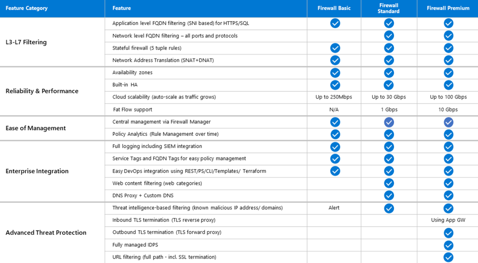
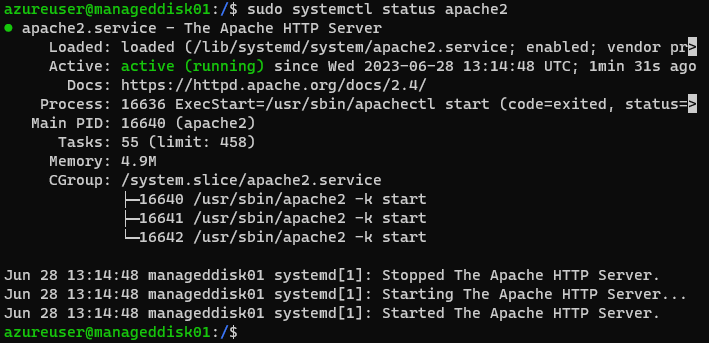
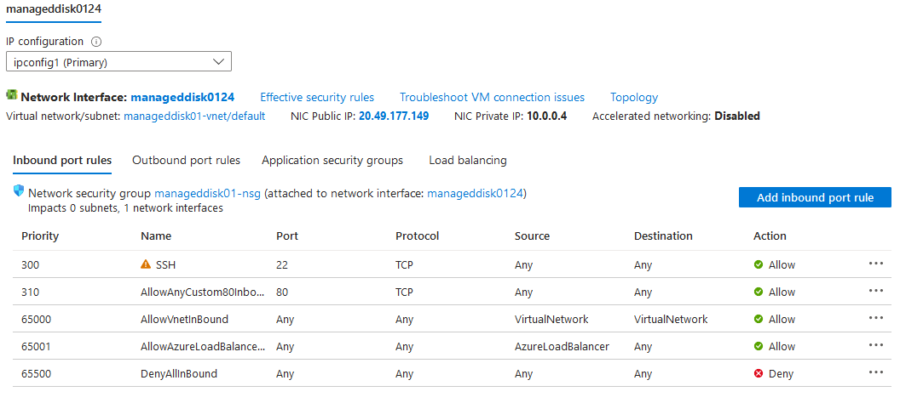
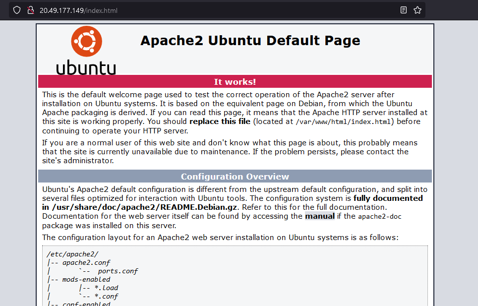
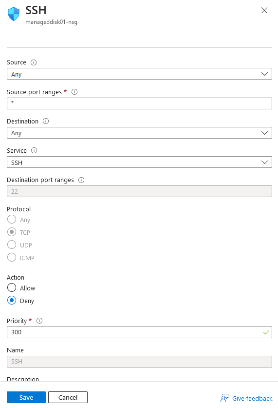
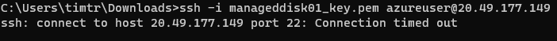

# Firewalls

Firewalls are indispensable in modern day networking and when dealing with Azure companies should try and pick the right Firewall for their specific situation. Azure offers its own Firewall solution to customers providing cloud-native network security.

Azure Firewall is a managed, stateful, cloud-based network security service that protects Azure Virtual Network resources and comes in three different flavors: Basic, Standard and Premium.

1. **Basic Firewall**: is designed for small and medium sized businesses. It offers its most basic but essential security at a prize that is affordable for SMB's. It scales up to 250 Mbps.
1. **Standard**: is aimed at larger companies and has several more features than the basic version, including  network level FQDN filtering, web content filtering, flat flow support and DNS proxy and custom DNS and known malicious IP/domain filtering. It also offers higher cloud scalability up to 30 Gbps.
1. **Premium**: this is the most advanced version of Azure Firewall and offers the most features of all versions. It is meant for the largest companies and organizations and in addition to all the previous versions' features it also offers: inbound + outbound TLS termination, fully managed IDPS and URL filtering as well as cloud scalability up to 100 Gbps.

For a full list of features have a look at this chart:



While Azure Firewall is a subscription based intelligent network firewall security service, Firewall Policy is the recommended way to configure these firewalls across multiple Azure Firewall instances in Secured Virtual Hubs and Hub Virtual Networks. These can be managed using the portal, REST API, templates, Azure PowerShell and CLI.

Based on the Firewall flavor used Firewall Policy offers different features:

| Policy type | Feature support | Firewall SKU support |
| --- | --- | --- |
| Basic policy | NAT rules, Application rules<br />IP Groups<br />Threat Intelligence (alerts) | Basic |
| Standard policy | NAT rules, Network rules, Application rules<br />Custom DNS, DNS proxy<br />IP Groups<br />Web Categories<br />Threat Intelligence | Standard or Premium |
| Premium policy | All Standard feature support, plus:<br />TLS Inspection<br />Web Categories<br />URL Filtering<br />IDPS | Premium |

Azure Firewall is considered much more than just a Firewall because if offers much more functionalities that go beyond basic network security. Some examples of these additional comprehensive features include but are not limited to:

- **Filtering**: control network traffic flow at the application and network levels.
- **NAT**: Azure Firewall includes Network Address Translation.
- **Threat Intelligence and Intrusion Detection**: premium can identify and block traffic from known malicious IP addresses and domains.
- **TLS Inspection**: Transport Layer Security inspection, which allows it to decrypt and inspect encrypted traffic.
- **Azure Services Integration**: can be integrated with services such as Azure Sentinel and Azure monitor.
- **Scalable and highly available**: can scale up to 100 Gbps based on traffic and can be deployed across multiple availability zones.

Network Security Groups are a much cheaper way to filter network traffic between Azure resources in a virtual network. A NSG contains as many rules as desired to allow or deny inbound or outbound network traffic, allowing you to specify source and destination, port and protocol.

While Azure Firewall is a dedicated network security service with advanced features, Network Security Groups are resource-level firewalls primarily used for network segmentation and basic traffic filtering.

In this assignment we will be using Network Security Groups.

## Key-terms
- **Azure Firewall**: cloud-based network security service offered by Microsoft Azure.
- **NSG**: Network Security Group; basic virtual firewall that is much cheaper than Azure Firewall.
- **Hub-and-spoke network**:  a design framework commonly used in networking to connect multiple sites or branches to a central location or hub.
- **SMB**: small to medium sized businesses usually having fewer than 500 employees.
- **Cloud Scalability**: a feature of the cloud that allows the system or service to adapt to increase traffic and workload demands without sacrificing performance or availability.

## Assignments

### Assignment 1
- [x] Zet een webserver aan. Zorg dat de poorten voor zowel SSH als HTTP geopend zijn.
- [x] Maak een NSG in je VNET. Zorg ervoor dat je webserver nog steeds bereikbaar is via HTTP, maar dat SSH geblokkeerd wordt.

### Sources
- [Wat is Azure Firewall?](https://learn.microsoft.com/nl-nl/azure/firewall/overview)
- [Azure Firewall Premium-functies](https://learn.microsoft.com/nl-nl/azure/firewall/premium-features)
- [Network security groups](https://learn.microsoft.com/en-us/azure/virtual-network/network-security-groups-overview)
- [Azure Firewall Manager policy overview](https://learn.microsoft.com/en-us/azure/firewall-manager/policy-overview)
- [Choose the correct Firewall](https://learn.microsoft.com/nl-nl/azure/firewall/choose-firewall-sku)

### Problems
No problems.

### Result

## Assignment 1

### Enable a webserver. Make sure the ports to SSH and HTTP are opened.

For this assignment I used the already running Virtual Machine from assignment az07 called `manageddisk01`. I installed the httpd server and enabled it:

```
apt update
apt install apache2 -y
ufw allow 'Apache'
systemctl enable apache2
systemctl restart apache2
```

Then checked the status of the server with `sudo systemctl status apache2`:



Everything is looking good.

### Make a NSG in your VNET. Make sure the webserver is still available through HTTP, but also that SSH is blocked.

Security group `manageddisk01-nsg` was created in virtual network `manageddisk01-vnet/default`. To make sure the webserver was available through HTTP I added a port rule that allowed TCP traffic through port 90 from any source to any destination:



Making sure that the webserver was actually accessible I opened the default page in the browser:



Next I needed to block SSH by changing the existing SSH rule action from `Allow` to `Deny`:



Double checking again to see if the SSH port 22 block worked:

