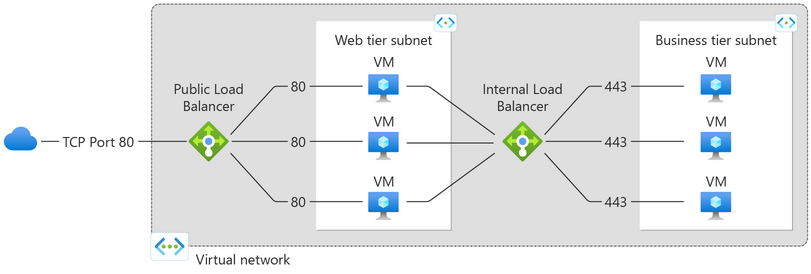
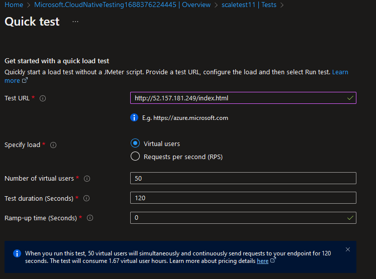
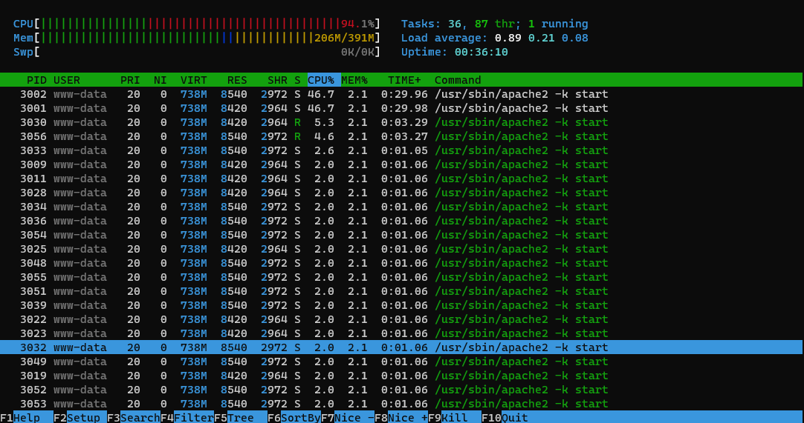
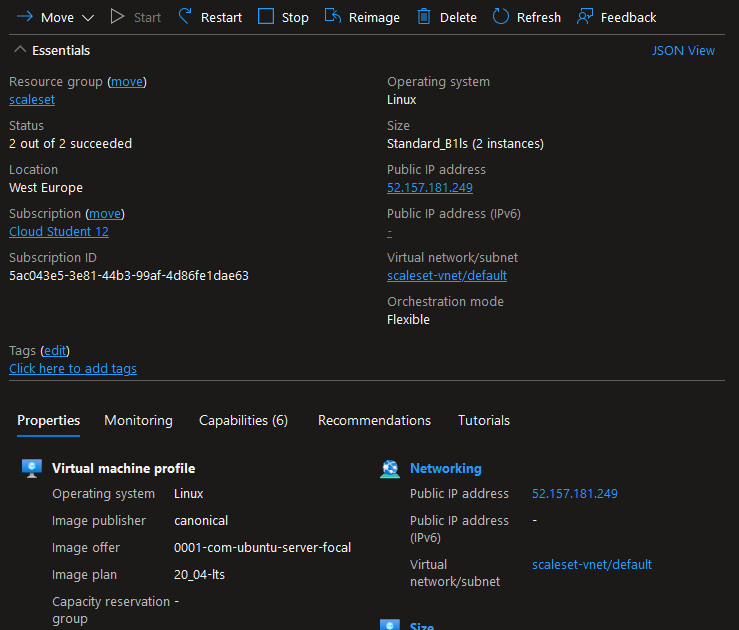
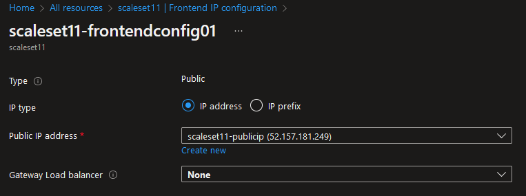
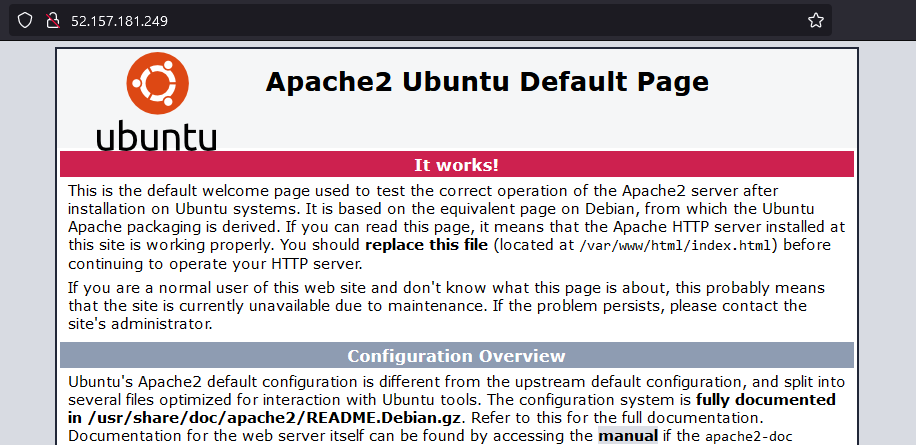
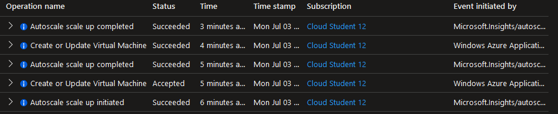
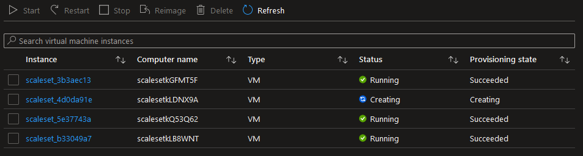

# Azure Load Balancer (ALB) & Auto Scaling

To help you improve the redundancy and performance of you Virtual Machines, Azure has introduced Virtual Machine Scale Sets. This service lets you create and manage a group of load balanced Virtual Machines and is designed to help you automatically scale your applications to meet demand, as well as ensure high availability and performance.

Helping traffic flow to these different Virtual Machines is done by the Azure Load Balancer. This service operates at the 4th layer of the OSI model and directs incoming traffic to the different VMs in your scale set based on a set of preconfigured load-balancing rules.

There are both public and internal (private) load balancers. The former handles load balancing internet traffic to your VM's, whilst the latter is used to handle traffic within the network.



Azure Monitor is the service that monitors traffic and workload and scales your VM's in a VMSS appropriately.

Using Virtual Machine Scale Sets has several benefits:

- **Application scalability**: VMSS allows the automatic scaling of applications based on increased traffic or workload. This scaling works both upwards and downwards.
- **High availability and application resiliency**: distribution of your Virtual Machines can happen across fault domains and availability zones. Should one VM fail, others will take over.
- **Simple management**: VMSS allows the use of profiles to maintain a consistent configuration across your scale set, reducing the need to manage and configure various aspects of the VM's individually.
- **Cost management**: by automatically scaling instances based on demand, excess costs for unused resources are reduced and you only have to pay for the VM's that are actually in use.

Azure offers two different scale set orchestration modes that allows you to have greater control over how VM's are managed by the scale set: Uniform and Flexible orchestration.

Testing the scalability of your Virtual Machines in a VMSC can be done using the Azure Load Testing service. This is a fully managed load-testing service that enables you to generate high-scale load.

It is also possible to use various Linux based stress tools for the purposes of this assignment.

## Key-terms
- **Auto Scaling**: the automatic scaling of applications or resources based on demand or workload.
- **Azure Monitor**: a cloud-based monitoring and diagnostics service for Azure.
- **Load Balancing**: distributing network traffic evenly amongst a group of resources.
- **Uniform orchestration**: Virtual Machine Scale Sets that use a virtual machine profile or template to scale up to desired capacity.
- **Flexible orchestration**: allows Virtual Machine Scale Sets where the user has greater control over the management of the VMs.
- **stress-ng**: a command-line tool used to generate various types of stress on a Linux System

## Assignments

### Assignment 1
- [x] Maak een Virtual Machine Scale Set met de volgende vereisten:
	- Ubuntu Server 20.04 LTS - Gen1
	- Size: Standard_B1ls
	- Allowed inbound ports: SSH (22), HTTP (80)
	- OS Disk type: Standard SSD
	- Networking: defaults
	- Boot diagnostics zijn niet nodig
	- Custom data:

	```
	#!/bin/bash
	sudo su
	apt update
	apt install apache2 -y
	ufw allow 'Apache'
	systemctl enable apache2
	systemctl restart apache2
	```
	- Initial Instance Count: 2
	- Scaling Policy: Custom
	- Aantal VMs: minimaal 1 en maximaal 4
	- Voeg een VM toe bij 75% CPU gebruik
	- Verwijder een VM bij 30% CPU gebruik

### Assignment 2

- [x] Controleer of je via het endpoint van je load balancer bij de webserver kan komen.
- [x] Voer een load test uit op je server(s) om auto scaling the activeren. Er kan een delay zitten in het creëren van nieuwe VMs, afhankelijk van de settings in je VM Scale Set.

### Sources
- [What are Virtual Machine Scale Sets?](https://learn.microsoft.com/en-us/azure/virtual-machine-scale-sets/overview)
- [What is Azure Load Balancer?](https://learn.microsoft.com/en-us/azure/load-balancer/load-balancer-overview)
- [Orchestration modes for Virtual Machine Scale Sets in Azure](https://learn.microsoft.com/en-us/azure/virtual-machine-scale-sets/virtual-machine-scale-sets-orchestration-modes)
- [Azure Load Testing](https://azure.microsoft.com/en-us/products/load-testing)
- [VMSS Flex Overview](https://www.youtube.com/watch?v=2BrckSF7ICI)
- [What is Azure Load Testing?](https://learn.microsoft.com/en-us/azure/load-testing/overview-what-is-azure-load-testing)
- [Quickstart: Create and run a load test with Azure Load Testing](https://learn.microsoft.com/en-us/azure/load-testing/quickstart-create-and-run-load-test?tabs=virtual-users)
- [How to Impose High CPU Load and Stress Test on Linux Using ‘Stress-ng’ Tool](https://www.tecmint.com/linux-cpu-load-stress-test-with-stress-ng-tool/)

### Problems
Originally I attempted a stress test using the Azure Load Tester:



However this did not provide the required 75% and higher CPU load. Whilst it did provide some spikes in CPU, it did not meet the 10 minute average required for the Auto Scaler to start creating more VMs.



So instead I switched to a Linux stress tool, which was more successful.

### Result

## Assignment 1

### Create a Virtual Machine Scale Set

I had to create a Virtual Machine Scale Set with the following requirements:

- Ubuntu Server 20.04 LTS - Gen1
- Size: Standard_B1ls
- Allowed inbound ports: SSH (22), HTTP (80)
- OS Disk type: Standard SSD
- Networking: defaults
- No Boot diagnostics
- Initial Instance Count: 2
- Scaling Policy: Custom
- Aantal VMs: minimum 1, maximum 4
- Add VM at 75% CPU usage
- Remove VM at 30% CPU usage
- Custom data:

	```
	#!/bin/bash
	sudo su
	apt update
	apt install apache2 -y
	ufw allow 'Apache'
	systemctl enable apache2
	systemctl restart apache2
	```

Resource was successfully deployed:



## Assignment 2

### Check to see if the webserver is accessible via the Load Balancer endpoint

First we need to find the public IP for the Load Balancer Endpoint:



Then we can check in our browser to see if the default Apache page is up:



### Execute a load test on your server to activate auto scaling

To execute a load test I first installed stress-ng:

`sudo apt-get install stress-ng`

I then ran a 10 minute stress test:

`sudo stress-ng --cpu 1 -v --timeout 600s`

After some time Azure Auto Scaler started scaling up the number of VM's on the VMSS:



After a while it created the maximum configured 4 instances. The VM's were visible in the Virtual Machine Instances tab:

