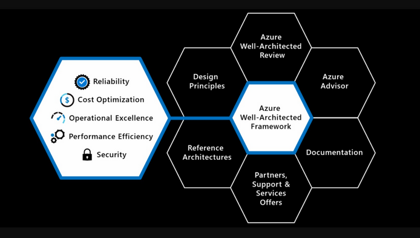
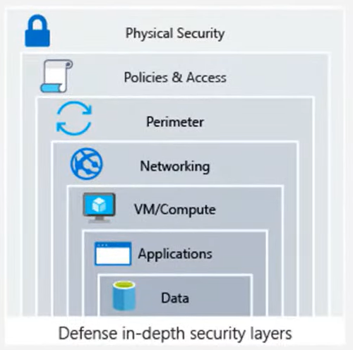
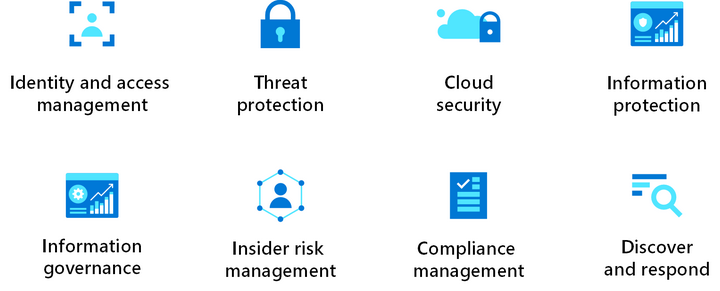

# Well-Architected Framework
 
The Microsoft Azure Well-Architected Framework is a set of guidelines users can use to improve the quality of the workload by following the five key pillars of architectural excellence:

1. Reliability
2. Security
3. Cost optimization
4. Operational excellence
5. Performance efficiency

Following these pillars helps Cloud Architects, developers and IT professionals design and build secure, reliable, scalable and efficient cloud-based solutions in the Azure Cloud. You can use CROPS as a mnemonic trick to remember them.

In the diagram above you will also see six supporting elements in addition to the five pillars. These contain additional guidance and resources to help organizations implement the framework effectively:

    [Azure Well-Architected Review](https://learn.microsoft.com/en-us/assessments/?id=azure-architecture-review&mode=pre-assessment)
    [Azure Advisor](https://learn.microsoft.com/en-us/azure/advisor/)
    [Documentation](https://learn.microsoft.com/en-us/azure/architecture/framework/)
    [Partners](https://azure.microsoft.com/partners/), [Support](https://azure.microsoft.com/support/options/#support-plans), and Services Offers
    [Reference architectures](https://learn.microsoft.com/en-us/azure/architecture/guide/)
    [Design principles](https://learn.microsoft.com/en-us/azure/architecture/guide/design-principles/)

Each pillar has its own critical design principles that can be used as lenses to assess the applications deployed on Azure compared to one of the pillars.

## Reliability

With reliability we primarily mean:

- Ensuring a highly available architecture.
- Recovering from failures such as data loss, major downtime, or ransomware incidents.

This pillar ensures that your application is delivered with the intended functionality consistently and predictably. This involves concepts like high availability, fault-tolerance, redundancy/clustering, recovery and resilience.

- **Design for business requirements**: your application must reflect the business requirements surrounding it. This comes with a cost implication trade-off
- **Design for failure**: increase reliability by anticipating failures and designing solutions to counter them in a resilient way.
- **Observe application health**: monitor your applications properly so issues can be detected and dealt with quickly and efficiently.
- **Drive automation**: by automating deployment and configuration operations human error can be minimized.
- **Design for self-healing**: using automation to minimize the time and effort required to recover from failures.
- **Design for scale-out**: design systems with horizontal rather than vertical scaling in mind. This allows systems to handle expected and unexpected traffic and reduce the effects of single point failure.

Here are some examples of services Azure offers to aid in reliability:

- Azure Availability Zones: physically separate data centers within an Azure region that allows resource distribution; enables high availability and fault tolerance.
- Azure Storage: highly available, massively scalable, durable, and secure storage for a variety of data objects in the cloud; provides durability and redundancy.
- Azure Backup: scalable, secure, and cost-effective backup service that protects your data and applications; provides reliability of data protection.

## Security

Data is the most valuable piece of your organizations' technical footprint. Protecting this data is therefore a key pillar and should be paramount in your design choices. Security provides the following insurances against deliberate attacks and abuse of your date and systems:

- Confidentiality
- Integrity
- Availability

Security breaches can take place in all 7 layers of the OSI model and include things like: exposed encryption keys/weak encryption, malicious code injection/execution (SQL, cross-site), malware, open ports/brute force attacks, DDoS, credentials exposure and unauthorized access to physical facilities.

Following a multilayered approach can help improve the security.

Microsoft recommends that you cover the following areas as you design this architecture:

Security tasks can be simplified by looking at specializations and the shared responsibility model.

- **Plan resources and how to harden them**: plan workload resources with security in mind and understand how individual cloud services are protected.
- **Automate and use least privilege**: grant only the minimum level of access to users, apps and processes that is needed for them to adequately function.
- **Classify and encrypt data**: classify the risk attached to different types of data and encrypt it both at rest and in transit.
- **Monitor system security, plan incident response**: implement robust and security monitoring and establish automated and manual procedures to respond to incidents.
- **Identify and protect endpoints**: monitor and secure endpoints using services like Firewalls and Web application firewalls.
- **Protect against code-level vulnerabilities**: identify and mitigate code-level vulnerabilities and implement security fixes and patches.
- **Model and test against potential threats**: identification and mitigation procedures, penetrating testing, static code analysis, code scanning etc.

Here are some examples of services Azure offers to aid in security:

- Azure Firewall: a cloud native firewall that provides network level security; Enables data protection.
- Azure Key Vault: enables the secure storage and management of encryption keys, certificates and secrets; allows you to safeguard encrypted data.
- Azure Active Directory: an identity and access management service; provides secure user identity management, MFA and access control.

## Cost optimization

Cost optimization can be characterized as the optimal balancing of quality, speed and efficiency versus the costs incurred, the balancing of business goals with budget justification. It is important to plan and estimate costs to help create a cost-effective workload whilst looking at ways to reduce unnecessary expenses. Examples of this are:

- Idle Virtual Machines.
- Retaining infrequently accessed data on a storage medium optimized for frequent access.
- Paying again for licenses that you already own.
- Manually repeating the building of a non-production environment.

These are cost optimizations you can make that will reduce your expenses in terms of money as well as staffing.

- **Choose the correct resources**: use the right resources for the right workload. Avoid overprovisioning or underutilizing resources. Using resources that have features that are unneeded for a particular workload when smaller alternatives are available can increases cost significantly.
- **Set up budgets and maintain cost constraints**: estimate the initial cost and then set budgets and alerts at different scopes to monitor cost.
- **Dynamically allocate and deallocate resources**: use Azure Advisor and other tools to identify idle or underutilized resources and reconfigure/consolidate/shut them down.
- **Optimize workloads, aim for scalable costs**: use Azure's auto-scaling features to automatically scale resources based on demand. In the cloud this prevents paying for unused resources by scaling out rather than up.
- **Continuously monitor and optimize cost management**: conduct regular cost reviews, measure and forecast capacity needs.

Here are some examples of services Azure offers to aid in cost optimization:

- Azure Advisor: provides recommendations to help optimize azure resources; enables cost savings.
- Azure Virtual Machine Scale Sets: allows the scaling of Virtual Machines by demand based on preset rules; optimizes costs by reducing unused resources.
- Azure Cost Management: gives a comprehensive overview of your resource costs and usage and allows the use of alerts, tracking, budgeting and forecasting; allows optimal resource allocation based on cost insights.

## Operational excellence

It is important to design modern architectures with modern operation practices and continuous integration in mind. Operational Excellence refers to the application of reliable, predictable and automated processes to your architecture to keep an application running in production.

Monitoring and analytic tools can be used to gain operational insights. Automation can be used to reduce both effort and human error, e.g. by starting and stopping a VM at the beginning and end of the workday. These principles focus on improving operational efficiency, reducing downtime, and ensuring the smooth functioning of applications and systems.

- **Optimize build and release processes**: Use software engineering disciplines across your entire environment to ensure the creation and management of environments throughout the software development lifecycle, which enables consistency, repetition and early detection of issues.
- **Understand operational health**: continuously monitor all aspect of your workload so you can proactively take action.
- **Rehearse recovery and practice failure**: it is important to implement strong incident management practices and practice them rigorously.
- **Embrace continuous operational improvement**: stagnant operational processes will have a negative effect on your organization.
- **Use loosely coupled architecture**: use modern architecture patterns to enable teams to build and deploy services independently and minimize the impact if there is a service failure.

Here are some examples of services Azure offers to aid in operational excellence:

- Azure Automation: enables the automation of repetitive tasks and processes; increases operations and reducing human errors.
- Azure Monitor: provides comprehensive monitoring and diagnostics for resources and applications; helps organizations proactively manage and optimize their Azure deployments.
- ARM templates: Azure Resource Manager templates allows the implementation of infrastructure as code and provides a way to automate the deployment and configuration of resources; enables consistent and reproducible deployments.

## Performance efficiency

Performance efficiency addresses the efficient use of resources to meet the required performance criteria and matching the resources that are available to an application with the demand that it's receiving; scaling the workload to meet the demands placed on it by users in an efficient manner.

We can measure different type of performance efficiency:

1. Latency: how soon does it start.
2. Throughput: how fast does it move.
3. Perceived responsiveness: queue it up. (E.g.: you click on an app in windows; nothing happens yet as the application is still loading, but the icon still changes to indicate it is responding to the click.)

- **Design for horizontal scaling**: instances are added (scale-out) or removed (scale-in) in response to changes in load.
- **Shift-left on performance testing**: early and often testing increases your ability to catch issues early.
- **Continuously monitor for performance in production**: monitor and log performance results in both development/testing environment and in production.

Here are some examples of services Azure offers to aid in performance efficiency:

- Azure Content Delivery Network: caches and delivers static content closer to users; reduces latency and improves content delivery performance.
- Azure Load Balancer: distributes incoming traffic across multiple resources; enables high availability and optimal resource utilization.
- Azure Autoscale: automatically scales resources based on preset rules; scaling based on demand enables improved performance and optimizes resource allocation.

## Assignments

### Assignment 1
- [x] Study: Well-Architected Framework van Azure.
- [x] Study: Hoe je elke pilaar kan implementeren met cloud-diensten

### Sources
- [Microsoft Azure Well-Architected Framework](https://learn.microsoft.com/en-us/azure/well-architected/)
- [Learn Live - Introduction to the Microsoft Azure Well-Architected Framework](https://www.youtube.com/watch?v=BF1Tw9MNa5U)

### Problems
No problems.
