# Files, AppServices, CDN, DNS, Database

## Azure App Service

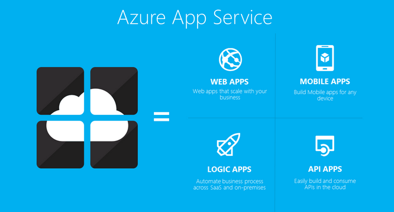

App Service is a fully managed platform-as-a-service (PaaS) available in Azure that allows developers to build, deploy and scale web, mobile and API applications. The platform supports many programming languages including .NET, .NET Core, Node.js, Java, Python, or PHP and runs in both Windows and Linux.

Every App Service app runs in an App Service plan which in turn is held by an App Service Environment. The App Service Plan is a container which has an assigned capacity, like vCore, RAM and storage which allows you to host multiple App Services within one App Service Plan. Scaling an app means you also scale the App Service Plan as well as all the apps in that plan; the needed infrastructure is added automatically.

App Service Deployment allows you to select a location for your code via automated continuous integration and deployment with various other services such as:

- Azure DevOps
- GitHub
- BitBucket
- Local Git
- Docker Hub
- OneDrive
- Dropbox

App Service can also be combined with external Identity Providers like Google, Facebook, Twitter etc. It is also possible to integrate App Services with Visual Studio through the use of extensions.

App Service is a great solution for organizations that want to develop and deploy applications without having to worry about the infrastructure, computers, networking, security patches that they would have to deal with on-premises. Azure App Services also offers a high availability of 99.95%.

## Content Delivery Network (CDN)

Azure Content Delivery Network delivers content all around the world with low latency and high performance through its cloud-based service. This service can be used for example to save bandwidth and improve responsiveness when encoding or distributing gaming software, firmware updates, and IoT endpoints and to reduce load time for sites, apps and steaming media.

Azure CDN achieves this by caching content in many edge servers all around the globe in various regions or PoPs. When someone requests a piece of content, Azure CDN automatically routes the request to an edge server nearest to the user, minimizing the distance traveled by the content. This improves the overall user experience by reducing latency and increasing the speed at which content can be accessed.

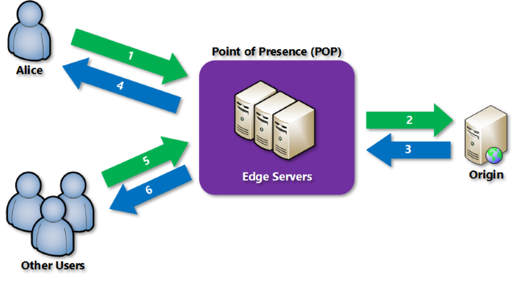

Organizations using Azure CDN can benefit from reduced loads on their origin servers, improved scalability, higher availability and improved global performance of their content.

Besides its main purpose of rapidly delivering high-bandwidth content using caching, Azure CDN can be seamlessly integrated with various other Azure services:

- Dynamic site acceleration
- CDN caching rules
- HTTPS custom domain support
- Azure diagnostics logs
- File compression
- Geo-filtering

Azure Content Delivery Network includes a total of four products:

1. Azure CDN Standard from Microsoft
2. Azure CDN Standard from Akamai
3. Azure CDN Standard from Verizon
4. Azure CDN Premium from Verizon.

To find out which one is the best fit for your organization, you can refer to the [What are the comparisons between Azure CDN product features?](https://learn.microsoft.com/en-us/azure/cdn/cdn-features) page.

It is important to note that Azure Content Delivery Network from Akamai is scheduled to be retired on October 31 of this year. Any existing users of this service are asked to switch to a different CDN Provider like Azure Front Door or Azure CDN Standard/Premium from Verizon.

## Azure DNS

DNS or Domain Name System is a fundamental component of the modern internet. It translates human-readable domain names (like techgrounds.nl) into IP addresses used by computers for communication purposes. Without DNS we would all have to remember a long set of numbers for every website we wanted to visit.

Microsoft Azure offers a cloud-based Domain Name System service called Azure DNS which provides name resolution using the Microsoft Azure infrastructure. Whilst Azure does not provide a domain name purchasing service, organizations van buy them from a third-party domain name register and then host them in Azure DNS for record management.

Azure DNS can be seamlessly integrated with other services in Azure where DNS is used in its operation (like apps, Virtual Machines, load balancers etc.), allowing for easy DNS configuration for various Azure resources.

In addition to standard Azure DNS, Microsoft also offers Private DNS and DNS Private Resolver:

- **Azure Private DNS**: a reliable and secure DNS service for virtual networks. Azure Private DNS manages and resolves domain names in the virtual network without the need to configure a custom DNS solution.
- **Azure DNS Private Resolver**: a new service that enables you to query Azure DNS private zones from an on-premises environment and vice versa without deploying VM based DNS servers.

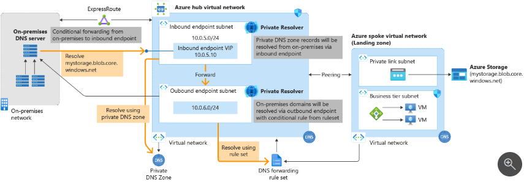

Using Azure DNS grants organizations various benefits:

- Global Availability
- Integration with other Azure Services
- Reliability
- Simplification of managing DNS domains
- Traffic routing
- Security

## Key-terms
- **PaaS**: Platform as a Service; a cloud computing model offering a platform and infrastructure for development.
- **PoP**: Point of Presense; a physical location within a network where providers have equipment and connectivity.
- **DNS**: Domain Name System; a naming system that translates domain names into IP addresses.
- **Relational Database**: database that facilitates the storage of data in a structured manner and creates relationships between tables via keys.
- **DBaaS**: Database-as-a-service; database management and hosting service.
- **DBMS**: Database Management System; software that manages the storage, organization and retrieval of data in a database.

## Assignments

### Assignment 1
- [x] Theoretical study: App Service
- [x] Theoretical study: Content Delivery Network (CDN)
- [x] Theoretical study: Azure DNS

### Assignment 2

- [x] In-depth study: Azure Files
- [x] In-depth study: Azure Database (+ managed instance)

### Sources
- [App Service](https://azure.microsoft.com/en-us/products/app-service/)
- [App Service documentation](https://learn.microsoft.com/en-us/azure/app-service/)
- [Azure Content Delivery Network](https://azure.microsoft.com/en-us/products/cdn)
- [What is a content delivery network on Azure?](https://learn.microsoft.com/en-us/azure/cdn/cdn-overview?toc=%2Fazure%2Ffrontdoor%2FTOC.json)
- [Migrate between CDN providers](https://learn.microsoft.com/en-us/azure/cdn/cdn-change-provider)
- [Azure DNS](https://azure.microsoft.com/en-us/products/dns)
- [What is Azure DNS?](https://learn.microsoft.com/en-us/azure/dns/dns-overview)
- [What is Azure Files?](https://learn.microsoft.com/en-us/azure/storage/files/storage-files-introduction)
- [Azure Files Tutorial | Easy file shares in the cloud](https://www.youtube.com/watch?v=BCzeb0IAy2k)
- [Azure SQL Database](https://azure.microsoft.com/en-us/products/azure-sql/database)
- [Azure SQL Database documentation](https://learn.microsoft.com/en-us/azure/azure-sql/database/?view=azuresql)
- [Azure SQL Database Tutorial | Relational databases in Azure](https://www.youtube.com/watch?v=BgvEOkcR0Wk)
- [Features comparison: Azure SQL Database and Azure SQL Managed Instance](https://learn.microsoft.com/en-us/azure/azure-sql/database/features-comparison?view=azuresql-mi)

### Problems
No problems

### Result

## Assignment 1 - Azure Files

Azure File Share is a cloud-based file sharing service that offers fully managed file shares that are accessible via the industry standard Server Message Block (SMB) protocol, Network File System (NFS) protocol, and Azure Files REST API.

Its main purpose is to allow users to access files and folders in the cloud from multiple machines simultaneously. This service offers cross-platform functionality because Azure Files supports the SMB protocol, which is commonly used across Windows, Linux and macOS systems.

To find this service in the Azure Portal we have to go into our Storage Account (or make a new one):

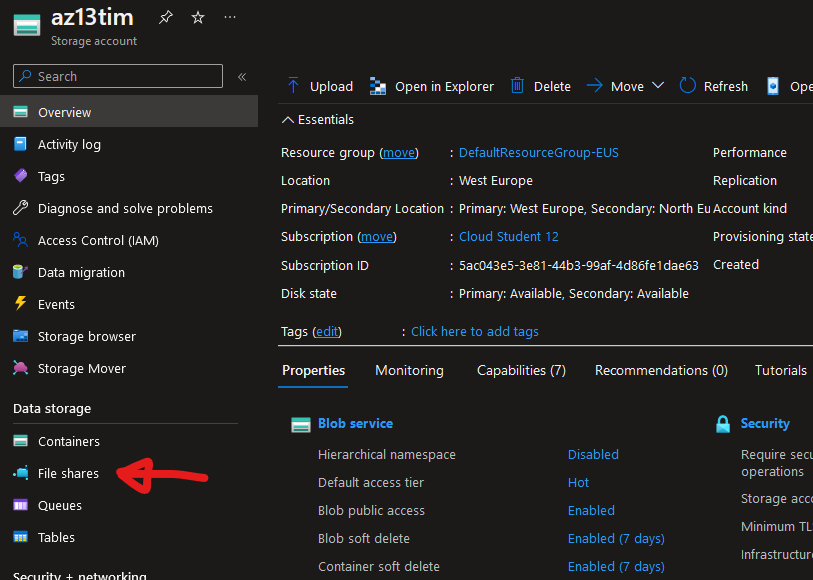

Here we find the button `File shares` under Data Storage. We can then create a new file share and give it a name, in this case we named it `az13fileshare`.

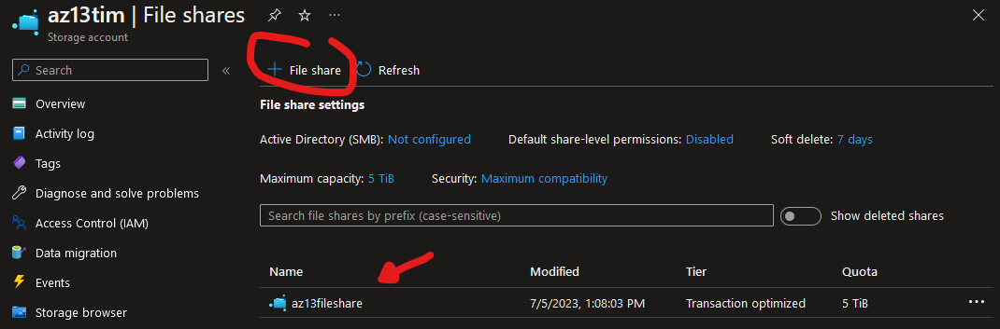

We have now enabled Fire share and can start using it to share files across different machines. To test this we can try setting up a Linux VM and using it to connect to the file share.

First we create a standard Linux Ubuntu VM through the azure portal:

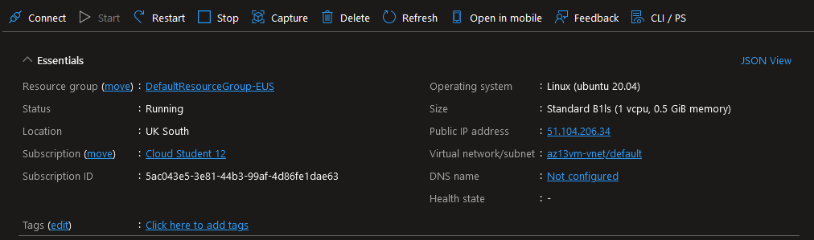

Following that we can go back into the File share in the portal and click `Connect`. Here we can have the system automatically generate a script we can run in Linux to store the file share authentication credentials, mount the file share and connect it to the VM: 

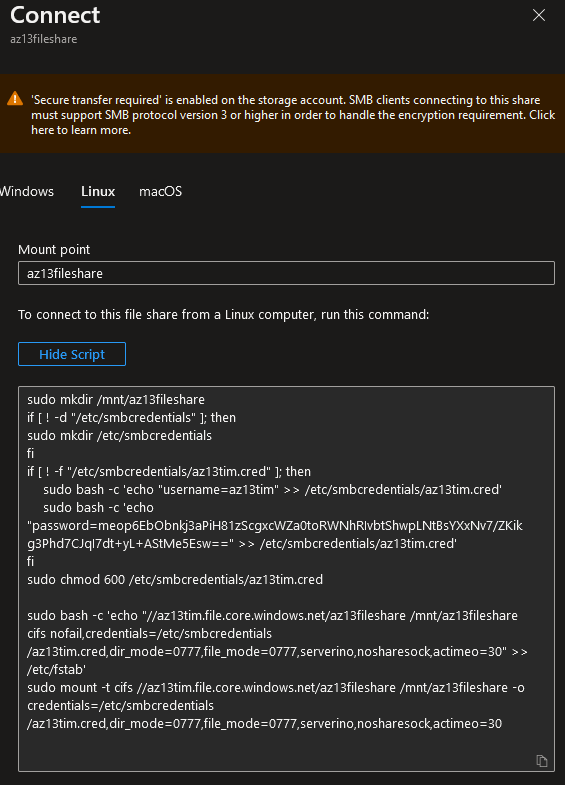

Now we can test if our new File share is accessible through the Linux VM by first uploading a test file via the Azure Portal `Browse` feature:

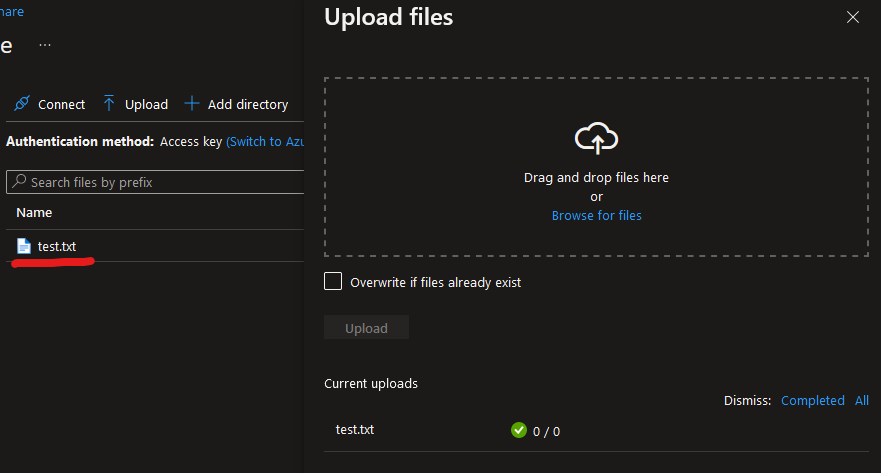

We then SSH back into Linux change to our new directory with `cd /mnt` and list the files:

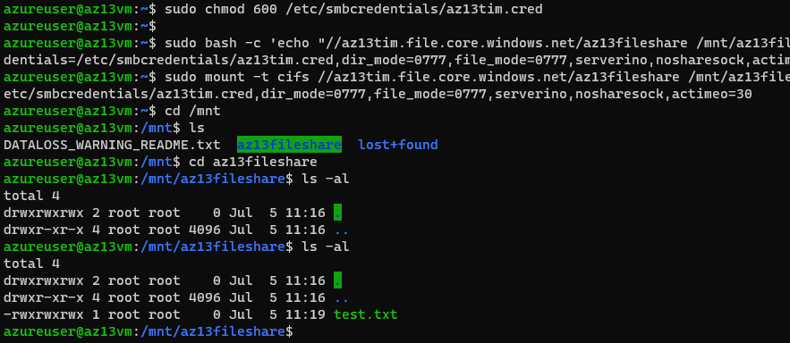

As you can see the newly uploaded file `test.txt` is visible.

## Assignment 2 - Azure Database (+ managed instance)

# Azure SQL Database

Azure SQL Database is an always-up-to-date, fully managed relational database service built for the cloud. Its fully managed nature allows for automatic updates, provisioning and backups. It is a general-purpose relational database-as-a-service that is based on the latest version of the Microsoft SQL Server Database engine.

Relational databases are a type of database management system where data is stored in tables, rows and columns. The Relational part refers to the linking of tables using primary and foreign keys. Primary keys uniquely identifies a row in a table while a foreign key establishes a link between a tables by referring to their primary keys. These types of databases are great for managing structured data and includes rich query capabilities.

Creating an Azure SQL Database first requires that you first create a Database Server that acts as a central administrative point for multiple or single pooled databases. The server allows you to configure things like logins, firewall, auditing rules, failover groups etc.

We can create an SQL Server called `az13tim` and then use the `Create database` button to create a new SQL database called `az13`:

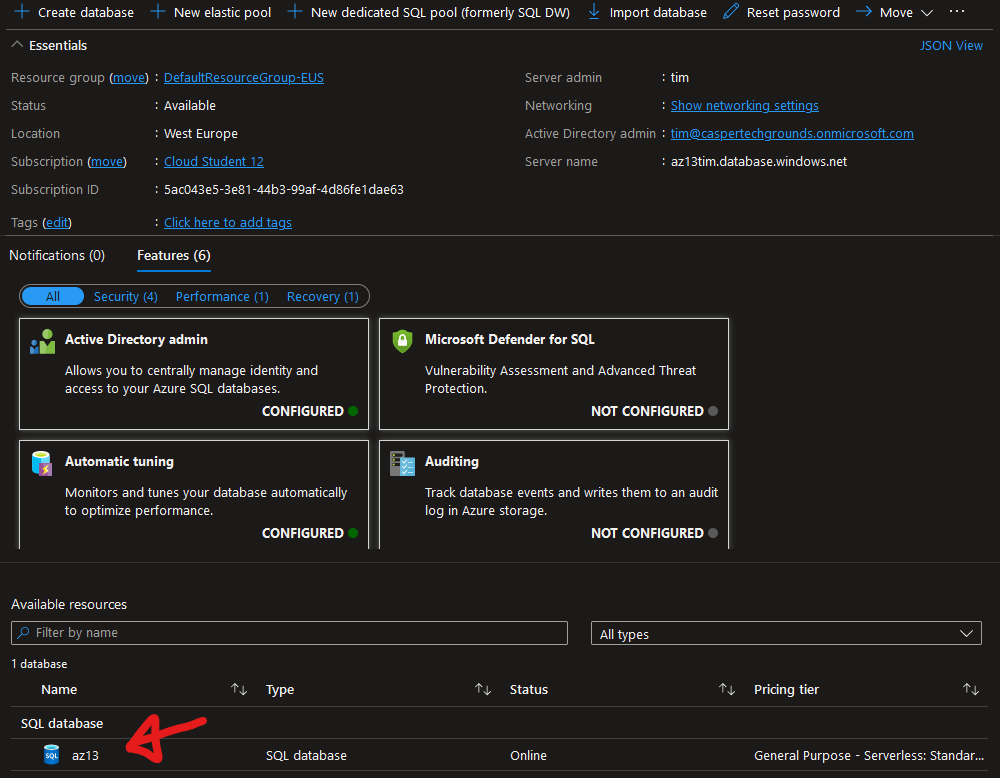

After creating the Database we can have a look at the Query editor that is build into the Azure Portal and add some tables:

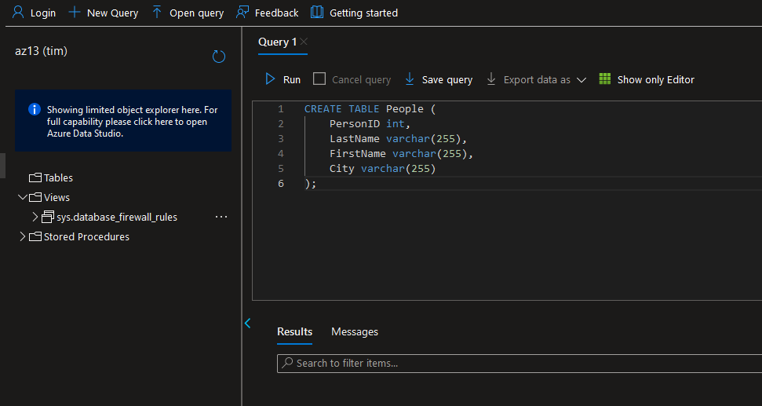

The Query editor is however a Preview version only so may be removed at some time in the future. We can also use other programs to have a look at our database like Visual Studio Code using Microsoft's SQL tool extensions:

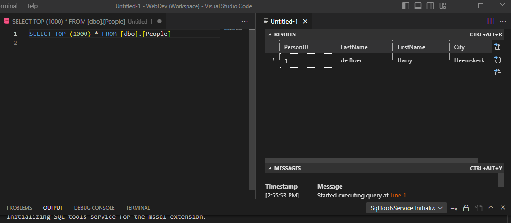

# Azure SQL Manage Instance

Azure SQL Managed Instance makes it much easier for organizations to migrate from their on-premise databases to the cloud. There are several features that are missing on normal Azure SQL that are available in Azure SQL Managed Instance. A key difference is that standard Azure SQL is a public resource and Azure SQL Managed Instance is not and is usually deployed in an isolated virtual network.

The Azure SQL Managed Instance is more aimed towards enterprise level organizations that want their on-premise workloads moved to the cloud. As such this is a pretty expensive service compared to the unmanaged one.

More differences between the two can be found on the [Features comparison: Azure SQL Database and Azure SQL Managed Instance](https://learn.microsoft.com/en-us/azure/azure-sql/database/features-comparison?view=azuresql-mi) documentation page.