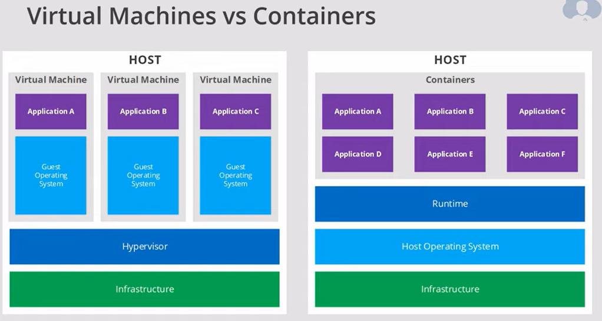
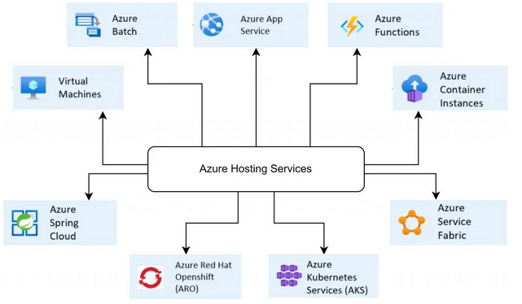

# Containers
 
## What is a container

A container is an efficient, lightweight and self-contained execution environment for running applications. It is a standard package of software that bundles the application code together with various other resources it needs to run. Most containers will contain most of the following resources:

- **Application Code**: the actual code of the application.
- **Runtime**: the runtime environment needed to execute the application.
- **System tools**: system level tools required for the application to run correctly.
- **Configuration Files**: configuration settings specific to the application.
- **Dependencies**: any dependencies needed for the application to run correctly, like libraries, frameworks or other software packages.

Containers are often compared to Virtual Machines since both of them offer a form of virtualization. Virtual Machines are software emulations of a physical computer system where the underlying hardware is virtualized, allowing multiple OS's to run on the hardware. Containers in contrast virtualize the underlying OS and causes the containerized app to perceive that it has the OS (+ CPU, Memory etc.) all to itself.

This makes it so containers provide various benefits over Virtual Machines:

- Less overhead: no need to created images for virtual machines or performing maintenance.
- Less resources: no operating systems hogging resources.
- Smaller Size: no OS files or load libraries required.
- Faster startup: smaller size and less resource consumption  makes startup faster.
- Simpler updates: no OS that has to run means no updates required.

While this also makes containers highly portable, it is important to note that they are constrained to the operating system they are defined for. Linux containers can't run on Windows and vice versa.

Containers are also a great solution for any organization looking to migrate existing applications to the cloud.

## Container Services

You can choose from several Azure services to aid you in your use of containers based on your needs:

- **Azure Kubernetes Service (AKS)**: an orchestration system that allows you to deploy and scale containers on managed Kubernetes, where Azure will take care of critical tasks like monitoring and maintenance.

- **Azure Red Hat OpenShift**: this platform extends Kubernetes by taking care of the additional tools and resources required to run containers in production with Kubernetes. These additional tasks are things like storage management, networking solutions, logging and monitoring tools.

- **Azure Container Apps**: a fully managed environment that enables you to run microservices and containerized applications on a serverless platform. This service is commonly used to handle deploying API endpoints, hosting background processing applications, handling event-driven processing or running microservices.

- **Azure Functions**: a serverless solutions to execute even-driven code while having to maintain less infrastructure and thus save on costs.

- **Azure Container Instances**: the fastest and simplest way to run containers in Azure. Azure Container Instances is a serverless option for isolated containers and is a great solutions for any scenario that involves simple applications, task automation and build jobs. For one-time-run apps it can also be very cost-effective as you only have to pay for execution time.

- **Azure Service Fabric**: a distributed systems platform that makes it easy to package, deploy, and manage scalable and reliable microservices and containers. It focusses on building stateful services.

- **Azure Container Registry**: A managed storage space for containers images and related artifacts.

## Use Cases

Microsoft gives four examples of use cases for containers:

1. **Cloud-native applications**

	> Cloud-native applications rely on containers for a common operational model across environments, including public, private, and hybrid. The low overhead and high density of containers allow many of them to be hosted inside the same virtual machine and makes them ideal for delivering cloud-native applications.

2. **Lift and shift**

	> An organization can gain significant benefits by migrating to the cloud, but may not want to rewrite an existing application. Using containers, you can potentially migrate your applications to the cloud without changing any code.

3. **Batch**

	> Batch processing refers to activities that can be done without human intervention or that can be done on a resource-available basis. Examples include generating reports, resizing images, and converting files from one format to another. Containers provide an easy way to run batch jobs without having to manage an environment and dependencies. Dynamic compute options, such as Azure Container Instances (ACI), can be used to efficiently ingest source data, process it, and place it in a durable store such as Azure Blob storage. Using such an approach instead of statically provisioned virtual machines can achieve significant cost savings through per-second billing.

4. **Machine learning

	> Machine learning applies algorithms to data and makes predictions based on patterns found in the data. Containers can make machine learning applications self-contained and easily scalable in any environment.

## Assignments

### Assignment 1
- [x] Study: Containers.

### Sources
- [What is a container?](https://azure.microsoft.com/en-us/resources/cloud-computing-dictionary/what-is-a-container/)
- [Container Services](https://azure.microsoft.com/en-us/products/category/containers)
- [Azure Container Instances Tutorial | Serverless containers in cloud](https://www.youtube.com/watch?v=jAWLQFi4USk)
- [How do we use Containers in Microsoft Azure?](https://www.testpreptraining.com/blog/how-do-we-use-containers-in-microsoft-azure/)
- [What is Azure Kubernetes Service?](https://learn.microsoft.com/en-us/azure/aks/intro-kubernetes)
- [Azure Container Instances vs App Service](https://devapo.io/blog/technology/azure-container-instances-vs-app-service/)

### Problems
No problems.
