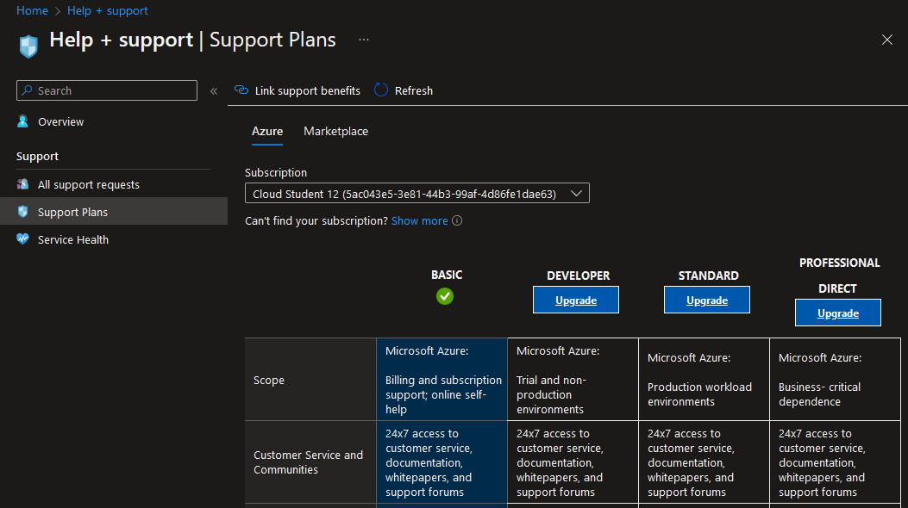

# Azure Support Plans
 
Azure offers four different support plans, the most basic one being included for all Azure customers while the other three require additional payment. The scope of the support per plan and the cost is defined as such:

1. Basic: included for all Azure customers for free.
2. Developer: trial and non-production environments. Costs: $29 a month.
3. Standard: production workload environments. Costs: $100 a month.
4. Professional Direct: business-critical dependence. Costs: $1000 a month.

Support is provided in nine different languages: English, Spanish, French, German, Italian, Portuguese, Traditional Chinese, Korean, and Japanese. Support is billed on a monthly basis and is automatically renewed.

What products and services are covered by these support plans can be found on their [Support scope and responsiveness](https://azure.microsoft.com/en-us/support/plans/response/) page:

> Microsoft Azure services released to General Availability and purchased from Microsoft are covered by all support plans.
> Microsoft Azure Public previews are covered by all support plans.
> Non-Microsoft technologies, when provided by Microsoft as part of an Azure product feature, are covered by all support plans, such as the Azure SDK and sample code for Python.
> Support for services purchased through another channel (other than purchased online, for example, Enterprise Agreement) are governed by the agreement terms for that purchase.

The **Basic** plan has the following features:

- Billing and subscription management support.
- 24/7 Self-help resources, including: Microsoft Learn, Azure Portal how-to videos, documentation and Community support.
- Unlimited tickets.
- Azure Advisor.
- Azure Health status and notifications.

The **Developer** plan includes all previous features as well as:

- Technical support during business hours via email.
- Unlimited Contacts and Cases.
- Third-party software support with interoperability & configuration guidance and troubleshooting.
- Case severity/Response Times: minimal business impact (Sev C): less than 8 business hours.
- Architecture Support: general guidance.

The **Standard** plan includes all previous features as well as:

- 24/7 Technical support via email as well as phone.
- Case severity/Response Times: minimal business impact (Sev C): less than 8 business hours, moderate business impact (Sev B): less than 4 hours and critical business impact (Sev A): less than 1 hour.

The **Professional Direct** plan includes all previous features as well as:

- Case severity/Response Times: minimal business impact (Sev C): less than 4 business hours, moderate business impact (Sev B): less than 2 hours and critical business impact (Sev A): less than 1 hour.
- Architecture support: architectural guidance based on best practice delivered by ProDirect Delivery Manager.
- Operations Support: Onboarding services, service reviews, Azure Advisor consultations
- Training: Azure Engineering-led web seminars
- Proactive Guidance: ProDirect Delivery Manager

Plans can be upgraded via the Azure Portal in the `Help + Support` service:

## Assignments

### Assignment 1
- [x] Study: Azure Support Plans.

### Sources
- [Compare support plans](https://azure.microsoft.com/en-us/support/plans)
- [Support scope and responsiveness](https://azure.microsoft.com/en-us/support/plans/response/)
- [Azure Support Plans | Detailed Comparison of Options](https://k21academy.com/microsoft-azure/az-900/az-900-azure-support-options/)

### Problems
No problems.
