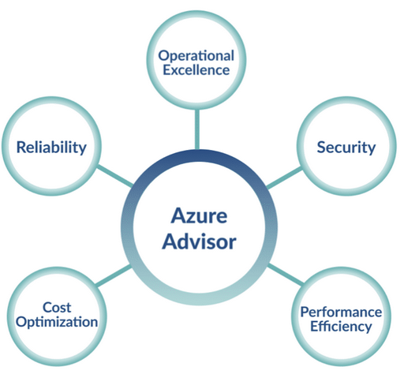
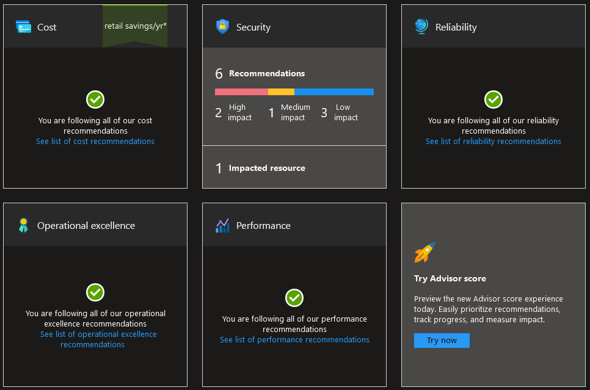

# Azure Advisor

Azure Advisor is a cloud service introduced by Microsoft to aid you while using Azure by offering recommendations and best practices. This helps you optimize various aspects of your azure projects like performance, security and cost-effectiveness.

It does this by using Artificial Intelligence to continuously monitor your Azure environment and basing it recommendations on what it sees in your various resources, like Virtual Machines, storage accounts, billing etc. Just some examples of recommendations and best practices Azure Advisor might give you are:

- Change the size of Virtual Machines or shut them down.
- Update/upgrade to the latest version of various services.
- Optimize settings.
- Enable replication to protect against outages.
- Enable autoscaling.

These are just a few of the many hundreds of recommendation Advisor can gives you. A more comprehensive list can be fount in the [Azure Advisor Documentation](https://learn.microsoft.com/en-us/azure/advisor/advisor-reference-cost-recommendations) under `Concepts -> Recommendations`.

Theses recommendations and best practices are structured after the 5 pillars of Microsofts's Well-Architected Framework: 

- **Reliability**: these recommendations deal with providing higher availability for your services. This includes things like high availability settings, fault tolerance implementation, availability zone deployment etc.

- **Security**: this section recommends various actions that will help improve the security of your services and help protect against things like hacks, data breaches and other malicious threats. The security advisor may recommend you enable Microsoft Defender, enable auto provisioning of log analytics, enable email notification for high security alerts etc.

- **Performance**: this Advisor pillar focusses on optimizing the performance and scalability of your Azure resources by recommending actions that improve resource utilization, scalability and performance. Examples here would be: improving cache performance for high network bandwidth, enable accelerated networking, use SSD Disks for higher performance etc.

- **Cost**: here Azure Advisor may give you various cost optimization recommendations. Nobody wants to overpay for things that can be used cheaper or for resources that are unused. Examples are: finding unused paid resources, using the right size resources, cleanup etc.

- **Operational Excellence**: running and managing your application can also be optimized. Azure Advisor will give you recommendations that accomplish this like setting up monitoring and alerts, implementing backup and recovery options, and automating routine tasks.

Organizations in a Shift and Lift migration can also be aided by Azure Advisor by giving them recommendations based on the five pillars.

The service also gives you a handy overview of various recommendations you have not yet followed:

## Assignments

### Assignment 1
- [x] Study: Azure Support Plans.

### Sources
- [AZ-900 Episode 20 | Azure Advisor](https://www.youtube.com/watch?v=58_6MkB2znI)
- [Azure Advisor](https://azure.microsoft.com/en-us/products/advisor)
- [Introduction to Azure Advisor](https://learn.microsoft.com/en-us/azure/advisor/advisor-overview)

### Problems
No problems.
