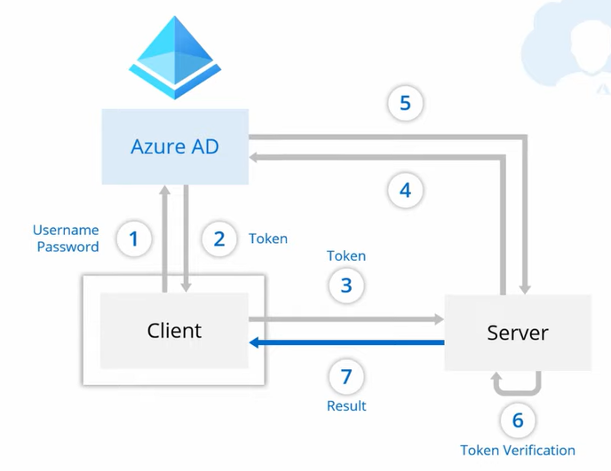
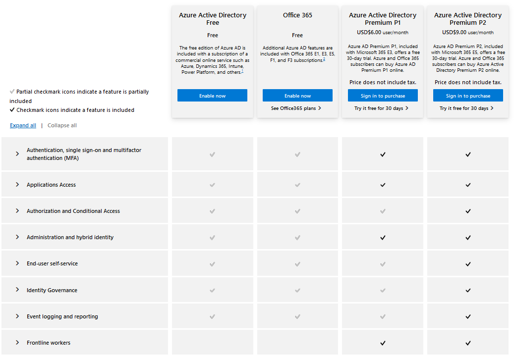
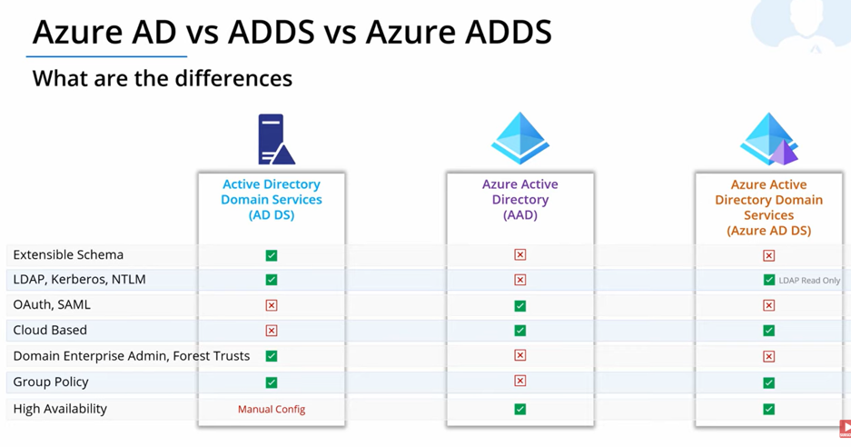
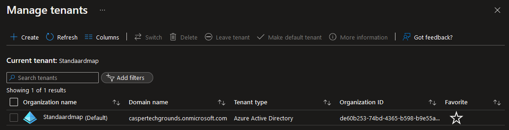
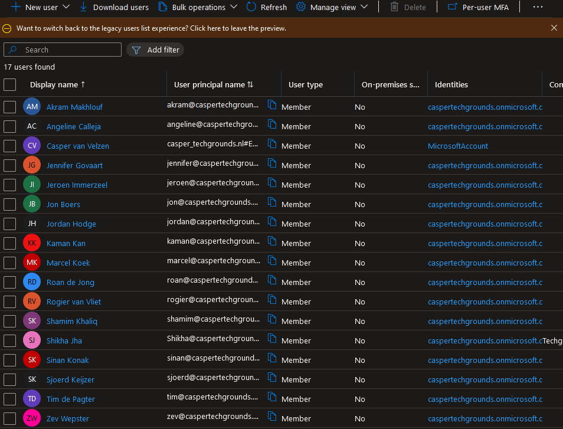
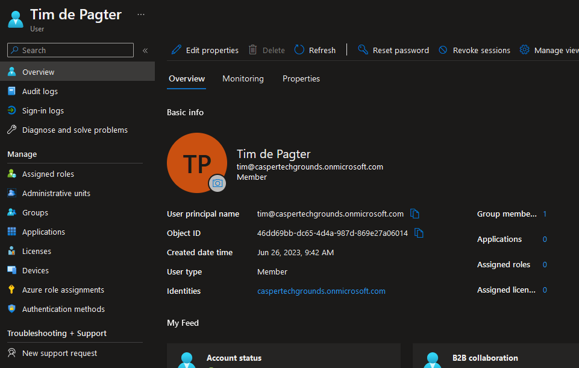

# Azure Active Directory

Azure Active Directory is an identity provider and access management service. It is a very common service within Azure and many applications you probably use outside of Azure such as Skype, OneDrive, Teams and Outlook. Even logging into Azure itself uses Azure Active Directory.

When we are talking about Azure AD being an Identity Provider we are referring to the service of providing identification by authenticating the users or applications using a username and password, secret key, certificates etc.

The usage and benefits of Azure Active Directory depends on the role of its users in their respective organization:

- **IT Admins**: control access to apps and resources.
- **App developers**: Azure AD allows developers to add single sign-on (SSO) authentication to their applications.
- **Microsoft 365, Office 365, Azure, or Dynamics CRM Online subscribers**: Azure AD is already active as an authentication method on these services.

For developers AAD can be especially useful for adding quick, cheap and secure authentication to their applications. In the classic approach individual apps used to have their own database of users and login credentials to authenticate its users.

This however had several downsides:

- It could be expensive and time consuming to set up.
- Every user database deployed was a security risk.
- User credentials change per application/service.

Azure AD attempts to solve these problems by taking care of the user identification process.

In the above graph the authentication via Azure AD follows these steps:

1. The client sends login credentials Azure AD.
2. Azure AD sends a token containing information on the client and its identity back to the client.
3. The client then sends the token to the server.
4+5. The server then exchanges information about the token with Azure AD.
6. The server provides token verification.
7. Verification success or failure result is returned to the client.

More information on the use of AAD for developers can be found in the [Microsoft identity platform documentation](https://learn.microsoft.com/en-us/azure/active-directory/develop/v2-overview).

There are 4 different pricing tiers (licenses) that organizations can consider based on their business needs:

Azure Active Directory Domain Services (AD DS) is the on-premises version of Active Directory. Azure Active Directory is the cloud version.

A problem with a lot of legacy applications is that they can't use modern authentication methods. Azure AD DS managed domain can be used to run legacy applications in the cloud and is often used to lift and shift those apps from on-premises into a managed domain. It can be integrated with an existing Azure AD tenant and allows users to sing in to services and application connected to the managed domain using their existing credentials.

The differences between the three AD versions can be seen in the graph below:

## Assignments

### Assignment 1
- [x] In-depth study: Azure Active Directory.

### Sources
- [What is Azure Active Directory?](https://learn.microsoft.com/en-us/azure/active-directory/fundamentals/active-directory-whatis)
- [Azure Active Directory (AD, AAD) Tutorial | Identity and Access Management Service](https://www.youtube.com/watch?v=Ma7VAQE7ga4)
- [What is the Microsoft identity platform?](https://learn.microsoft.com/en-us/azure/active-directory/develop/v2-overview)
- [Microsoft identity platform documentation](https://learn.microsoft.com/en-us/azure/active-directory/develop/v2-overview)
- [Understanding Tenants and Subscriptions in Azure](https://azure-training.com/2022/02/28/understanding-tenants-and-subscriptions-in-azure/)
- [What is Azure Active Directory Domain Services?](https://learn.microsoft.com/en-us/azure/active-directory-domain-services/overview)

### Problems
No problems.

## Assignment 1

In Azure a tenant refers to a single dedicated and trusted instance of Azure Active Directory which automatically gets created when you sign up for Microsoft cloud. When we open up Azure Active Directory in the Azure Portal we can have a look at the tenants by clicking `Manage tenants`:

Here we can see our organization name is `Standaardmap` and domain name `caspertechgrounds.onmicrosoft.com`. It is possible to use a custom domain name in addition to the initial domain name that is supplied upon first creation of the tenant `<domainname>.onmicrosoft.com.`.

Azure Active Directory tenants names are globally unique.

Using the side panel we can navigate to the user management section of AAD where users can be added, removed or changed:

Here we see a list of all students of the cloud 11 Techgrounds class as well as some students from a previous cloud class. Columns can be edited to show more or less information.

Clicking on a name allows use to access managing options for individual users:

Here we can perform administrative tasks like assigning/removing roles, groups, applications, licenses, devices, resetting passwords etc. It also contains auditing and sign-in logs.