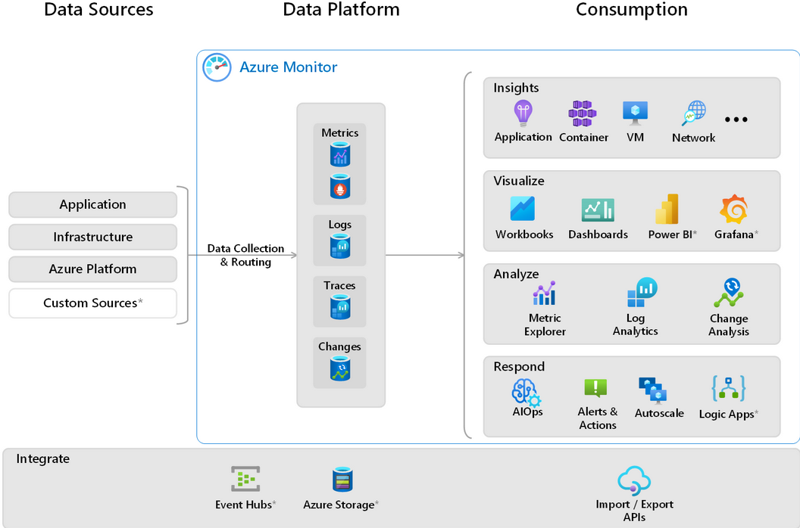
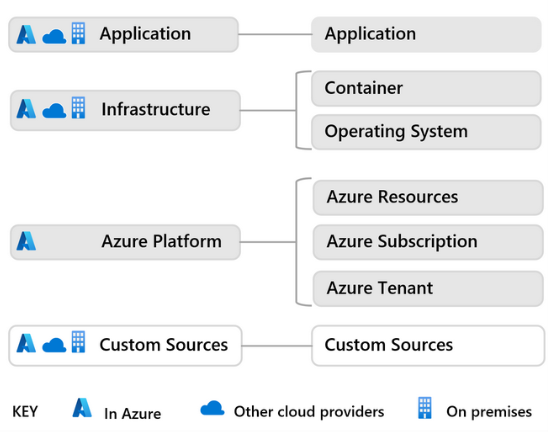
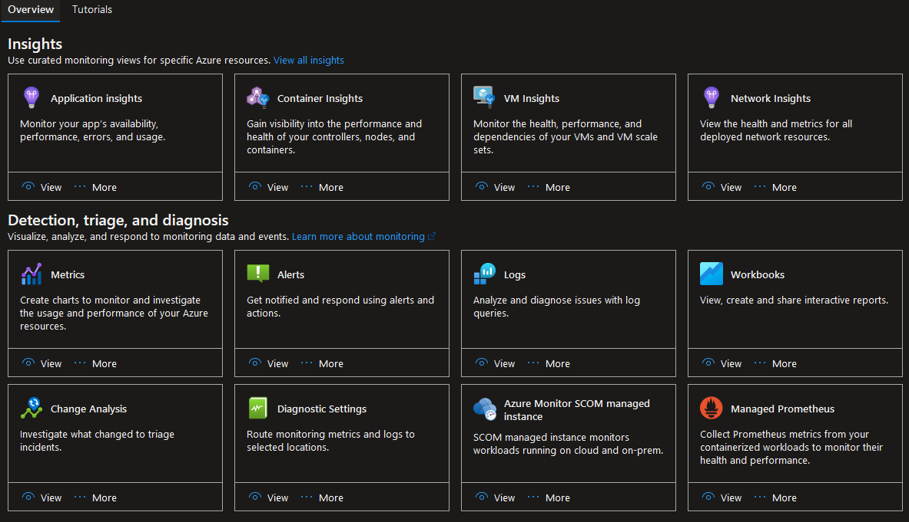
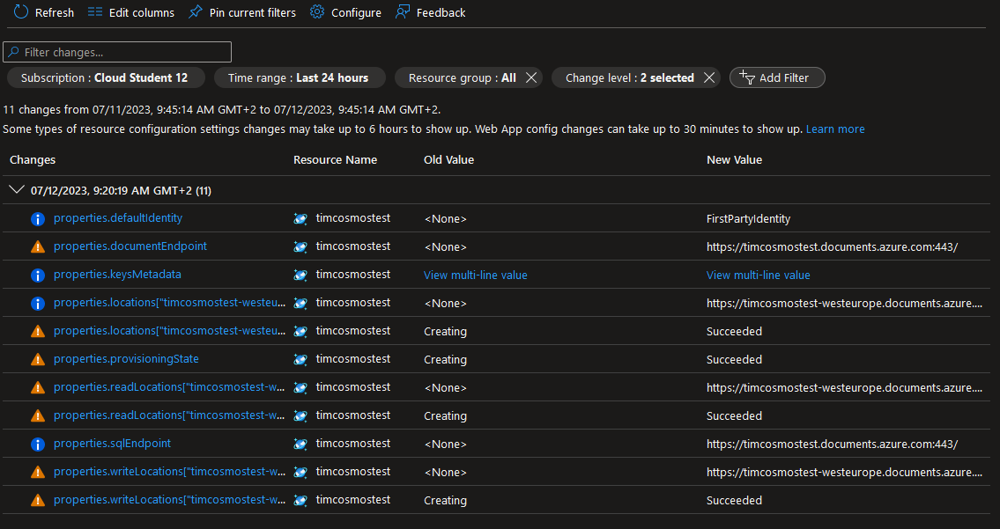
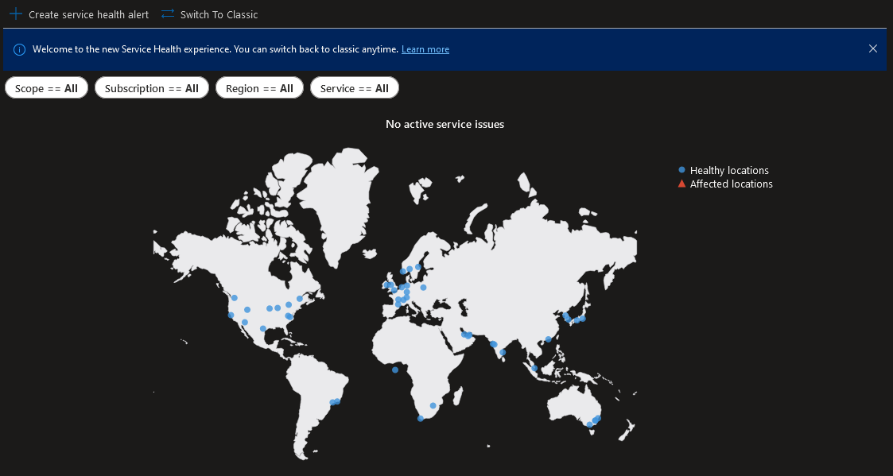
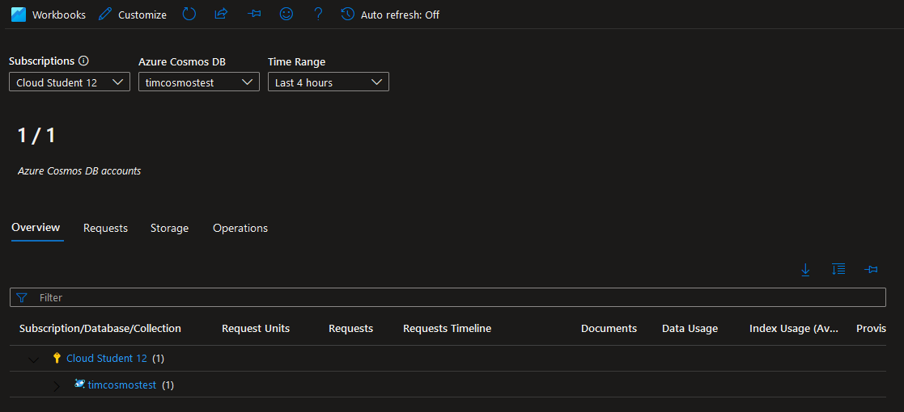

# Azure Monitor

Azure Monitor is a comprehensive monitoring service that collects, analyzes and acts on various telemetry data from your resources and applications. The data Azure Monitor collects is important to understand how your applications and resources are performing and allows you to proactively identify and address any potential issues affecting them.

Azure Monitor can collect data on the following resources:

- Applications
- Virtual machines
- Guest operating systems
- Containers including Prometheus metrics
- Databases
- Security events in combination with Azure Sentinel
- Networking events and health in combination with Network Watcher
- Custom sources that use the APIs to get data into Azure Monitor

The data from across multiple Azure subscriptions is stored together allowing for correlation and a analyzing using a common set of tools.

In the above graph we can see three major parts of the Azure Monitor architecture:

### Data Sources

Azure Monitor collects a variety of data from various sources, including application data, operating system data, Azure resource data, Azure subscription monitoring data, Azure tenant monitoring data and more. 

These data sources and be categorized into four different types: application, infrastructure, Azure Platform and Custom Sources:

The collection of this data starts as soon as a resource is created since Azure Monitor is an automated system.

### Data Platform

Data collected is then stored in data stores according to the 4 pillars of observability:

1. **Metrics**: numerical values that describe an aspect of a system at a particular point in time.
2. **Logs**: recorded system events.
3. **Traces**: the path of a request as it travels through different services and components.
4. **Changes**: a series of events in your application and resources.

### Consumption

The Monitor section of the Azure Portal gives you access to the various ways you can "consume" this data and an easy way to access all the tools. Examples of some of the bigger tools:

1. **Insights**
	- Application Insights: monitors the availability, performance, and usage of your web applications.
	- Container Insights: gives you performance visibility into container workloads that are deployed to managed Kubernetes clusters hosted on Azure Kubernetes Service.
	- VM Insights: VM Insights monitors your Azure VMs.
	- Network Insights: a comprehensive and visual representation through topologies, of health and metrics for all deployed network resources, without requiring any configuration.

2. **Visualize**
	- Azure dashboards: combine different kinds of data into a single pane in the Azure portal.
	- Workbooks: a flexible canvas for data analysis and the creation of rich visual reports in the Azure portal. 
	- Power BI: business analytics service that provides interactive visualizations across various data sources.
	- Grafana: an open platform that excels in operational dashboards.

3. **Analyze**
	- Metrics explorer: investigate the health and utilization of your resources.
	- Log Analytics: query the log data collected by Azure Monitor so that you can quickly retrieve, consolidate, and analyze collected data.
	- Change Analysis: a subscription-level Azure resource provider that checks resource changes in the subscription and provides data for diagnostic tools to help users understand what changes might have caused issues.

4. **Respond**
	- Alerts: create rules to alert you based on collected metrics.
	- Autoscale: dynamically control the number of resources running to handle the load on your application.
	- Azure Logic Apps: create and run automated workflows with little to no code.

In a lift and shift scenario the on-premises System Center operation Manager installation can be moved to the Azure cloud using Azure Monitor SCOM Managed Instance, which is included in Azure Monitor.

## Assignments

### Assignment 1
- [x] In-depth study: Azure Monitor.

### Sources
- [Azure Monitor overview](https://learn.microsoft.com/en-us/azure/azure-monitor/overview)
- [Microsoft Azure Monitoring](https://www.serverless360.com/microsoft-azure-monitoring)

### Problems
No problems.

## Assignment 1

Access the Azure Monitor service via the Azure Portal lands us on the overview page:

Here we can see a collection of the various insight, detection, triage and diagnosis tools we can access.

Since we recently created an Azure Cosmos DB for another assignment we can have a look at the various metrics available for this resource:

Here we can analyze the changes made to the Cosmos DB resources. When the Cosmos DB resource was deployed various properties were created here in the Change Analysis log.

We can access the Service Health tool to check the health of Azure locations, including the one where our Cosmos DB is located, which is West Europe. Everything seems to be operational:

Insights also provides a monitoring tool specifically for Comsos DB:

