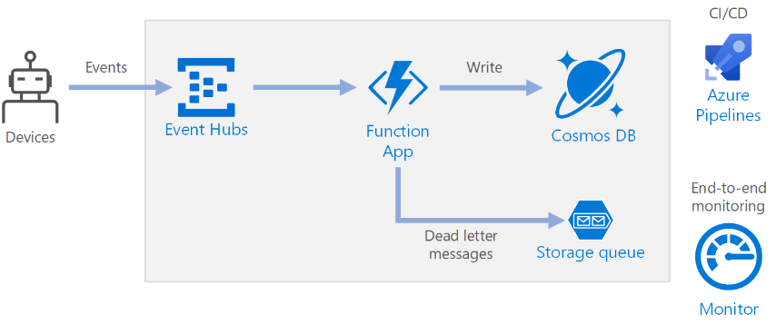
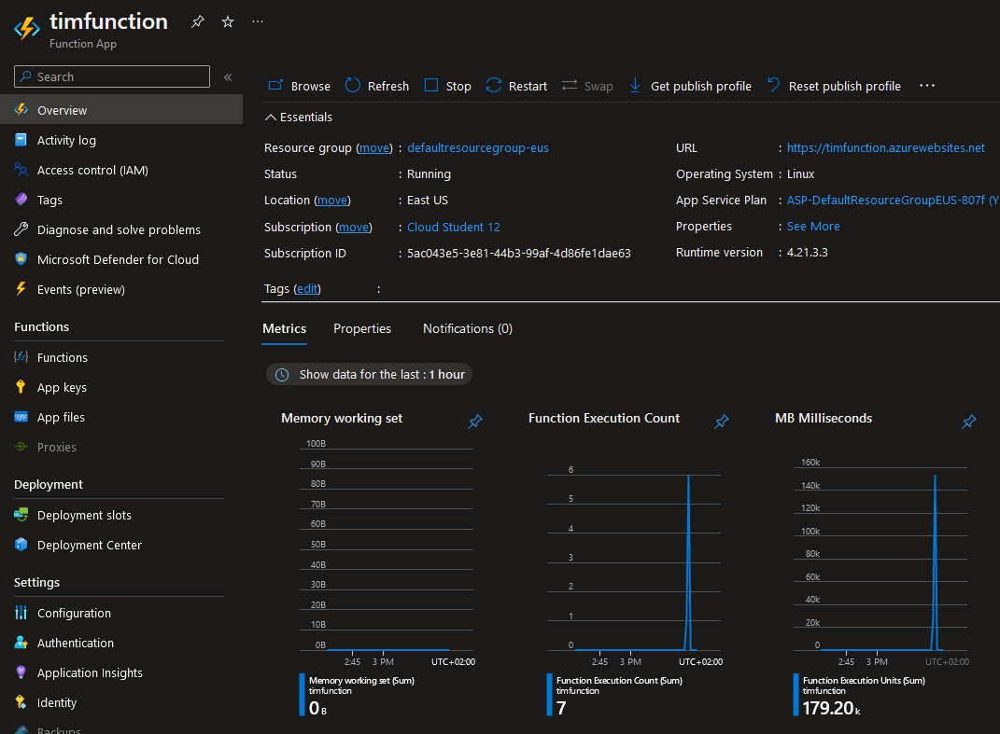
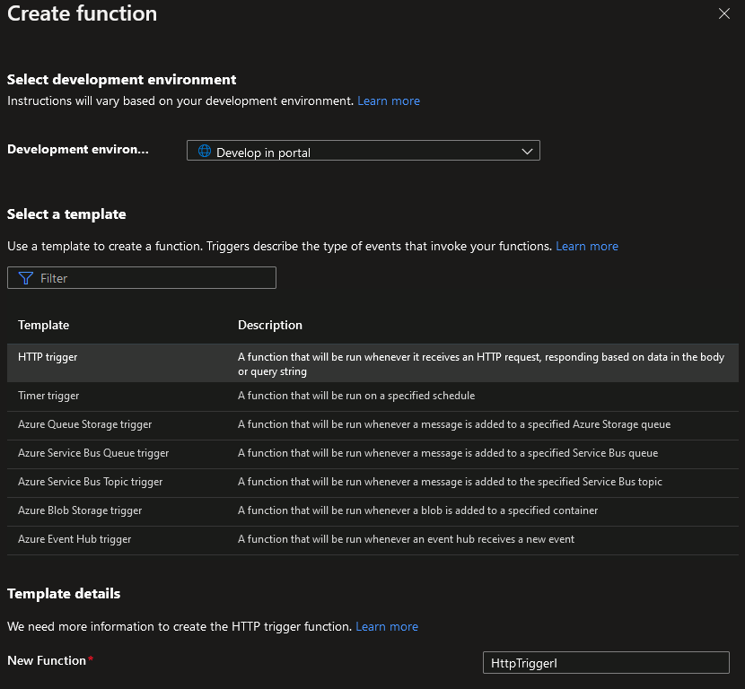
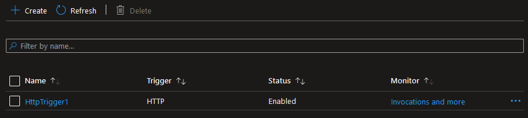
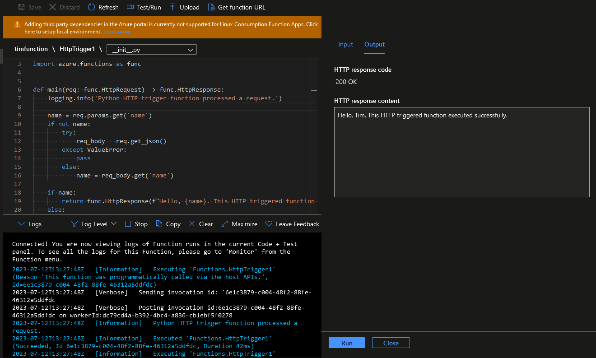
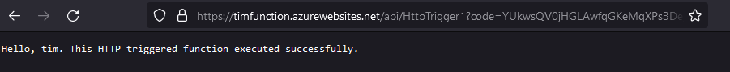
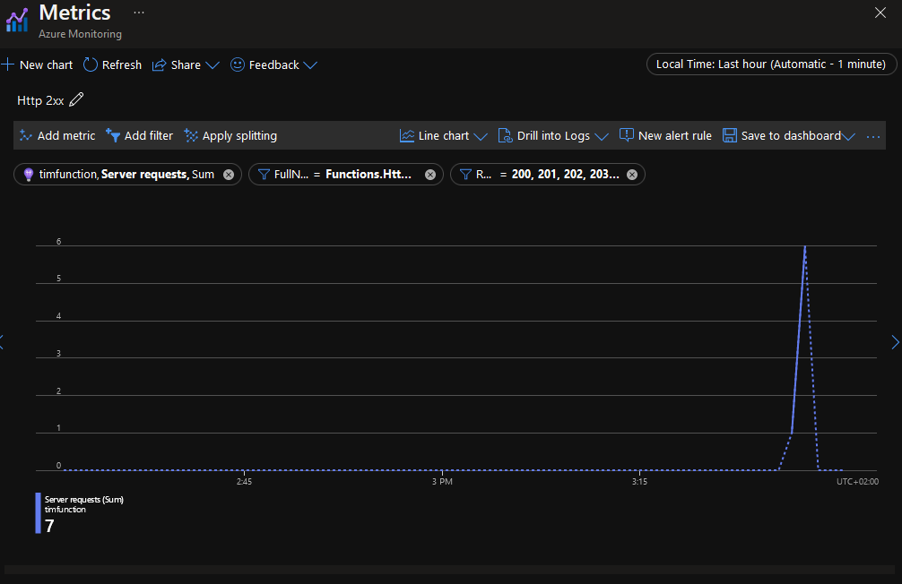

# Azure Functions

Azure Functions are a way for you to run small pieces of code easily in the cloud. Azure refers to such a piece of code as a function. Rather than having to create an entire web application or to worry about managing the underlying infrastructure, Azure Functions takes care of all of this so you can focus solely on that small piece of code you want to execute.

One of the best features of Azure Functions is the ability to execute code based on event-driven triggers and bindings. With this you can run a script as a response to various events such as HTTP requests, timers, messages from queues or changes in data within your Azure subscription.

Azure Functions supports a multitude of programming languages such as:

- C#
- Java
- JavaScript
- PowerShell
- Python
- TypeScript

Its also possible to create a function app and related resources using Bicep and ARM templates.

This service is an extension of Azure App Service and as such shares a lot of the functionality. The features your Azure Functions App has is also dictated by the hosting plan selected. Hosting plan selection determines how your app is scaled, what resources are available to each function app instance and what support you get for advanced functionality. 

There are currently three hosting plans available:

1. **Consumption plan**: this is the default hosting plan. On the Consumption plan, instances of the Functions host are dynamically added and removed based on the number of incoming events. You only have to pay for the functions that are running and it will automatically scale with high demand/workload.

2. **Premium Plan**: here functions automatically scale based on demand using pre-warmed workers, which run applications with no delay after being idle, runs on more powerful instances, and connects to virtual networks. This plan is cost efficient for function apps that run continuously, have a high number of executions but low GB/s, need more CPU, run longer, or requires more advanced features.

3. **Dedicated Plan**: run your functions within an App Service plan at regular App Service plan rates. Best for long-running scenarios where Durable Functions can't be used. Consider an App Service plan in the following situations: you have existing, underutilized VMs that are already running other App Service instances or predictive scaling and costs are required.

There are a lot more differences between the hosting plans; to view them all please visit the [Azure Functions hosting options](https://learn.microsoft.com/en-us/azure/azure-functions/functions-scale) page.

There are many benefits to using the Azure Functions service:

- Pay-per-use model: you only pay for functions that are used/executed.
- Dependencies or 3rd party libraries: you can bring third-party dependencies and libraries into your functions apps like JSON files, binary files and machine learning models.
- Integrated security: feature coming from Azure App Service.
- Simple integration: allows the use of external tools.
- Flexible development: allows development in Azure Portal, Visual Studio Code, GitHub or other tools.
- Open-source: allows for technology agility.

The main way Functions work is that an event trigger occurs, a piece of code is executed, and there is an output:

`Trigger` -> `Code` -> `Output`

To give an example of what this would look like in a real serverless scenario:

In the above diagram an event arrives at Azure Event Hubs which triggers a piece of code from Functions App to be executed. The output of this code is then written to Cosmos DB or, if the Function App failed to store the output, it then drops the output in the Storage Queue to be processed at a later time.

## Assignments

### Assignment 1
- [x] In-depth study: Azure Functions.

### Sources
- [Azure Functions documentation](https://learn.microsoft.com/en-us/azure/azure-functions/)
- [Microsoft Azure Functions](https://www.serverless360.com/azure-functions)
- [Azure Function Apps Tutorial | Introduction for serverless programming](https://www.youtube.com/watch?v=Vxf-rOEO1q4)

### Problems
No problems.

## Assignment 1

In Azure Function App we can create a new Function App called `timfunction`. The overview for this new Function App shares a lot of the features of Service App since Azure Function up is an extension of that service:

Here we can see some essential configurations as well as some basic metrics.

Under `Functions` we can then create a new python function with an http trigger and specify that we want to be able to develop it inside the Azure Portal:

Which will then appear in the list of functions:

You can specify a template to begin with, which will populate the function with a Python script that will take a name variable from a HTTP trigger and if successful parse it:

We can see run a test and see the output in the log or we can run it directly in the browser:

Metrics for the function can be viewed in Azure Monitor:

