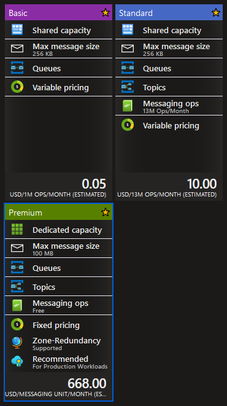
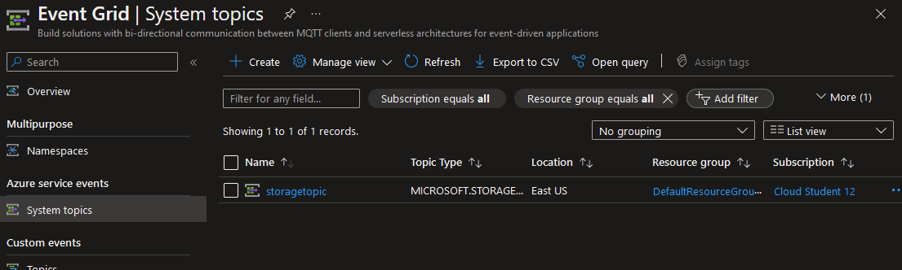
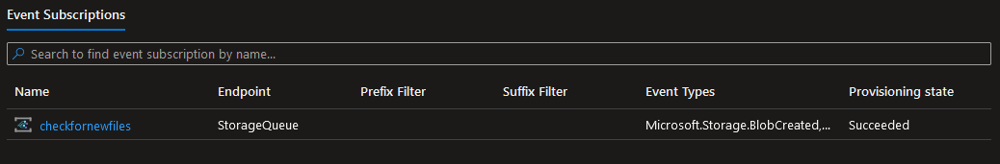
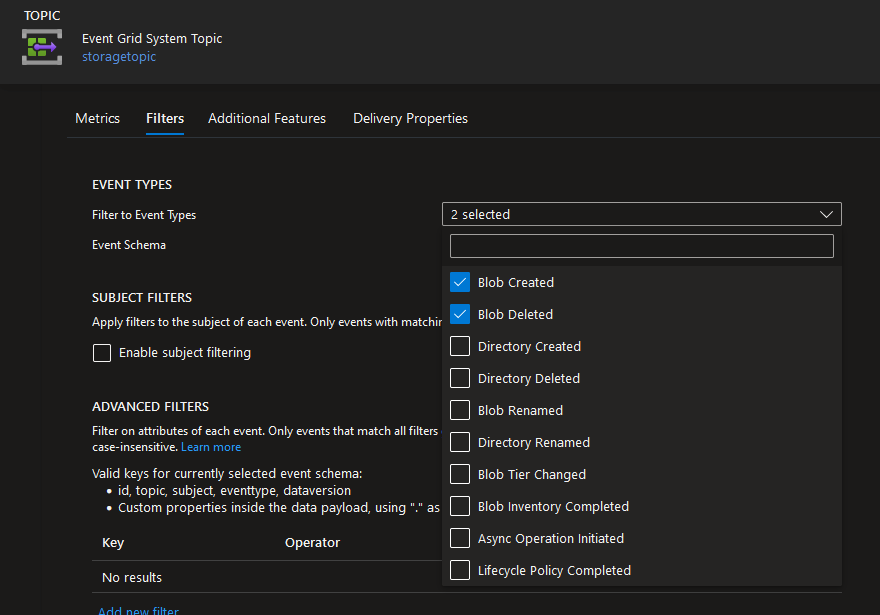
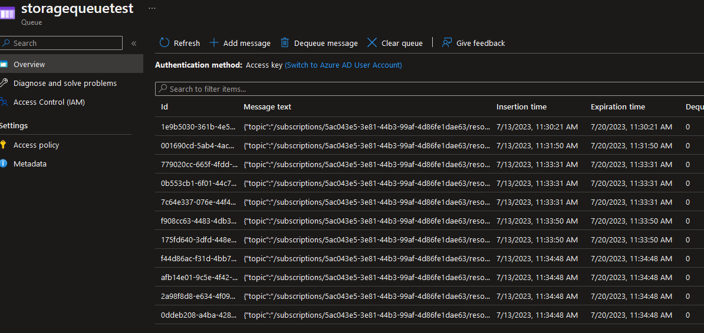
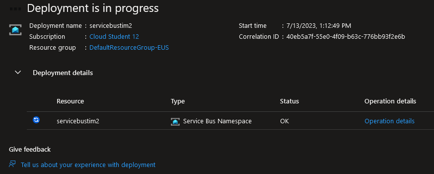
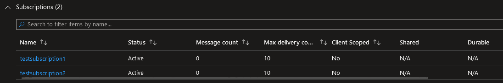
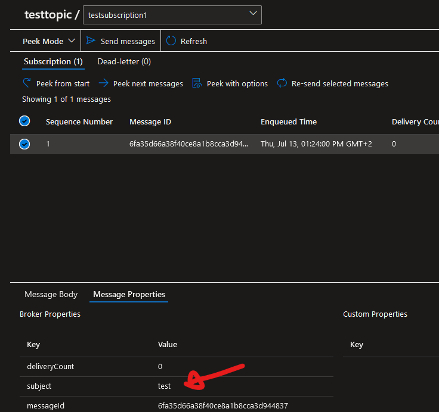

# Event Grid, Queue Storage, Service Bus

### Event Grid
Azure Event Grid is a fully managed and scalable message distribution service that enables real-time event processing and reactive programming. The service can be used at different stages of data pipelines to achieve a diverse set of integration goals. Event Grid works using the push-push model.

Event Grid currently supports two protocols:

1. MQTT: a lightweight, publish-subscribe, machine to machine network protocol for message queue/message queuing service.
2. HTTP: application layer request-response protocol.

The Event Grid architecture looks something like this:

1. An **Event** happens, which is a description of something that happened. This **Event** originates from a source, which is the location the event took place, like an Azure Resource such as Blob Storage.

2. This **Event** then gets send to a **Topic**, which is a logical endpoint for these event messages that acts like a communication channel. 

3. Here a **Subscription** handles the events by routing it to a handler based on filtering rules, event delivery options and the endpoint where events should be send.

4. The message then ends up with an **Event Handler**, which is the app or service that eventually reacts to the event.

Event grid is commonly used in serverless application architecture where it's possible to instantly react to events on e.g. blob storage and process data that is uploaded there.

It is also very useful for task automation as it allows for integration with Azure Automation. This service can be notified of an event which then allows it to perform some kind of automation task like diagnostics or other function.

Azure Event Grid is also a great tool for application integration as it allows you to connect your app with other services using Event Grid Topics.

There are many benefits to using Azure Event Grid:

1. It's simple and get be set up easily using point and click.
2. It allows for advanced filtering options.
3. It allows for fanning-out by allowing multiple endpoints to subscribe to the same event.
4. Its reliable and comes with 24-hour retries if messages are failed to deliver.
5. Its cost effective. The first 100,000 operations per month are free, after that its only $0.60 per million operations.

### Queue Storage
Azure Storage Queue is a messaging service designed for reliable, asynchronous communication between components of a distributed system. It can be used to store a large number of messages that can be accessed from anywhere in the world using HTTP or HTTPS.

Each queue maintains a list of messages that can be added by a sender component and processed by a receiver component. With a queue, your application can scale immediately to meet demand. The maximum size of a Queue Storage message is 64 KB.

### Service Bus
Azure Service Bus is a fully managed messaging service that provides reliable message-based communication between various components or services. 

Azure Service Bus offers 3 different pricing tiers. It is important to not that in addition to the difference in cost per operation, some tiers lack important features, such as topics and redundancy options. Here is a more comprehensive feature list for Azure Service Bus:

Developers often have to choose between Azure Service Buss and Azure Event Grid. In general Azure Service Buss is commonly used to handle transactional messages, whereas Azure Event Grid is more aimed at handling discrete events.

Another big difference is that Service Bus uses the push-pull model, whereas Event Gris uses push-push. This means that applications have much more control of the speed at which they have to process messages or events if they use Service Bus.

## Assignments

### Assignment 1
- [x] In-depth study: Event Grid, Queue Storage, Service Bus.

### Sources
- [What is Azure Event Grid?](https://learn.microsoft.com/en-us/azure/event-grid/overview)
- [Azure Event Grid Tutorial](https://www.youtube.com/watch?v=TujzkSxJzIA)
- [Azure Service Bus VS Event Grid](https://yourazurecoach.com/2021/08/11/azure-service-bus-vs-event-grid/)
- [Choose between Azure messaging services - Event Grid, Event Hubs, and Service Bus](https://learn.microsoft.com/en-us/azure/service-bus-messaging/compare-messaging-services)
- [How to use Azure Service Bus Topics | Azure Tips and Tricks](https://www.youtube.com/watch?v=kfjUSibSico)
- [What is Azure Queue Storage?](https://learn.microsoft.com/en-us/azure/storage/queues/storage-queues-introduction)

### Problems
No problems.

## Assignment 1

In Azure Event Grid we can create a new system topic in `System topics` which handles events from Azure resources. We pick `Storage Accounts (Blob & GPv2)` as our topic type so we can collect events from blob storage and call this topic `storagetopic`:

We then add an Event Subscription:

By adding a filter to our Topic Subscription we can make sure only events we are interested in are selected. In this case we select `Blob Created` and `Blob Deleted` because we only want events that trigger when a file on our blob storage is created or deleted:

Following all that we can set an endpoint for our subscriptions, which in this case will be a Storage Queue called `storagequeuetest`.

Now we can test and see if our messages are correctly being received and delivered. We do this by first uploading and deleting a couple of images to our blob storage with Microsoft Azure Storage Explorer:

After uploading and deleting several image files we can now open up Queue Storage `storagequeuetest` and see several messages:

Opening up our Event Grid System Topic we can see some metrics on these events:

In the above example we can see Azure Event Grid and Azure Queue Storage. Now lets have a look at Azure Service Bus. First we have to create a namespace:

Next, just like in the previous example, we add a Topic as well as two subscriptions:

In these subscriptions we can then set filters to make sure we only get the messages we want. In `testsubscription1` we can set a filter that will only accept messages with the Label/Subject `test`; we will leave `testsubscription2` as it is without any filters.

Afterwards we can use the Service Bus Explorer to send a few messages to the `servicebustim2` topic, of which only one will contain the Label/Subject `test`.

The result can be seen here:

Of the four messages we send all of them are visible in `testsubscription2`. But in `testsubscription1` we only see the message that had the `test` subject filter active:

