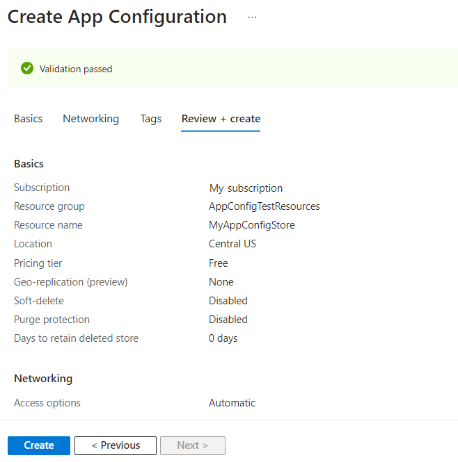
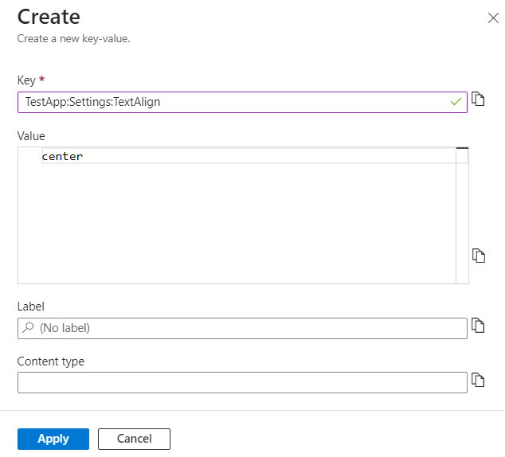
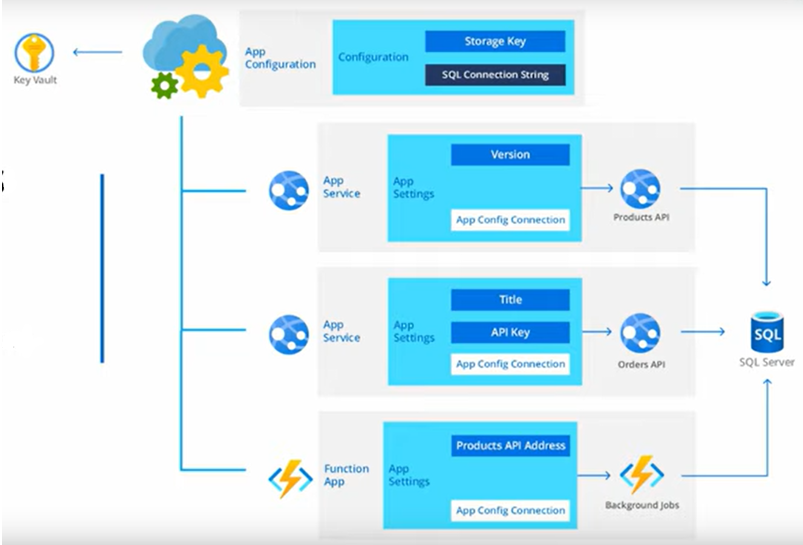

# Azure App Configuration

Azure App Configuration is a service that helps centralize your application configuration and feature management. This feature is very handy when you are developing applications as it gives you a centralized place where you can park your application settings and feature flags. A feature flag is a way to turn on or off a specific feature in your application either completely or for a portion of your users.

The benefit of storing configuration settings like key-value pairs or feature flags in this service is that you don't have to redeploy your application whenever you want to change these. These settings can be easily accessed and updated and decouples the configuration data from your application code for increased flexibility.

App Configuration offers many more benefits:

- Fully Managed.
- Quickly set up.
- Label tags.
- Point-in-time replay of settings.
- Dedicated UI for feature flag management.
- Configuration comparison.
- Enhanced security.
- Encryption and key-vault integration.
- Integration with popular frameworks.

Getting started with Azure App Configuration is as simple as creating an App Configuration store:

And then adding keys or feature flags to that store:

Applications can fetch configurations from Azure App Configuration at runtime, allowing you to update applications without needing to redeploy or even restart them.

Azure App Configuration also seamlessly integrates with other services like Azure Functions, Azure Container Apps and Azure Kubernetes Service.

It is important to note that App Configuration complements Azure Key Vault; it does not replace it. The Key Vault is still the best place to store application secrets.

## Assignments

### Assignment 1
- [x] Study: Azure App Configuration.

### Sources
- [What is Azure App Configuration?](https://learn.microsoft.com/en-us/azure/azure-app-configuration/overview)
- [Azure App Configuration Tutorial](https://www.youtube.com/watch?v=t6m13DxUJMc)

### Problems
No problems.
