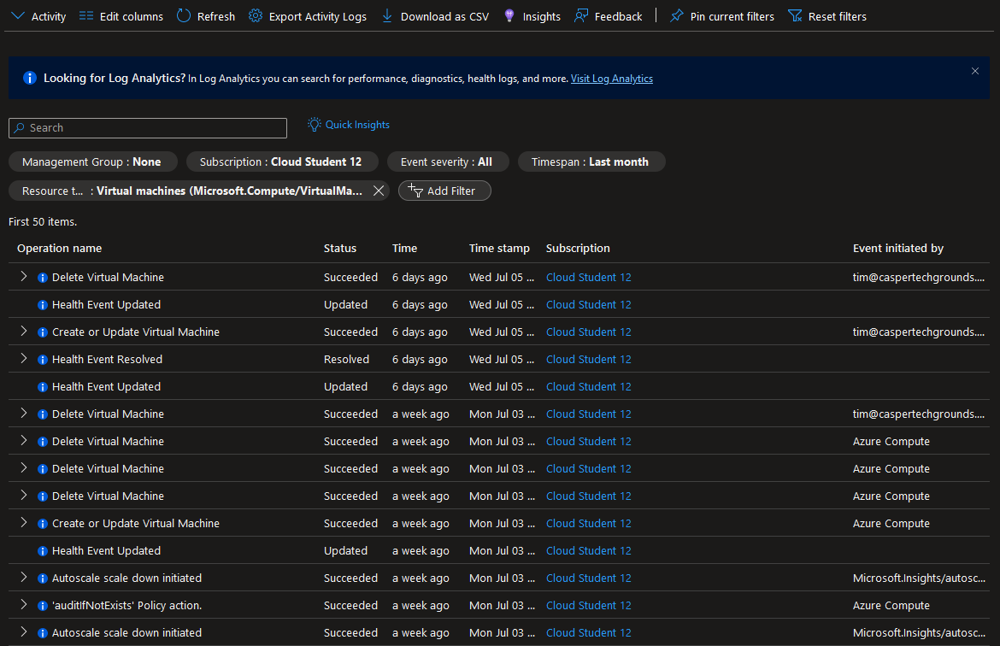

# Azure Activity Log

This is a service provided my Microsoft Azure that records operations and changes within your Azure subscription and gives you a clear insight into your Azure environment.

The Activity Log can be viewed via the Azure Portal or log entries can be retrieved using PowerShell or the Azure CLI. Logs can also be downloaded as CVS. Activity logs are retained for a maximum of 90 days, however this can be extended by creating a diagnostic setting and then routing the entries to another storage location.

Activity logs can be send to various other Azure services allowing for easy integration. These services include Azure Event hubs, Azure Storage, Log Analytics workspace etc.

These extensive logs give you a comprehensive view of any events happening in your Azure Environment allowing you to do things like monitoring resource utilization, troubleshooting problems and watching out for unexpected or unauthorized actions.

Actions listed in the Activity log get assigned one of four severity levels:

1. **Critical**: events that demand the immediate attention of a system administrator. May indicate that an application or system has failed or stopped responding.
2. **Error**: events that indicate a problem, but do not require immediate attention.
3. **Warning**: events that provide forewarning of potential problems, although not an actual error. Indicate that a resource is not in an ideal state and may degrade later into showing errors or critical events.
4. **Informational**: events that pass noncritical information to the administrator. Similar to a note that says: "For your information".

Important note: developers are the ones that decide what severity level is assigned to their resource entries.

Events are further divided into eight categories:

1. **Administrative**: contains the record of all create, update, delete, and action operations performed through Resource Manager.
2. **Service Health**: contains the record of any service health incidents that have occurred in Azure.
3. **Resource Health**: contains the record of any resource health events that have occurred to your Azure resources.
4. **Alert**: contains the record of activations for Azure alerts.
5. **Autoscale**: contains the record of any events related to the operation of the autoscale engine based on any autoscale settings you have defined in your subscription.
6. **Recommendation**: contains recommendation events from Azure Advisor.
7. **Security**: contains the record of any alerts generated by Microsoft Defender for Cloud.
8. **Policy**: contains records of all effect action operations performed by Azure Policy.

Columns in the activity log can be edited to show more or less information as needed.

Filters can be added to the list of operations in the activity log to get more specific results.

The logs can be filtered by:

- Management Group
- Resource
- Subscription
- Resource type
- Event severity
- Timespan
- Operation
- Who initiated an event
- Event category

For example by adding the resource type `Virtual Machines (Microsoft.Computer/VirtualMachines)` and setting the timespan to `Last month` we can filter out all the events that occurred during the Virtual Machine and Scale Set assignments:

## Assignments

### Assignment 1
- [x] Study: Azure Activity Log.

### Sources
- [Azure Monitor activity log](https://learn.microsoft.com/en-us/azure/azure-monitor/essentials/activity-log?tabs=powershell)

### Problems
No problems.
