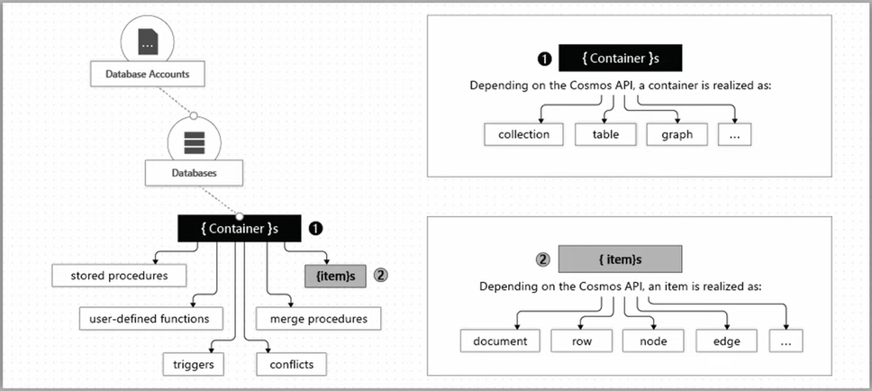
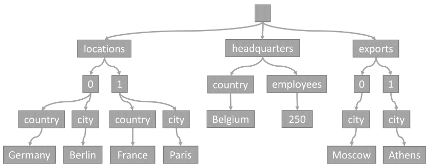
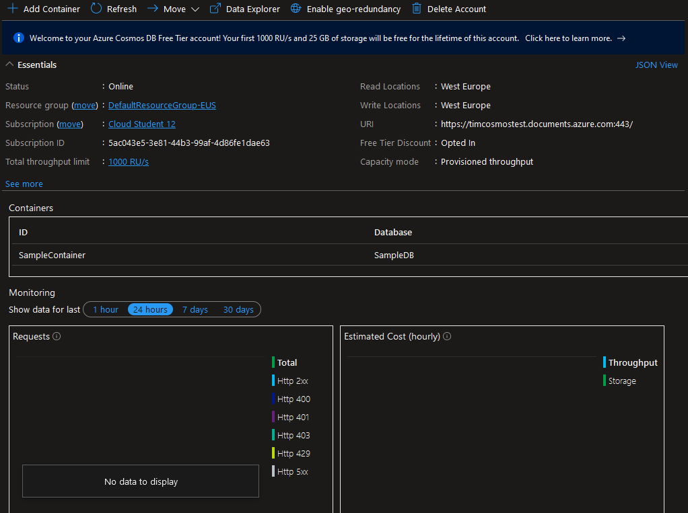
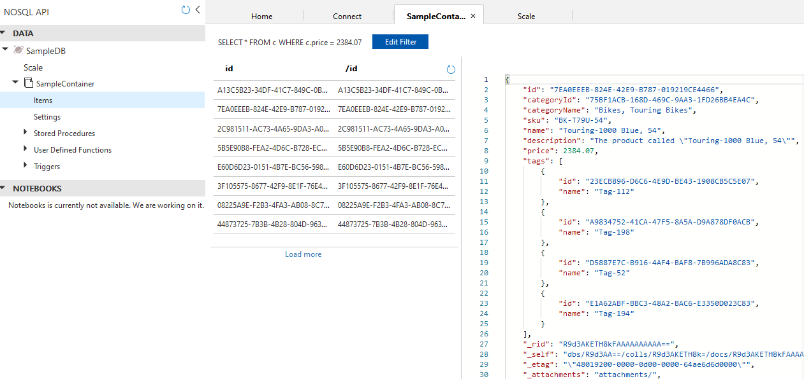
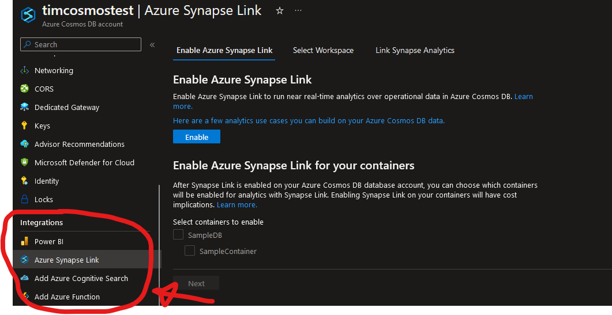
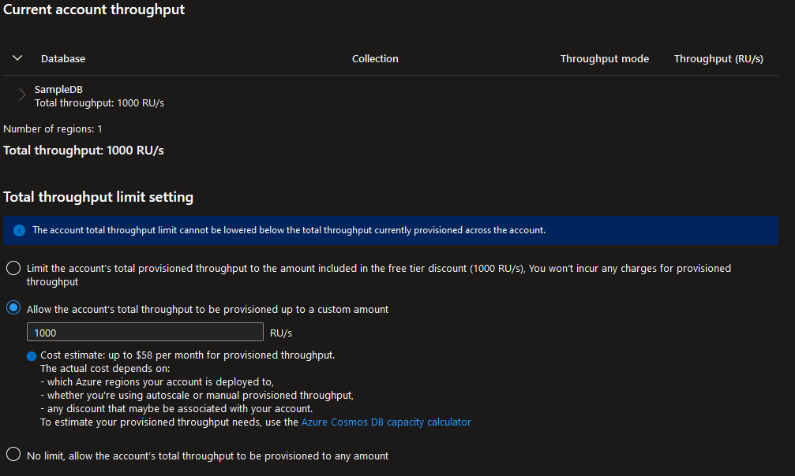

# Azure Cosmos DB

Azure Cosmos DB is a fully managed NoSQL and relational database with turnkey global distribution and transparent multi-master replication. Azure Cosmos DB was designed for modern app development and offers low latency, automatic and instant scalability and guaranteed speeds.

Cosmos DB uses the schema-agnostic data model, meaning it can store and query data in a number of different formats. Cosmos DB automatically indexes every property of all items in a container without you having to define a schema or configure secondary indexes.

The structure in Cosmos DB is fairly straightforward:



Database Account is the top level resource in Azure for Cosmos DB. One of these accounts can contain multiple databases and each database can have 1 or more containers. Containers can be seen as a type of classic database tables and every container has rows of items.

Azure Cosmos DB also offers multiple database APIs including NoSQL, MongoDB, PostgreSQL Cassandra, Gremlin, and Table. Depending on the API used containers and items use different data realizations.

In simple terms is essentially a document database where everything is stored in JavaScript Object Notation (JSON) document. Whenever an item gets stored in a container, its content is projected in a JSON document, after which it gets converted into a tree representation. For example an item containing locations, headquarters and exports can be projected as such:

```
{
  "locations": [
    { "country": "Germany", "city": "Berlin" },
    { "country": "France", "city": "Paris" }
  ],
  "headquarters": { "country": "Belgium", "employees": 250 },
  "exports": [
    { "city": "Moscow" },
    { "city": "Athens" }
  ]
}
```
This then gets converted to a tree representation:



Indexes are pointers to column of data in a table. Azure Cosmos DB currently supports three types of indexes:

1. **Range index**: an index based on an ordered tree-like structure.
2. **Spatial index**: an index that enables efficient queries on geospatial objects.
3. **Composite index**: an index that enables efficient operations on multiple fields.

Azure Cosmos DB has many benefits:

- Turnkey Global Distribution: databases are distributed across all major regions and has transparent replication.
- High integration with other Azure services: Azure Functions, IoT Hubs, Azure Kubernetes Service, App Service etc.
- All Azure regions: Cosmos DB is available in all 60+ regions.
- High availability: 99.999% availability for reads and writes.
- Role-based access: allows for greater control and keeps data safe.
- High security: Cosmos DB offers enterprise level security.
- Fully managed: automatic maintenance, patching and updates.
- Automatic scaling: independently and elastically scale storage and throughput across any Azure region.
- Low latency: under 10ms read/write for the 99th percentile.
- Strong consistency: choice between performance and consistent replication.
- schema-agnostic data model: no schema or index management required. 

One of the cost benefits of using Cosmos DB is that the cost of all operations is normalized and expressed in Request Units. Rather than paying for memory, cpu usage or Input Output Requests per Second you pay for RUs/second for throughput where a request unit is a read, insert, upsert, delete or query operation. The number of RUs depends on the size of the operation.

## Assignments

### Assignment 1
- [x] In-depth study: Azure Cosmos DB.

### Sources
- [Azure Cosmos DB documentation](https://learn.microsoft.com/en-us/azure/cosmos-db/)
- [Azure Cosmos DB Tutorial | Globally distributed NoSQL database](https://www.youtube.com/watch?v=R_Fi59j6BMo)
- [Schema-agnostic databases](https://en.wikipedia.org/wiki/Schema-agnostic_databases)

### Problems
No problems.

## Assignment 1

After creating an Azure Cosmos DB account we can have a look at the overview:



Here we can find some essential information as well as a list of currently active containers and some requests and estimated cost monitoring graphs.

Using the Data Explorer tool we can add some sample data to a database and then query this data in the browser. Using `SELECT * FROM c WHERE c.price = 2384.07` we can find all the items where the price is 2384.07:



Azure Cosmos DB also provides seamless integration with many services such as Power BI, Azure Synapse Link and Azure Functions:



Azure Synapse Link for Azure Cosmos DB is a cloud-native hybrid transactional and analytical processing (HTAP) capability that enables near real time analytics over operational data in Azure Cosmos DB.

The cost management also gives us a good insight into the cost estimates and allows us to set a maximum number of RUs/second:


